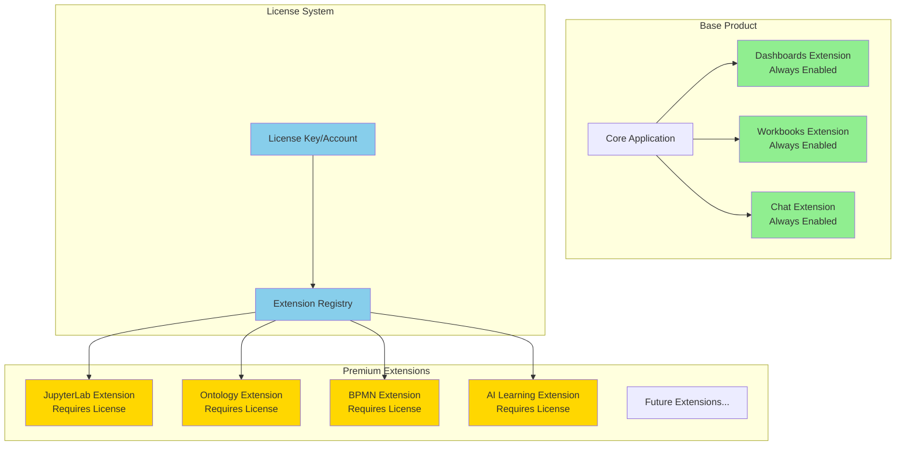
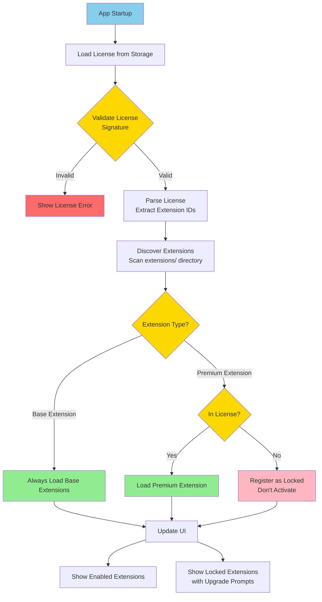
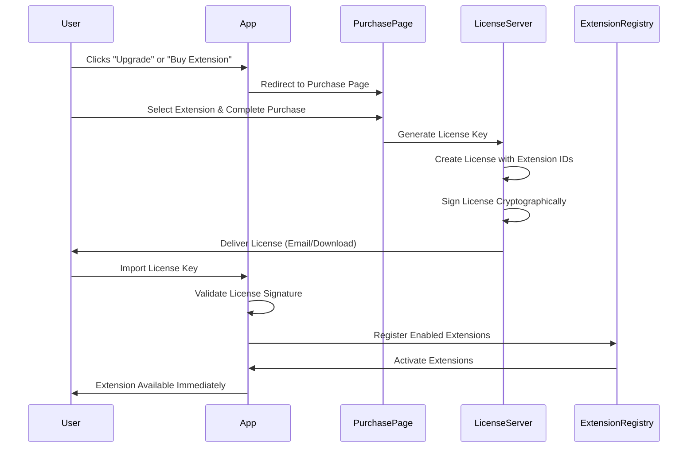
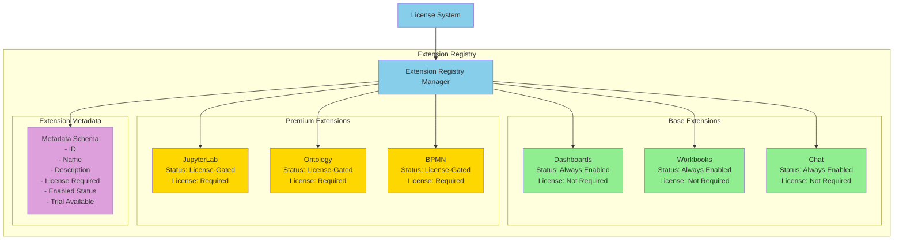
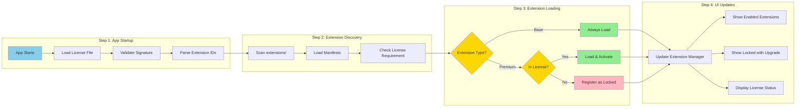
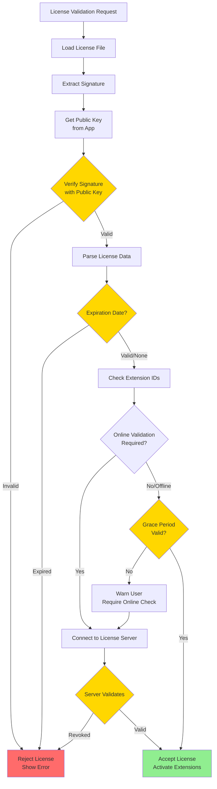
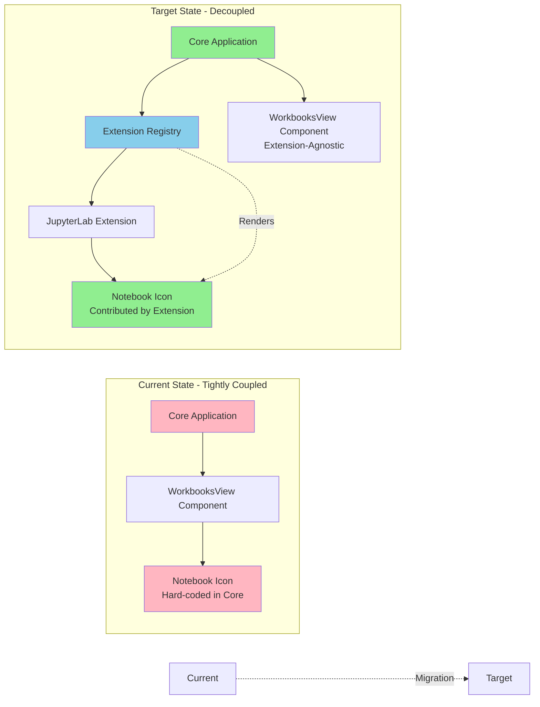
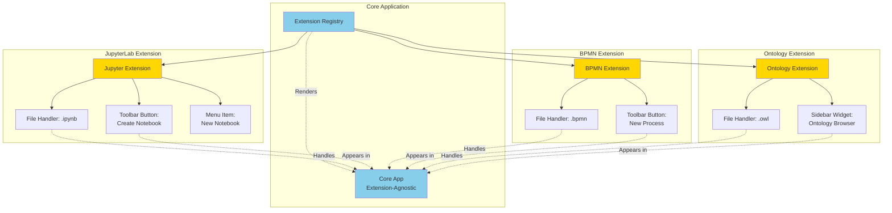
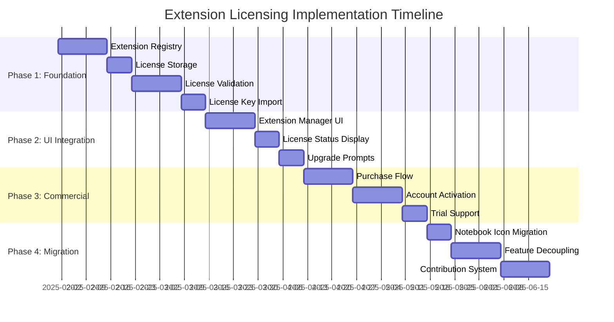

# Extension Licensing Architecture

## Overview

This document outlines the architecture for a commercial extension licensing system that allows the base product to include core extensions while enabling premium extensions to be sold separately. This enables a freemium model where users can purchase individual extensions as needed.

## Extension Categories

### Base Extensions (Included with Base Product)

These extensions are always enabled and require no license:

- **Dashboards Extension** - Core dashboard functionality
- **Workbooks Extension** - Core workbook management
- **Chat Extension** - Core chat/LLM functionality

### Premium Extensions (Paid Add-ons)

These extensions require a valid license to enable:

- **JupyterLab Extension** - Python notebook execution
- **Ontology Extension** - Ontology management and visualization
- **BPMN Extension** - Business Process Model and Notation tools
- **AI Learning & Context Optimization Extension** - Reinforcement learning for intelligent context selection and personalized responses
- *Additional premium extensions as they are developed*

### Extension Architecture Diagram



## Licensing System Components

### 1. License Key System

Each user receives a license key (purchased or trial) that contains:

- **User ID / Account ID** - Unique identifier for the license holder
- **Enabled Extension IDs** - List of extension IDs that are activated
- **Expiration Date** - Optional expiration for time-limited licenses
- **Feature Flags** - Additional feature-level permissions
- **License Signature** - Cryptographic signature to prevent tampering

### 2. License Storage

**Local Storage:**
- Encrypted license file stored locally (e.g., `license.json` or `.license`)
- Stored in app data directory with appropriate permissions
- Allows offline operation

**Optional Online Validation:**
- Periodic validation against license server
- Account-based activation for multi-device support
- Real-time license status updates

### 3. Extension Activation Flow



### 4. Purchase Flow



## Implementation Options

### Implementation Options Comparison

```mermaid
graph TB
    subgraph "Option 1: License Key File"
        L1[User Purchases Extension]
        L2[Download .license File]
        L3[Import into App]
        L4[Validate Locally]
        L5[Activate Extension]
        L1 --> L2 --> L3 --> L4 --> L5
        L1 -.Offline Capable.-> L5
    end

    subgraph "Option 2: Account-Based"
        A1[User Purchases Extension]
        A2[Login to Account in App]
        A3[App Checks Account API]
        A4[Auto-Activate Extension]
        A1 --> A2 --> A3 --> A4
        A2 -.Requires Internet.-> A4
    end

    subgraph "Option 3: Hybrid Recommended"
        H1[User Purchases Extension]
        H2{Import Method?}
        H3[License Key File]
        H4[Account Login]
        H5[Validate & Sync]
        H6[Activate Extension]
        H1 --> H2
        H2 -->|Offline| H3
        H2 -->|Online| H4
        H3 --> H5
        H4 --> H5
        H5 --> H6
        H3 -.Works Offline.-> H6
        H4 -.Multi-Device Sync.-> H6
    end

    style L5 fill:#90EE90
    style A4 fill:#90EE90
    style H6 fill:#90EE90
    style H2 fill:#FFD700
```



### Option 1: License Key File

**Pros:**
- Works completely offline
- Simple implementation
- User controls license file

**Cons:**
- Manual license import required
- License file can be lost
- No automatic multi-device sync

**Implementation:**
- User downloads `.license` file after purchase
- App provides "Import License" functionality
- License validated locally with cryptographic signature

### Option 2: Account-Based Activation

**Pros:**
- Automatic activation after purchase
- Multi-device support
- Centralized license management
- Can revoke licenses if needed

**Cons:**
- Requires internet connection
- More complex infrastructure needed
- Server costs for validation

**Implementation:**
- User logs into account within application
- App checks account's purchased extensions via API
- Extensions auto-enable based on account status
- Periodic online validation for security

### Option 3: Hybrid Approach (Recommended)

**Pros:**
- Best of both worlds
- Offline capability with license key
- Online sync for convenience
- Flexible for different user needs

**Cons:**
- More complex to implement
- Requires both systems

**Implementation:**
- Primary: License key for offline use
- Optional: Account sync for multi-device
- Online validation for enhanced security
- Grace period for offline operation

## Extension Registry Architecture



### License Check Flow



## User Interface Considerations

### Extension Manager

A dedicated UI component showing:

- **Extension List**
  - Extension name and description
  - Status: Enabled / Locked / Trial
  - Version information

- **Locked Extensions**
  - Grayed out appearance
  - "Upgrade" or "Purchase" button
  - Brief feature description

- **Trial Extensions**
  - Limited-time use (e.g., 14 days)
  - Trial countdown timer
  - "Purchase" button to convert

### License Status Display

Settings panel showing:

- License validity status
- Enabled extensions list
- License expiration date (if applicable)
- "Import License" button
- "Check for Updates" button (for online validation)

### Upgrade Prompts

When user attempts to use locked extension:

- Modal or inline prompt
- Extension features overview
- Pricing information
- Direct link to purchase

## Security Considerations

### License Validation Flow



### License Validation

- **Cryptographic Signatures**
  - License signed with private key
  - App validates with public key
  - Prevents license tampering

- **Extension Code Protection**
  - Core functionality can validate license
  - Obfuscation for sensitive code
  - Runtime license checks in critical paths

### Online Validation

- **Periodic Checks**
  - Validate license against server (e.g., daily)
  - Check for revoked licenses
  - Update extension availability

- **Offline Grace Period**
  - Allow X days of offline operation
  - Warn user when grace period expires
  - Require online validation after grace period

### Anti-Piracy Measures

- License tied to machine/user ID
- Online validation requirements
- License revocation capability
- Usage analytics (optional, privacy-conscious)

## Extension Decoupling Strategy

### Moving Features to Extensions



**Current State:**
- Notebook creation icon in core WorkbooksView component
- Tightly coupled to core application

**Target State:**
- Notebook creation icon provided by JupyterLab extension
- Core app doesn't know about notebooks
- Extension contributes UI elements via extension registry

### Extension Contributions



Extensions can contribute:

- **File Handlers** - Register file type handlers (`.ipynb`, `.bpmn`, etc.)
- **Toolbar Buttons** - Add buttons to toolbars
- **Menu Items** - Add items to context menus
- **Sidebar Widgets** - Add panels to sidebar
- **Command Palette** - Register commands

### Benefits of Decoupling

- **Modularity** - Each extension is self-contained
- **Flexibility** - Enable/disable features without code changes
- **Maintainability** - Easier to update individual extensions
- **Commercialization** - Clear boundaries for paid features

## Implementation Phases



### Phase 1: Foundation
- Extension registry with enable/disable capability
- License storage and validation system
- Basic license key import

### Phase 2: UI Integration
- Extension manager UI
- License status display
- Upgrade prompts for locked extensions

### Phase 3: Commercial Features
- Purchase flow integration
- Account-based activation (optional)
- Trial extension support

### Phase 4: Migration
- Move notebook icon to JupyterLab extension
- Decouple other features to extensions
- Full extension contribution system

## License File Format (Example)

```json
{
  "version": "1.0",
  "user_id": "user_12345",
  "account_id": "acc_67890",
  "issued_date": "2025-01-15",
  "expiration_date": null,
  "extensions": [
    "jupyter-lab",
    "ontology"
  ],
  "signature": "cryptographic_signature_here"
}
```

## Questions for Discussion

1. **License Delivery Method**
   - Prefer license key file, account-based, or hybrid?
   - How should licenses be delivered after purchase?

2. **Offline Capability**
   - How important is offline operation?
   - What grace period for offline validation?

3. **Trial Extensions**
   - Should we offer trial periods for premium extensions?
   - How long should trials last?

4. **Pricing Model**
   - Per-extension pricing or bundles?
   - One-time purchase or subscription?

5. **Multi-Device Support**
   - Should licenses work across multiple devices?
   - How many devices per license?

6. **Extension Decoupling Priority**
   - Which features should be moved to extensions first?
   - Timeline for decoupling existing features?

## Next Steps

1. Review and discuss this architecture with team
2. Decide on licensing approach (key file vs. account-based vs. hybrid)
3. Design license file format and validation system
4. Plan extension registry enhancements
5. Design Extension Manager UI
6. Create implementation timeline

---

*Document Version: 1.0*
*Last Updated: 2025-01-15*

