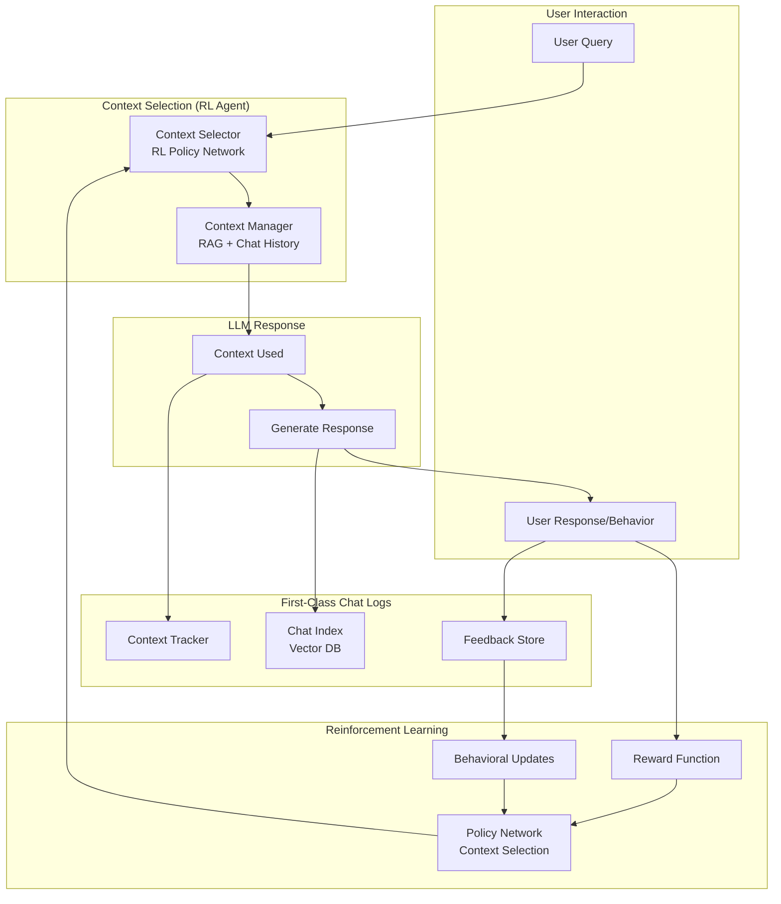
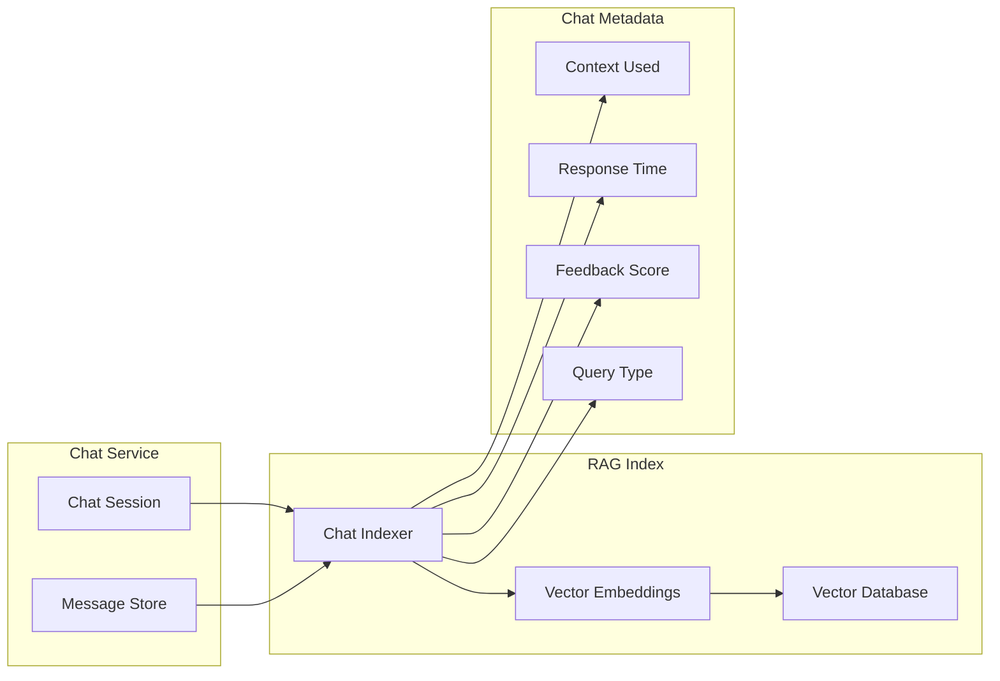
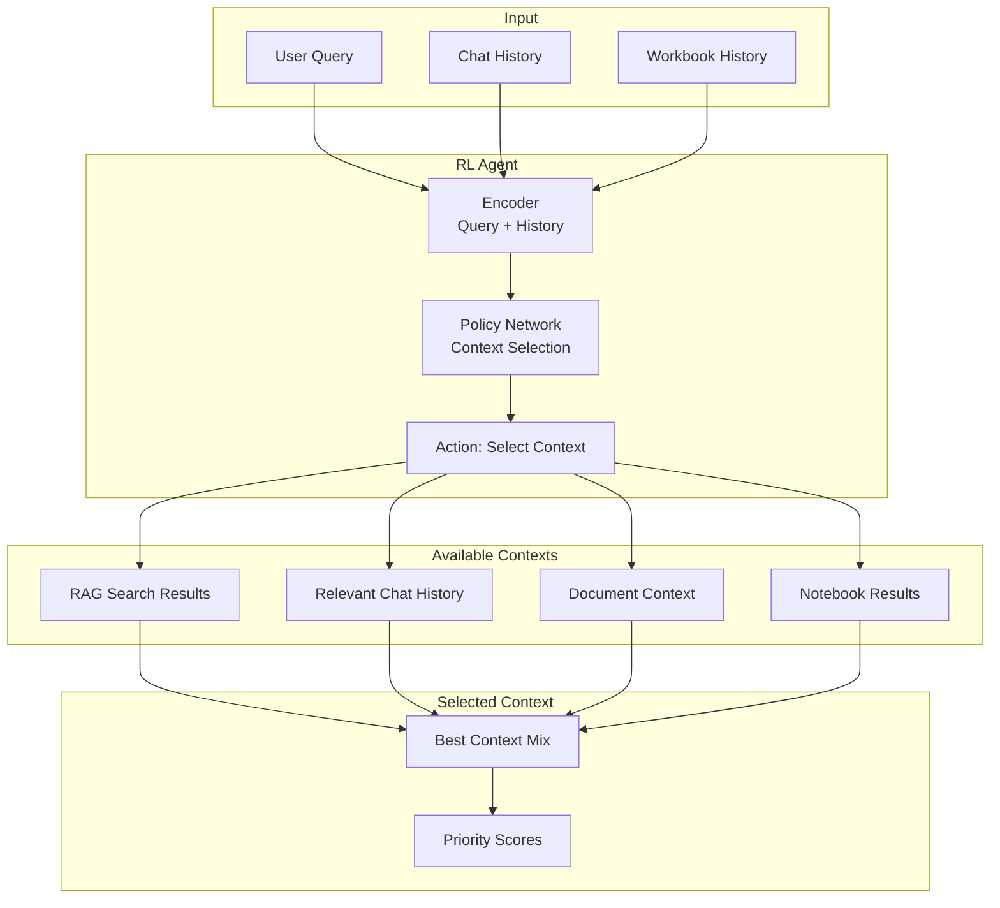
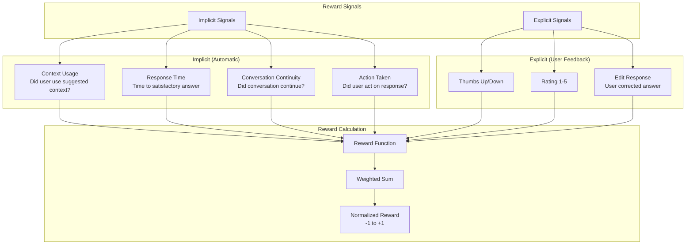
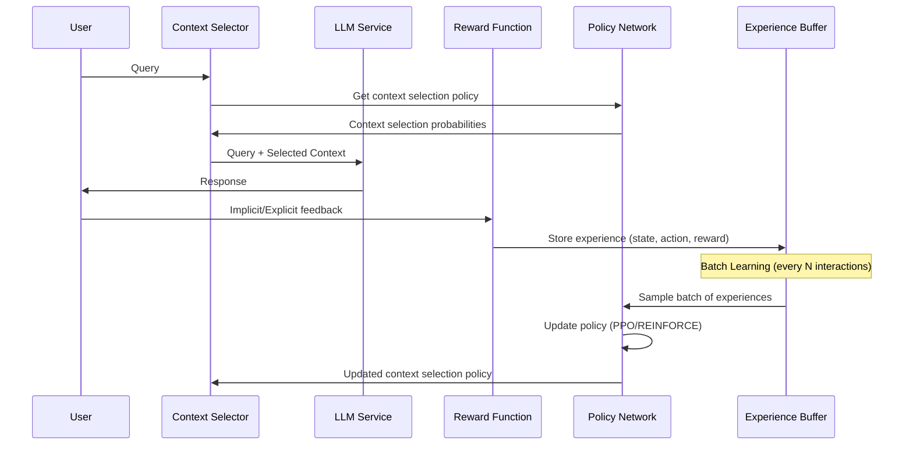
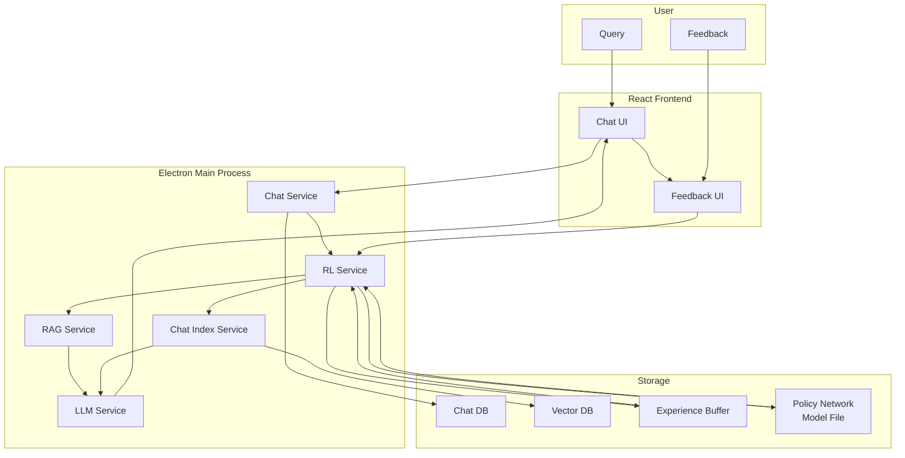
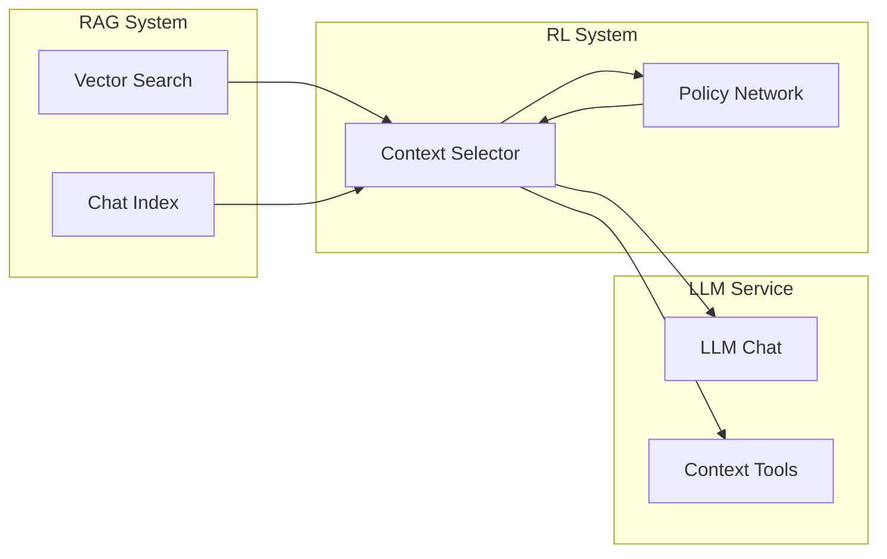
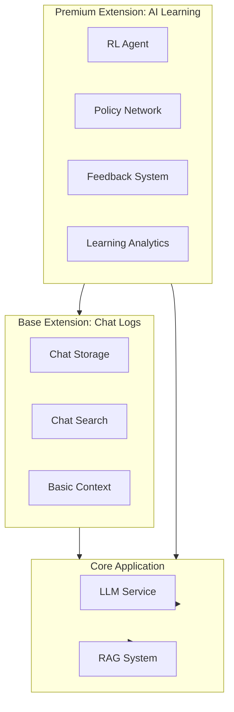

# Reinforcement Learning Architecture for insightLM-LT

**Date:** 2025-01-15
**Status:** Strategic Planning Document
**Extension Type:** 🏆 **Premium Extension**
**Goal:** Make chat logs first-class citizens and enable the tool to learn from interactions to improve context management and response quality over time.

---

## Executive Summary

Currently, chat logs are "last-class citizens" - they're stored but not actively used to improve the system. This document outlines a reinforcement learning (RL) architecture that will:

1. **Elevate chat logs to first-class status** - Index, search, and learn from every interaction
2. **Learn from user behavior** - Understand which contexts lead to successful outcomes
3. **Improve context selection** - Automatically choose the most relevant context for each query
4. **Adapt over time** - The tool becomes smarter with each interaction

---

## Current State Analysis

### Chat Log Storage (Current)

```typescript
// electron/services/chatService.ts
- Chats stored as JSON files per session
- Basic message storage (role, content, timestamp)
- No indexing or searchability
- Not integrated with RAG system
- No learning or feedback mechanisms
```

### Context Management (Current)

```typescript
// electron/services/llmService.ts
- RAG search available but not always used
- Context selection is manual or basic
- No tracking of which contexts led to successful responses
- No feedback loop for context quality
```

### Gaps

1. ❌ Chat logs not indexed in RAG system
2. ❌ No feedback mechanism (implicit or explicit)
3. ❌ No context selection learning
4. ❌ No reward signal tracking
5. ❌ No model fine-tuning or adaptation

---

## Reinforcement Learning Architecture

### High-Level Overview



### Core Components

#### 1. **Chat Log Indexing (First-Class Citizens)**

**Goal:** Make every chat interaction searchable and learnable.



**Implementation:**
- Index every chat message (user + assistant) in RAG system
- Store metadata: context used, response quality, user behavior
- Enable semantic search over chat history
- Link chats to workbooks, documents, and contexts

#### 2. **Context Selection RL Agent**

**Goal:** Learn which contexts lead to the best responses.



**Policy Network Architecture:**
- **Input:** Query embedding + user history + available contexts
- **Output:** Probability distribution over context combinations
- **Action Space:** Select N contexts from available pool
- **Reward:** Based on user satisfaction and response quality

#### 3. **Reward Function**

**Goal:** Define what "good" means for the system.



**Reward Components:**

1. **Implicit Rewards:**
   - **Context Relevance:** +0.3 if user references context in follow-up
   - **Response Acceptance:** +0.5 if user doesn't ask for clarification
   - **Action Taken:** +0.7 if user performs action based on response
   - **Quick Resolution:** +0.2 if resolved in ≤2 messages
   - **Context Ignored:** -0.3 if user explicitly rejects context

2. **Explicit Rewards:**
   - **Thumbs Up:** +1.0
   - **Thumbs Down:** -1.0
   - **Rating 5:** +0.8, **Rating 4:** +0.4, **Rating 3:** 0.0, **Rating 2:** -0.4, **Rating 1:** -0.8
   - **Edit/Correction:** -0.5 (indicates wrong answer)

3. **Composite Reward:**
   ```
   R = w1*R_implicit + w2*R_explicit + w3*R_temporal
   where w1=0.4, w2=0.5, w3=0.1
   ```

#### 4. **Learning Loop**

**Goal:** Continuously improve context selection.



**Learning Algorithm Options:**

1. **PPO (Proximal Policy Optimization)**
   - Stable, sample-efficient
   - Good for continuous learning
   - Recommended for production

2. **REINFORCE**
   - Simpler, good for initial implementation
   - Can start here, migrate to PPO

3. **Actor-Critic**
   - Faster convergence
   - More complex implementation

**Recommendation:** Start with REINFORCE, migrate to PPO.

---

## Implementation Phases

### Phase 1: Chat Logs as First-Class Citizens (Week 1-2)

**Goal:** Index and make chat logs searchable.

**Tasks:**
1. ✅ Extend `RAGIndexService` to index chat messages
2. ✅ Create `ChatIndexService` for chat-specific operations
3. ✅ Index all existing chat history
4. ✅ Add chat search to RAG system
5. ✅ Link chats to workbooks and documents
6. ✅ Store chat metadata (context used, response time, etc.)

**Deliverables:**
- Chat messages indexed in vector DB
- Semantic search over chat history
- Chat metadata tracking

### Phase 2: Context Tracking & Feedback (Week 3-4)

**Goal:** Track which contexts are used and gather feedback.

**Tasks:**
1. ✅ Add context tracking to `LLMService`
2. ✅ Store context metadata with each response
3. ✅ Implement implicit feedback signals
4. ✅ Add explicit feedback UI (thumbs up/down, rating)
5. ✅ Create feedback storage system
6. ✅ Build reward calculation service

**Deliverables:**
- Context usage tracking
- Feedback collection (implicit + explicit)
- Reward calculation system

### Phase 3: Context Selection RL Agent (Week 5-8)

**Goal:** Build RL agent for context selection.

**Tasks:**
1. ✅ Design policy network architecture
2. ✅ Implement context encoder (query + history)
3. ✅ Build action space (context selection)
4. ✅ Implement REINFORCE algorithm
5. ✅ Create experience buffer
6. ✅ Add batch learning pipeline
7. ✅ Integrate with LLM service

**Deliverables:**
- RL agent for context selection
- Policy network trained on user interactions
- Improved context selection over time

### Phase 4: Advanced Learning (Week 9-12)

**Goal:** Enhance learning with advanced techniques.

**Tasks:**
1. ✅ Migrate to PPO algorithm
2. ✅ Add multi-armed bandit for exploration
3. ✅ Implement contextual bandits for different query types
4. ✅ Add user preference learning
5. ✅ Create A/B testing framework
6. ✅ Build learning analytics dashboard

**Deliverables:**
- Advanced RL algorithms
- User preference models
- Learning analytics

---

## Technical Architecture

### Data Flow



### Service Architecture

```typescript
// New Services to Create

1. ChatIndexService
   - indexChat(sessionId, messages, metadata)
   - searchChatHistory(query, filters)
   - getRelevantChats(query, limit)

2. RLService
   - selectContext(query, availableContexts)
   - recordExperience(state, action, reward)
   - updatePolicy(batch)
   - getContextSelectionPolicy()

3. FeedbackService
   - recordImplicitFeedback(sessionId, signals)
   - recordExplicitFeedback(sessionId, rating)
   - calculateReward(experience)
   - getFeedbackHistory(sessionId)
```

### Database Schema

```typescript
// Chat Experience Record
interface ChatExperience {
  id: string;
  sessionId: string;
  query: string;
  contextsUsed: string[];  // Context IDs/names
  response: string;
  reward: number;
  feedback: {
    implicit: ImplicitFeedback;
    explicit?: ExplicitFeedback;
  };
  timestamp: Date;
  metadata: {
    responseTime: number;
    queryType: string;
    workbookId?: string;
  };
}

// Policy Network State
interface PolicyState {
  version: string;
  modelPath: string;
  trainingData: {
    totalExperiences: number;
    averageReward: number;
    lastUpdated: Date;
  };
  hyperparameters: {
    learningRate: number;
    batchSize: number;
    explorationRate: number;
  };
}
```

---

## Integration with Existing Systems

### RAG System Integration



**Changes Needed:**
- Extend RAG to index chat messages
- Add chat search endpoint
- Integrate RL context selector into RAG search flow

### LLM Service Integration

```typescript
// Updated LLMService.chat() flow

async chat(messages: LLMMessage[]): Promise<string> {
  // 1. Get query from last user message
  const query = messages[messages.length - 1].content;

  // 2. RL Agent selects contexts
  const selectedContexts = await rlService.selectContext(
    query,
    await this.getAvailableContexts()
  );

  // 3. Retrieve contexts
  const contextData = await this.retrieveContexts(selectedContexts);

  // 4. Generate response with selected contexts
  const response = await this.chatWithToolsOpenAI(
    messages,
    contextData
  );

  // 5. Track context usage (for learning)
  await this.trackContextUsage(query, selectedContexts, response);

  return response;
}
```

---

## Model Options

### Option 1: OpenAI Fine-Tuning (Recommended for MVP)

**Approach:** Fine-tune GPT-3.5/GPT-4 on chat history with context selection patterns.

**Pros:**
- Leverages OpenAI's infrastructure
- No local model training needed
- Good performance out of the box

**Cons:**
- Requires sending data to OpenAI
- Ongoing API costs
- Less control over learning

**Implementation:**
- Collect training data (query, contexts, reward)
- Fine-tune model periodically (weekly/monthly)
- Use fine-tuned model for context selection

### Option 2: Local RL Model (Recommended for Production)

**Approach:** Train a small neural network locally using PyTorch/TensorFlow.js.

**Pros:**
- Complete privacy (no data leaves device)
- Full control over learning
- No ongoing API costs
- Can run offline

**Cons:**
- Requires local model training infrastructure
- More complex implementation
- Need to handle model updates

**Implementation:**
- Use TensorFlow.js or PyTorch (via Python MCP server)
- Train policy network on device
- Store model locally, update periodically

### Option 3: Hybrid Approach (Best of Both Worlds)

**Approach:** Use OpenAI for initial context selection, learn patterns locally, fine-tune periodically.

**Pros:**
- Best performance (OpenAI) + privacy (local learning)
- Gradual migration path
- Can A/B test approaches

**Cons:**
- Most complex implementation
- Requires both systems

**Implementation:**
- Start with OpenAI-based selection
- Collect experiences locally
- Train local model in background
- Gradually shift to local model
- Periodically fine-tune OpenAI model

**Recommendation:** Start with Option 1 (OpenAI Fine-Tuning) for MVP, migrate to Option 2 (Local RL) for production.

---

## Privacy & Security Considerations

### Data Privacy

1. **Local-First Learning:**
   - All learning happens on-device
   - Chat logs never leave user's machine
   - Only aggregated metrics (optional) sent for analytics

2. **User Control:**
   - Opt-in for learning from chats
   - Ability to delete chat history
   - Ability to reset learned preferences

3. **Data Minimization:**
   - Only store necessary data for learning
   - Anonymize sensitive information
   - Allow user to exclude specific chats from learning

### Security

1. **Model Security:**
   - Validate model updates before applying
   - Sign model files
   - Rollback capability

2. **Feedback Security:**
   - Validate feedback signals
   - Prevent feedback manipulation
   - Rate limit feedback submissions

---

## Success Metrics

### Learning Metrics

1. **Context Selection Accuracy:**
   - % of times selected context is relevant (user feedback)
   - Average reward per interaction
   - Improvement over time

2. **Response Quality:**
   - User satisfaction scores
   - Conversation resolution time
   - Action success rate

3. **System Performance:**
   - Context selection latency
   - Model training time
   - Storage usage

### Business Metrics

1. **User Engagement:**
   - Chat usage frequency
   - Session length
   - Return rate

2. **Productivity:**
   - Time to answer
   - Questions resolved per session
   - User-reported productivity gains

---

## Future Enhancements

### Advanced Learning

1. **Multi-Task Learning:**
   - Learn different policies for different query types
   - Specialized context selection for code, analysis, writing, etc.

2. **Transfer Learning:**
   - Learn from similar users (anonymized)
   - Pre-trained models for common domains

3. **Meta-Learning:**
   - Learn to learn (adapt quickly to new domains)
   - Few-shot learning for new contexts

### Personalization

1. **User Profiles:**
   - Learn individual user preferences
   - Adapt to user's work style
   - Personal context selection

2. **Domain Adaptation:**
   - Learn domain-specific context patterns
   - Adapt to user's industry/field
   - Specialized models per domain

### Collaboration

1. **Team Learning:**
   - Learn from team interactions (with permission)
   - Shared context selection models
   - Team-specific improvements

2. **Knowledge Sharing:**
   - Share learned patterns across teams
   - Community models (opt-in)
   - Best practice context selections

---

## Implementation Roadmap

### Q1 2025: Foundation
- ✅ Chat log indexing
- ✅ Feedback collection
- ✅ Basic context tracking

### Q2 2025: RL Agent
- ✅ Policy network implementation
- ✅ REINFORCE algorithm
- ✅ Experience buffer
- ✅ Initial learning loop

### Q3 2025: Advanced Learning
- ✅ PPO migration
- ✅ Multi-armed bandits
- ✅ User preference learning
- ✅ Analytics dashboard

### Q4 2025: Production
- ✅ Local model training
- ✅ Privacy enhancements
- ✅ Performance optimization
- ✅ User controls

---

## Questions & Decisions

### Q1: Should we use OpenAI's fine-tuning or train locally?

**A1:** Start with OpenAI fine-tuning for MVP (faster), migrate to local training for production (privacy).

### Q2: How often should we update the policy?

**A2:** Continuous learning (update after each batch), but validate before deploying major changes.

### Q3: Should learning be opt-in or opt-out?

**A3:** Opt-in for explicit feedback, opt-out for implicit learning (with clear disclosure).

### Q4: How do we handle cold start (no learning data)?

**A4:** Use rule-based context selection initially, gradually shift to learned policy as data accumulates.

### Q5: Should we learn from all users or per-user?

**A5:** Both - per-user learning for personalization, aggregated learning for general improvements.

---

## Extension Strategy

### Premium Extension: "AI Learning & Context Optimization"

This reinforcement learning capability is designed as a **Premium Extension** that users can purchase to unlock advanced AI learning features.

#### Extension Tiers

**Base Extension (Included):**
- Basic chat log storage
- Simple context selection (rule-based)
- Chat history search

**Premium Extension (Paid):**
- ✅ Reinforcement learning for context selection
- ✅ Automatic learning from user interactions
- ✅ Advanced feedback collection (implicit + explicit)
- ✅ Personalized context selection
- ✅ Learning analytics dashboard
- ✅ Model fine-tuning capabilities
- ✅ Multi-task learning (different policies per query type)

#### Pricing Model

**Options:**
1. **One-time purchase** - Lifetime access to learning features
2. **Subscription** - Monthly/yearly subscription for ongoing model updates
3. **Usage-based** - Pay per model training cycle or per learning session

**Recommended:** Hybrid - One-time purchase for core features + optional subscription for cloud model updates and advanced analytics.

#### Extension Benefits

**For Users:**
- Tool gets smarter with every interaction
- Better context selection = better responses
- Privacy-preserving (local learning)
- Measurable productivity improvements

**For Business:**
- Recurring revenue stream
- Differentiating premium feature
- Justifies higher pricing tier
- Creates user lock-in through personalization

#### Integration with Extension System



**Extension Manifest:**
```typescript
{
  id: "ai-learning-premium",
  name: "AI Learning & Context Optimization",
  version: "1.0.0",
  type: "premium",
  description: "Advanced reinforcement learning for intelligent context selection",
  features: [
    "reinforcement-learning",
    "context-optimization",
    "learning-analytics",
    "personalization"
  ],
  licenseRequired: true,
  mcpServer: {
    path: "extensions/ai-learning/mcp-server",
    enabled: true
  }
}
```

## Conclusion

This architecture transforms insightLM-LT from a static tool into a learning system that improves with every interaction. By making chat logs first-class citizens and implementing reinforcement learning for context selection, the tool will become increasingly effective at understanding user needs and providing relevant context.

**Key Benefits:**
- 📈 Continuously improving context selection
- 🎯 Better responses over time
- 🔒 Privacy-preserving (local learning)
- 🚀 Scalable architecture
- 📊 Measurable improvements
- 💰 **Premium extension revenue opportunity**

**Business Value:**
- Differentiating premium feature
- Recurring revenue potential
- User lock-in through personalization
- Justifies higher pricing tier

**Next Steps:**
1. Review and approve architecture
2. Design extension manifest and licensing integration
3. Begin Phase 1 implementation (chat indexing - base extension)
4. Set up feedback collection infrastructure
5. Design and implement RL agent (premium extension)
6. Create extension purchase/activation flow

---

**Document Status:** Ready for Review
**Extension Classification:** Premium Extension
**Next Review Date:** After Phase 1 completion

