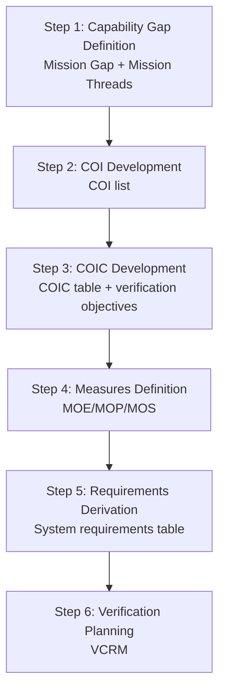
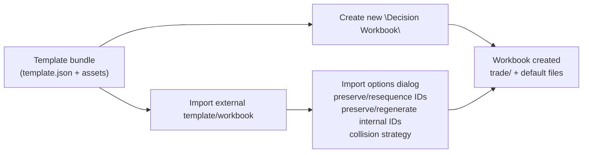

# Trade Space Workflow & Extensions (MTA / COIC) — Notes for MVP + Roadmap

This document captures an internal design discussion for how InsightLM‑LT can support a rigorous, study-driven systems engineering workflow for MTA programs while staying lightweight for MVP (v1.0).

It builds on:
- `docs/Customer_UseCase/mta_se_approach.md`
- `docs/Customer_UseCase/quick_guilde.md`

## Goals

- **Translate “talk” into study**: capture stakeholder language in a structured form that can be studied rigorously (DOE/UQ, sensitivity, feasibility, trade-offs).
- **Support MTA reality**: begin with existing materiel solution capability, desirements (aimpoints), and trade space—not spec-first “shall” statements.
- **Walk-up maturity**: start with a **light lane** (simple outputs people can absorb) while running a **heavy lane** (rigorous studies) in the background.
- **Traceability without bureaucracy**: keep the artifacts connected (COI → COIC → Measures → Requirements → VCRM), but avoid heavyweight workbenches in MVP.

## Non-goals (for v1.0 MVP)

- A full formal Requirements Workbench / Ontology Workbench UI (ODRAS-scale).
- Full MCDA UI or “merge semantics” for imports (can be roadmap).
- Full SysMLv2 modeling workbench (possible future extension).

## Key decisions from the thread

- **Canonical object model lives in the sheet**:
  - LuckySheet-based “Insight Sheet” (`.is`) is the **source of truth** for IDs and fields.
  - Notebooks produce **derived** outputs only (never authoritative).
- **Requirements live in the sheet**:
  - Keeps it easy for non-technical users to see and edit.
  - Export capability (CSV/Excel/SysMLv2) can come later.
- **Human-readable IDs are default** with optional auto-fill:
  - e.g., `COI-001`, `COIC-003`, `MEAS-014`, `REQ-007`.
- **Templates are the right UX**:
  - A “Decision Workbook” / “Analysis Workbook” template can create the default structure and starter files automatically.
  - Template definitions should be **JSON-driven** for easy editing and growth.
- **Import should offer choices**:
  - Preserve vs re-sequence human IDs.
  - Preserve vs regenerate internal stable IDs.
  - Collision strategy (skip/rename/overwrite).

## What the product already has (relevant capabilities)

InsightLM‑LT already includes these primitives that map cleanly to the MTA/COIC workflow:

- **Workbooks** as containers (folders + documents).
- **Insight Sheets (`.is`)**: LuckySheet viewer for a structured, spreadsheet-like artifact.
- **Jupyter Notebooks (`.ipynb`)**: embedded notebook viewer with a Jupyter MCP server for cell execution.
- **Markdown documents (`.md`)**: easy for recommendation documents and decision memos.
- **Dashboards**: a lightweight tile-based view to surface key results for leadership (optional for v1).

## Mapping the Customer Use Case process to app artifacts

From `quick_guilde.md`, the capability definition pipeline can be represented as:

- **Step 1: Capability Gap Definition**
  - Artifact(s): `mission_gap.md`, `mission_threads.is` (or a tab inside a single canonical sheet)
- **Step 2: COI Development**
  - Artifact(s): COI tab in `trade-model.is`
- **Step 3: COIC Development**
  - Artifact(s): COIC tab in `trade-model.is`
- **Step 4: Measures Definition (MOE/MOP/MOS)**
  - Artifact(s): Measures tab in `trade-model.is`
- **Step 5: System Requirements Derivation**
  - Artifact(s): Requirements tab in `trade-model.is`
- **Step 6: Verification Planning (VCRM)**
  - Artifact(s): VCRM tab in `trade-model.is`

From `mta_se_approach.md`, additional MTA-specific artifacts are needed:

- **Desirements (aimpoints) + tolerance bands**
- **Trade options and decisions** (A/B/C/D and rationale)
- **Decision documentation** with residual risk/impact

## The “two-lane” workflow (light + heavy)

### Light lane (what most stakeholders can handle)

- Fill in a canonical sheet (COIs/COICs/measures/requirements/VCRM/options/decisions).
- Produce a **Recommendation / Decision memo** (markdown) with:
  - current capability (as-is),
  - gaps framed as trade opportunities,
  - chosen option(s) and why,
  - residual risk,
  - and a planned next step section (“Pareto/drivers/feasibility studies to run next”).

### Heavy lane (your rigor, in-app)

- Use a notebook to run:
  - space exploration (e.g., grids, LHC),
  - sensitivity (e.g., Sobol),
  - feasibility mapping,
  - optimization (e.g., genetic) if needed.
- Persist derived outputs back into the workbook:
  - `results/summary.json` (machine-readable)
  - `results/*.csv` (tables)
  - `results/plots/*.png` (figures)

## Canonical object model (sheet tabs + IDs)

This is the minimal set of “objects” that should exist as rows in the canonical sheet.

- **Mission Thread**: `MT-###`
- **COI**: `COI-###` (yes/no question; linked to `MT-###`)
- **COIC**: `COIC-###` (criterion; linked to `COI-###`)
- **Measure**: `MEAS-###` (MOE/MOP/MOS + units + calc/source; linked to `COIC-###`)
- **Desirement** (optional but strongly aligned to MTA): `DES-###` (aimpoint + bands/ranges; linked to `COIC`/`Measure`)
- **Requirement**: `REQ-###` (derived; linked to `COIC-###` + `MEAS-###`)
- **VCRM row**: `VCRM-###` (verification method + evidence; linked to `REQ-###`)
- **Option**: `OPT-###` (A/B/C/D; linked to impacted `COIC/REQ`)
- **Decision**: `DEC-###` (authority + rationale + residual risk; linked to `OPT-###`)

### Notes on IDs

- Human IDs are **default** and should be editable.
- Auto-fill can be offered as a helper to assign missing IDs without overwriting existing ones.

## Recommended v1 workbook layout

Within a workbook, create a stable folder for trade-space work:

- `trade/`
  - `trade-model.is` (canonical)
  - `trade-study.ipynb` (heavy lane)
  - `recommendation.md` (light lane deliverable)
  - `results/` (derived artifacts)

## Recommendation doc (v1) structure

The “deliverable” for v1 is a markdown doc that is LLM-assisted but evidence-grounded:

- **Executive summary**
- **Existing capability baseline** (as-is, what exists today)
- **Capability gaps framed as trades** (not “deficiencies”)
- **COIs / COICs overview** (what matters, how judged)
- **Options considered** (A/B/C/D framing)
- **Decision + rationale**
- **Residual risk / impacts**
- **Planned analyses (walk-up plan)**:
  - driver identification,
  - feasibility mapping,
  - Pareto exploration,
  - sensitivity/UQ,
  - and (future) export to clusters/grid.

## Template system concept (JSON-driven)

### Why templates

Templates reduce friction and enforce consistent structure so that:
- Stakeholders can use familiar forms (sheet tabs, simple columns).
- Notebook automation can reliably read canonical data.
- Recommendation docs can be generated consistently.

### Template definition (concept)

Templates should be described by a small JSON manifest and optional assets:
- `template.json`
- `assets/` containing starter `.is`, `.ipynb`, `.md`, and any helper files.

The manifest should support:
- workbook creation (name pattern),
- folder creation,
- file creation (inline content or from assets),
- (future) dashboard creation,
- (future) post-create instructions.

## Import/Export roadmap (design notes)

### Import options (user-facing)

At import time, provide explicit choices:

- **Human-readable IDs** (`COI-001`, `REQ-007`, etc.)
  - preserve (default)
  - re-sequence (for merges)
- **Internal stable IDs** (docIds, workbookId)
  - regenerate (default)
  - preserve (for round-trip restore)
- **Collision strategy**
  - skip / rename / overwrite

### Export

Two export flavors:

- **Template export**: ships `template.json` + assets (no program-specific content).
- **Workbook export**: ships a workbook bundle (canonical + derived artifacts) for sharing/reuse.

## Mermaid diagrams

### Architecture overview (canonical vs derived)

### Process mapping (Quick Guide steps)

### Template lifecycle (create + import)

## Gaps to address (post-MVP / extensions)

These are the minimal missing pieces that unlock the workflow described above:

- **Sheet-aware context provider**: provide canonical sheet rows to the LLM when drafting `recommendation.md` (currently stubbed in extensions).
- **Notebook-results context provider**: provide `results/summary.json` (and optionally key plots/tables) as LLM context (currently stubbed in extensions).
- **Template execution**: apply a JSON template manifest to create a workbook with default structure and starter artifacts.
- **Import/export**: bundle/rehydrate templates and workbooks with the import-time options described above.

## Notes on Mermaid syntax

When node text contains special characters (parentheses, quotes, etc.), wrap text in double quotes:
- Example: `F["see(bbbf)"]`

