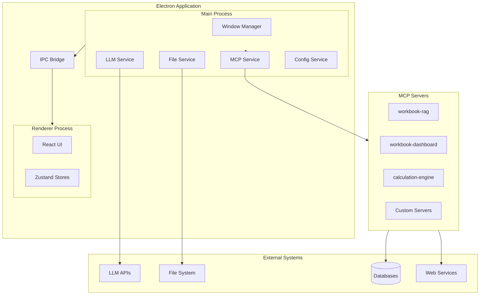
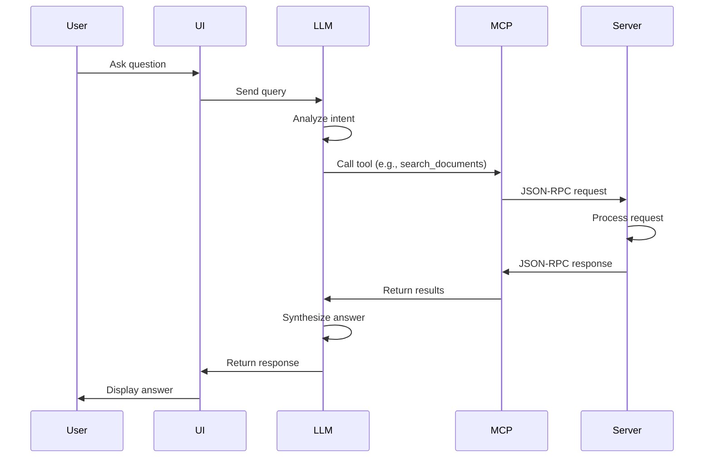
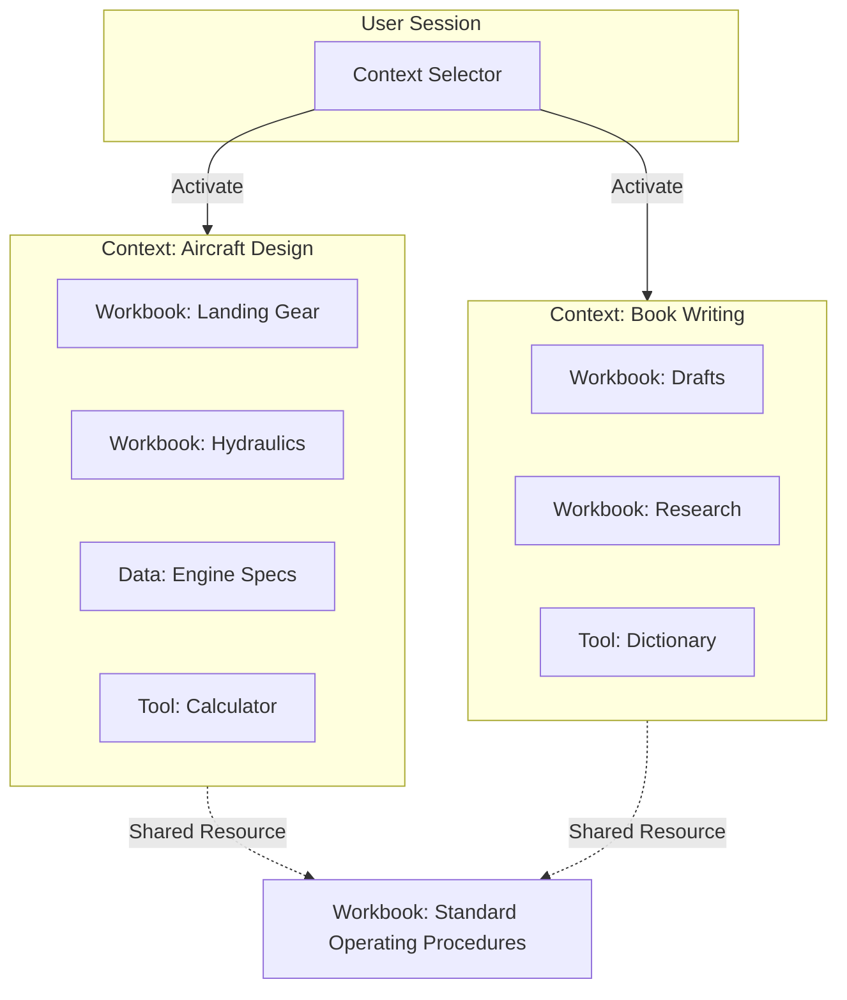
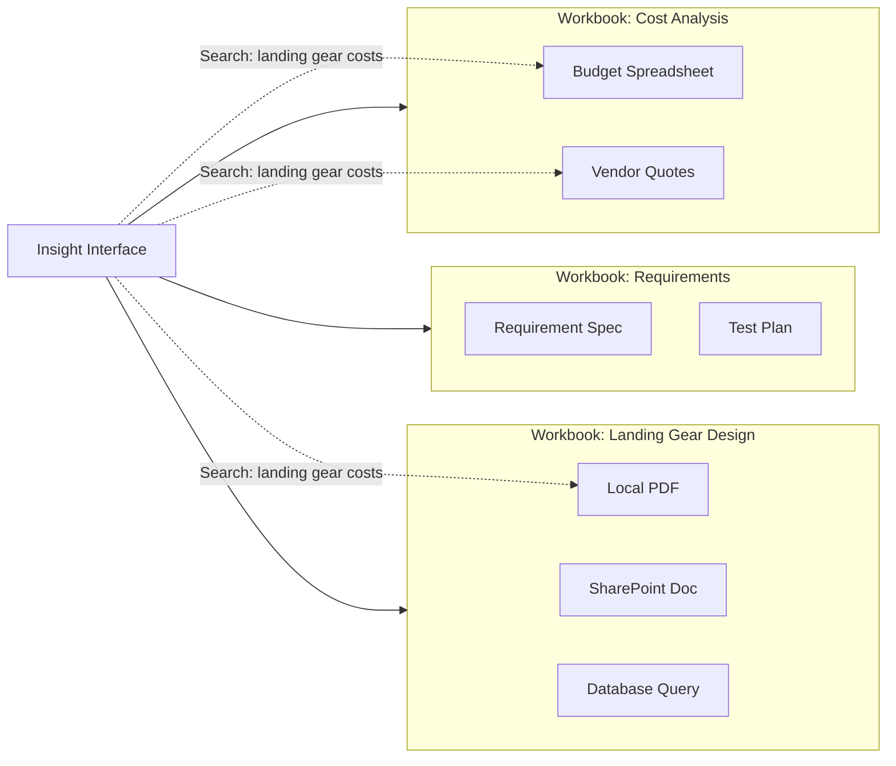
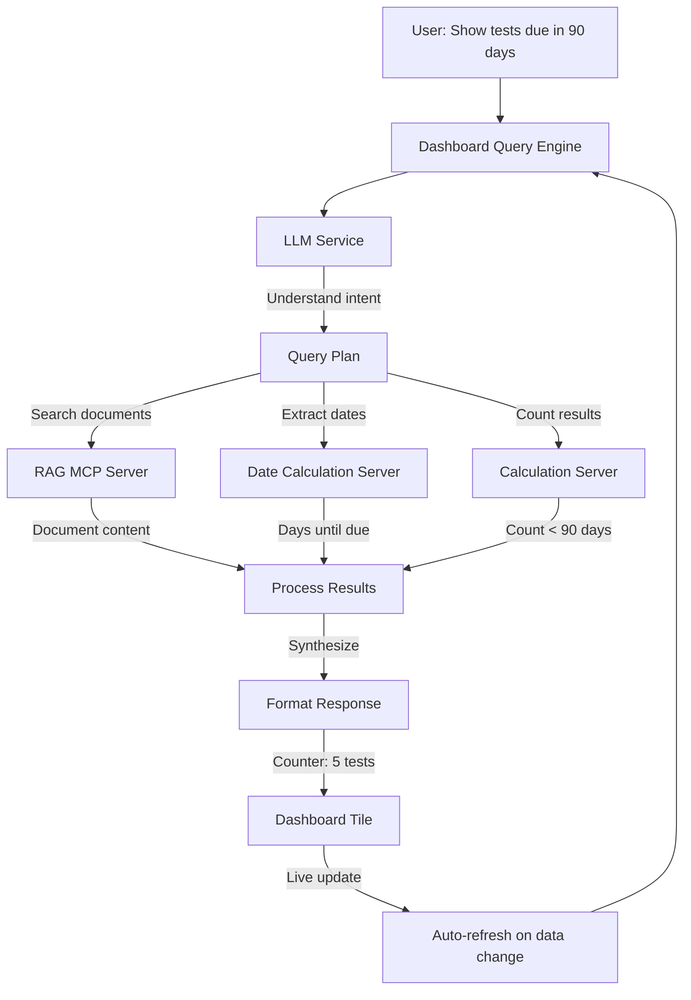
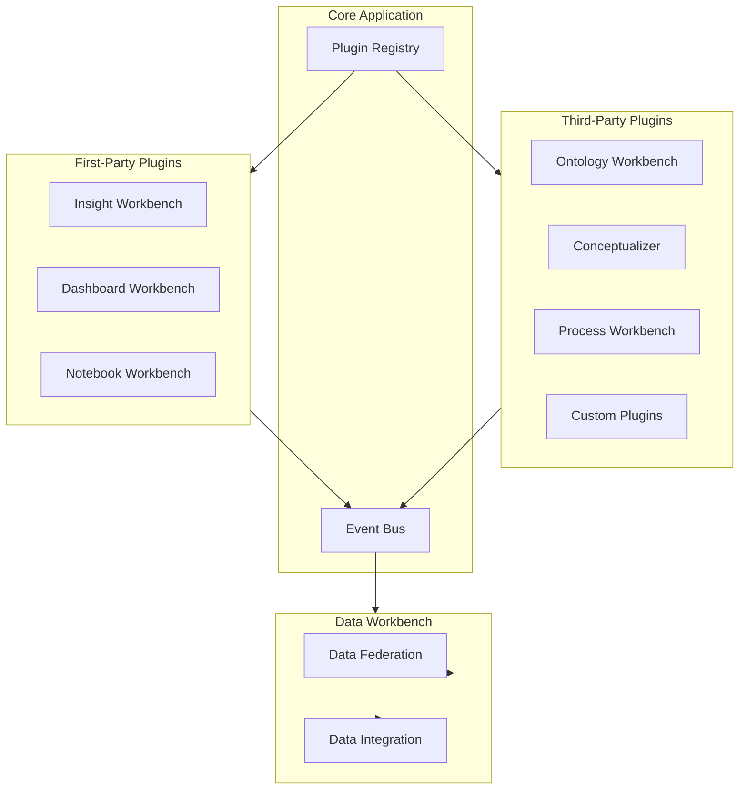
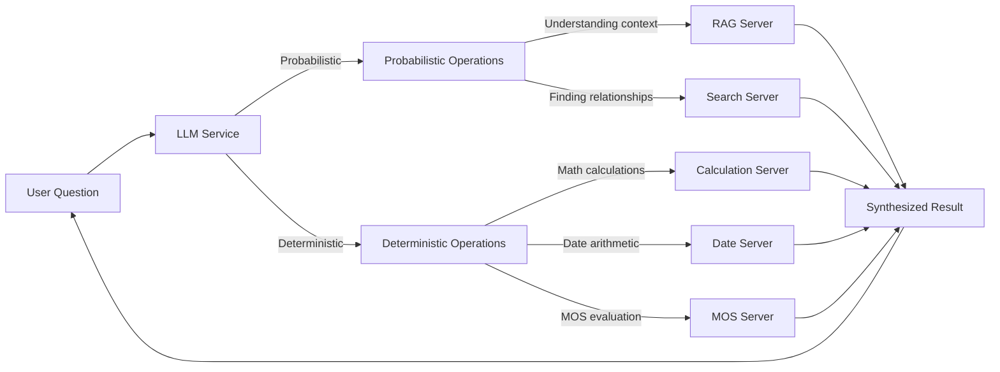

# Insight LM-LT: A Vision for Personal Knowledge Management and Design

## Introduction

Insight LM-LT represents a fundamental reimagining of how individuals interact with their work, their data, and their creative processes. Born from frustration with overly complex development environments and fragmented information systems, this lightweight desktop application seeks to provide a unified platform where users can organize, understand, and build upon their accumulated knowledge. The "LT" designation—standing for "Light"—reflects our commitment to simplicity and focus, a deliberate departure from the feature bloat that characterizes many modern development tools.

The core premise is elegantly simple: people need better ways to track what they're doing, understand relationships between disparate pieces of information, and leverage artificial intelligence to gain insights that would otherwise remain hidden. Whether designing an aircraft, writing a book, managing a complex project, or simply trying to remember where that important document was saved, Insight LM-LT aims to become the central hub for personal knowledge work.

## The Problem Space

Modern knowledge workers face an increasingly fragmented digital landscape. Information resides in countless locations: local files, cloud storage, databases, web services, SharePoint repositories, and specialized tools. Each system has its own interface, its own way of organizing data, and its own limitations. Finding connections between related pieces of information becomes a manual, time-consuming process. Questions like "Where did I save that cost analysis?" or "What's the relationship between this requirement and that design decision?" require navigating multiple systems and relying on memory.

Traditional solutions fall short in several ways. Integrated development environments like VS Code, while powerful, become overwhelming when trying to integrate too many features. They're designed for code, not for the broader context of knowledge work. Document management systems focus on storage and retrieval but lack the ability to understand content or relationships. Project management tools track tasks but don't help understand the underlying information architecture.

What's missing is a system that understands context, relationships, and meaning—not just storage and retrieval. A system that can answer questions like "What documents mention both the landing gear and the brake system?" or "Show me all the requirements that relate to this component design." A system that grows with the user's needs, from simple file organization to complex ontology-driven design work.

## Architectural Foundation: Electron and Desktop-First Design

Insight LM-LT is built on Electron, a framework that combines Chromium's rendering engine with Node.js's backend capabilities. This choice reflects a deliberate architectural decision: desktop-first, with full access to local resources, file systems, and system capabilities. Unlike web applications constrained by browser security models, Electron applications can directly access local files, spawn processes, and integrate deeply with the operating system.

The Electron architecture provides a clean separation between the user interface—built with React and modern web technologies—and the backend services that handle file operations, data processing, and external integrations. This separation enables a responsive user experience while maintaining the ability to perform computationally intensive operations in background processes. The main process manages application lifecycle, window creation, and service coordination, while renderer processes handle the user interface.

This architecture also enables a crucial capability: the ability to run specialized services as separate processes. These services, implemented as MCP (Model Context Protocol) servers, can be written in any language, use any libraries, and perform any computation without impacting the main application's performance or stability. If one service crashes or encounters an error, the others continue operating normally.

## The MCP Server Architecture: Extensibility Through Specialization

The Model Context Protocol (MCP) server architecture represents one of Insight LM-LT's most powerful design decisions. Rather than building monolithic functionality into the core application, specialized capabilities are implemented as independent servers that communicate via a standardized protocol. This approach provides several critical advantages.

First, it enables true extensibility. New capabilities can be added without modifying core application code. A calculation engine, a document parser, a database connector, or a custom analysis tool can all be implemented as separate MCP servers. Each server has a single, well-defined responsibility, making the system easier to understand, maintain, and extend.

Second, it provides isolation and reliability. If a document parsing server encounters a corrupted file and crashes, the rest of the application continues functioning. The workbook management system, the chat interface, and other servers remain unaffected. This isolation is particularly valuable when integrating with external systems or performing risky operations like parsing untrusted file formats.

Third, it enables language and technology flexibility. MCP servers can be written in Python, Node.js, Go, Rust, or any language that can communicate via standard input/output. This means we can use the best tool for each job: Python for data analysis and scientific computing, Node.js for web integrations, specialized tools for domain-specific tasks.

The protocol itself is elegantly simple: JSON-RPC over standard input/output. Servers declare their capabilities at startup, describing the tools they provide, their input schemas, and their purposes. The main application discovers these servers, registers their tools, and makes them available to the LLM service. When the LLM needs to perform an operation—searching documents, calculating values, querying databases—it calls the appropriate tool, and the server handles the request.

This architecture transforms the application from a fixed set of features into a platform that can grow and adapt to user needs. A user working on aircraft design might add servers for structural analysis and aerodynamic calculations. A writer might add servers for research management and citation tracking. The core application remains lightweight while capabilities expand through specialized servers.

## Workbooks: The Organizational Metaphor

At the heart of Insight LM-LT lies the workbook concept—a flexible container for organizing related information. A workbook can contain:

1.  **Files**: Local PDFs, Markdown documents, images.
2.  **Analysis & Notebooks**: Embedded, executable Jupyter-style notebooks for calculations, simulation, and ML modeling. These are not separate "lab" files; they are integral pages of the workbook itself.
3.  **Data Subscriptions**: Direct links to external data sources (SQL queries, APIs, or published peer data).
4.  **References**: Links to SharePoint, web services, or desktop applications.

The workbook metaphor is intentionally familiar. Like a physical workbook, it's a place to gather related materials. Unlike a physical workbook, it can contain references to resources that exist elsewhere, creating a virtual organization structure that doesn't require copying or moving files.

This approach solves several problems simultaneously. Users don't need to reorganize their existing file structures or duplicate information. They can create logical groupings—"Project Alpha Requirements," "Design Reviews," "Cost Analysis"—that reference files wherever they actually reside. The system tracks these references, maintains relationships, and enables searching and querying across all workbook contents.

The workbook structure also enables context-aware operations. When a user asks a question in the Insight interface, the system can search across all workbooks, understanding not just file names but content, relationships, and context. A question about "landing gear requirements" might find relevant documents across multiple workbooks, showing where each document is located and how it relates to the query.

## Contexts: Focusing Your Environment (Supersedes "Projects")

_Note on Evolution: Initially, this vision considered a rigid "Project" hierarchy—a database entity that would "own" workbooks. We deliberately moved away from this. "Projects" as a separate layer create unnecessary friction and rigidity. Instead, we adopted the more flexible concept of "Active Contexts."_

While workbooks provide flexible containers for organizing information, users need a way to maintain distinct working modes without cognitive overload. Rather than forcing a rigid "Project" structure, Insight LM-LT uses **Active Contexts**. A Context is simply a named state—a saved configuration of which workbooks are open, which data subscriptions are active, and which workbooks are visible.

This approach addresses the fundamental challenge of knowledge work: context switching.

Consider a user who works on multiple distinct endeavors: designing an aircraft landing system, managing a software development project, and writing a technical book. Each of these represents a different **Context**.

When a user switches to the "Aircraft Design Context," the system instantly reconfigures:

1.  **Active Workbooks**: Only relevant workbooks (Landing Gear, Requirements, Hydraulics) remain open.
2.  **Workbench Layout**: Tools specific to engineering (Calculation Engine, CAD Viewer) appear; writing tools disappear.
3.  **Data Scope**: The Insight engine restricts its attention _only_ to the data and files within this active set.

The next day, switching to the "Book Writing Context" clears the desk. The "Hydraulics" workbook closes, the "Drafts" and "Research" workbooks open, and the interface shifts to support writing. The Insight tool forgets about landing gear dynamics and focuses solely on the narrative structure of the book.

This "Context" model provides the benefits of project organization—focus, isolation, and customization—without the overhead of managing a database of projects. It allows for flexible associations: a "Standard Parts" workbook can exist in both the "Aircraft Design" context and a separate "Inventory Management" context simultaneously, without needing to be duplicated or moved.

## The Insight Interface: Beyond Chat

The Insight interface—currently labeled as "Chat" but more accurately described as an intelligent query and understanding system—represents the primary way users interact with their accumulated knowledge. This interface goes far beyond simple question-and-answer interactions. It enables users to explore relationships, discover connections, and gain insights that wouldn't be apparent through traditional search.

When a user asks "Where is my OpenAI cost analysis?" the system doesn't just search filenames. It searches document content, understands context, and provides not just the location but relevant excerpts showing why the document matches. It can answer follow-up questions, explore relationships between documents, and help users understand how different pieces of information connect.

The Insight interface leverages large language models not as a replacement for search, but as an intelligent layer that understands intent, context, and relationships. When searching for information about a specific component, the system can understand that "landing gear" and "main gear" might refer to the same thing in different documents. It can identify when documents discuss related topics even if they use different terminology. It can synthesize information from multiple sources to provide comprehensive answers.

This capability becomes particularly powerful when combined with the project structure, workbook organization, and MCP server architecture. When operating within a project context, the system searches only that project's workbooks and notebooks, ensuring that answers remain relevant to the current work. The system can search across local files, query databases, access external services, perform calculations, and synthesize results—all within the project's boundaries. The LLM orchestrates these operations, calling appropriate tools, processing results, and presenting coherent answers that reflect the current project context.

## The Dashboard: Intelligent Summarization Through Live Queries

The dashboard workbench represents a sophisticated approach to information summarization that goes far beyond traditional dashboard tools. Rather than requiring users to manually configure charts, graphs, and indicators by clicking through interfaces and selecting data sources, the dashboard leverages the same intelligent query capabilities that power the Insight interface. Users describe what they want to see in natural language, and the system builds appropriate visualizations dynamically.

When a user asks the dashboard to show "how many tests are due within 90 days," the system doesn't simply display a static number. Instead, it uses the same MCP servers and tools that the Insight interface uses—searching documents, parsing dates, performing calculations, and understanding context. The dashboard query engine formulates an appropriate question, calls the necessary tools to gather current data, processes the results, and generates a visualization that reflects the current state of the user's information.

This approach means that dashboard elements are always live, always current, and always based on the actual data available. A counter showing "components with MOS below threshold" doesn't rely on manually maintained spreadsheets or pre-configured queries. It searches the current workbook contents, identifies relevant documents, extracts margin of safety values, compares them against thresholds, and displays the current count. If new documents are added or existing documents are updated, the dashboard automatically reflects those changes the next time it refreshes.

The dashboard supports multiple visualization types, each intelligently generated based on the nature of the data and the user's intent. Counter tiles display single values with appropriate context—not just "5" but "5 tests due within 90 days" with severity indicators. Graph tiles automatically determine appropriate chart types—bar charts for categorical comparisons, line charts for trends over time, pie charts for distributions. Table tiles extract structured data from documents and present it in organized formats. Date tiles show temporal information with context about urgency or deadlines. Color tiles provide status indicators that reflect the current state of systems or processes.

The intelligence extends to how visualizations are constructed. When asked to show "budget variance by department," the system doesn't require the user to specify which departments exist or how to calculate variance. It searches documents for budget information, identifies departments mentioned in those documents, extracts budgeted and actual values, calculates variances, and presents the results in an appropriate format. The system understands context—knowing that "variance" in a budget context means the difference between budgeted and actual amounts, and that negative variances typically indicate over-budget situations.

This dynamic, query-driven approach means that dashboards become living summaries of the user's current information state. They don't require maintenance when data structures change or new information sources are added. They adapt automatically to the available data, using the same understanding of context and relationships that powers the Insight interface. A dashboard built for tracking project requirements will automatically incorporate new requirements documents as they're added to workbooks. A dashboard monitoring component margins of safety will reflect updates to design documents without manual reconfiguration.

The dashboard workbench integrates seamlessly with the MCP server architecture, calling the same tools for document search, content extraction, and calculation that the Insight interface uses. This consistency ensures that dashboards and queries provide the same view of information, reducing confusion and ensuring accuracy. When the Insight interface reports that there are three components with low margin of safety, the dashboard counter showing the same information will display the same count, because both are using the same underlying tools and data sources.

This approach transforms dashboards from static reporting tools into dynamic, intelligent summaries that grow and adapt with the user's information. They become a way to maintain situational awareness across complex projects, providing at-a-glance views of critical metrics that are always current and always accurate. Whether tracking test schedules, monitoring budget performance, following requirement coverage, or watching any other aspect of a project, the dashboard provides intelligent, live visualizations that reflect the current state of the user's accumulated knowledge.

## Extensibility Through Workbenches

The workbench concept extends Insight LM-LT's organizational capabilities into specialized domains. A workbench represents a complete mode of operation tailored to specific types of work. The current implementation includes an Insight workbench focused on document management and analysis, but the architecture supports unlimited expansion.

The ontology workbench enables users to build formal knowledge structures—defining concepts, relationships, and rules that govern a domain. This isn't just taxonomy building; it's creating a semantic framework that the system can use to understand relationships and make inferences. In aircraft design, an ontology might define concepts like "Component," "System," "Requirement," and "Test," along with relationships like "implements," "validates," and "depends_on." Once established, the system can use this ontology to understand how requirements relate to components, how tests validate requirements, and how changes in one area might affect others.

The conceptualizer workbench builds upon ontologies to help users design systems. Given a set of requirements and an ontology, the conceptualizer can propose components, functions, and relationships that fulfill those requirements. It can trace proposed designs back to requirements, ensuring traceability. It can identify gaps, conflicts, and opportunities for optimization. This transforms ontology from a static knowledge structure into an active design tool.

The data workbench provides capabilities for managing and integrating data from diverse sources. Users can create data objects that pull from external databases, web services, other workbenches, or workbooks. These data objects can be integrated into federations—unified views that combine information from multiple sources. The LLM can query these federations, perform analysis, and generate insights that wouldn't be possible when data remains siloed.

The process workbench enables modeling and execution of business processes using BPMN (Business Process Model and Notation). Users can define workflows, specify decision points, integrate with external systems, and monitor process execution. This capability transforms Insight LM-LT from a knowledge management tool into a process automation platform, enabling users to not just understand their work but automate it.

Each workbench operates with isolated state, preventing interference between different domains of work. Communication between workbenches occurs through events and shared data structures managed by the data workbench. This architecture enables workbenches to be developed independently, added incrementally, and customized for specific use cases without affecting core functionality.

## The Plugin Architecture: Growing the Platform

The workbench system is implemented through a plugin architecture that enables incremental expansion of capabilities. Plugins can be first-party—shipped with the application—or third-party—developed by users or the community. This architecture transforms Insight LM-LT from an application into a platform.

First-party plugins provide core capabilities: document management, dashboard creation, notebook support, and basic workbenches. These plugins are tightly integrated, well-tested, and maintained as part of the core application. They provide the foundation upon which everything else builds.

Third-party plugins enable specialized capabilities that might be too domain-specific or experimental for core inclusion. An aircraft design firm might develop plugins for specific analysis tools. A research organization might create plugins for citation management and academic workflows. The plugin architecture enables these extensions without requiring modifications to core code.

Plugins communicate through a pub/sub event bus, enabling loose coupling and independent development. A plugin that processes documents can emit events when new documents are added. Other plugins can subscribe to these events and react accordingly—perhaps updating an index, triggering an analysis, or notifying users. This event-driven architecture enables plugins to work together without direct dependencies.

The plugin system also enables users to customize their environment. Users working primarily on writing might enable plugins for research management and citation tracking while disabling plugins for process modeling. Users focused on design might enable ontology and conceptualizer plugins while keeping other capabilities available but not prominent. This customization ensures that the application remains lightweight and focused even as capabilities expand.

## Deterministic Operations: When Accuracy Matters

One of the key insights driving Insight LM-LT's architecture is the recognition that not all operations should be probabilistic. Large language models excel at understanding context, generating text, and making connections, but they're not reliable for mathematical calculations, date arithmetic, or other deterministic operations. The system addresses this through specialized MCP servers that provide guaranteed accuracy.

The calculation engine server performs mathematical operations using Python's NumPy and SciPy libraries, ensuring that calculations are always correct. When a user asks "What is four times four?" the system doesn't rely on the LLM's probabilistic answer. Instead, it calls the calculation engine, which returns a deterministic result. This approach extends to complex operations: matrix calculations, statistical analysis, optimization problems, and engineering computations.

This pattern applies broadly. Date calculations, margin of safety evaluations, budget variance analysis, and other operations that require precision are handled by specialized servers rather than LLMs. The LLM orchestrates these operations, understanding user intent and calling appropriate tools, but the actual computation happens in deterministic systems.

This architecture provides the best of both worlds: the LLM's ability to understand natural language and context, combined with specialized tools' ability to perform accurate computations. Users can ask questions in natural language, and the system will determine when to use probabilistic reasoning and when to use deterministic calculation, seamlessly combining both approaches.

## Deployment and Updates: Desktop Application Considerations

As a desktop application, Insight LM-LT faces different deployment challenges than web applications. Users install the application locally, and updates must be delivered reliably without disrupting their work. The application uses electron-builder to package everything—code, dependencies, Electron runtime, and Node.js—into platform-specific installers.

Auto-update capabilities ensure that users receive improvements and fixes automatically. The system checks for updates on startup and periodically, downloading updates in the background and prompting users to restart when ready. This approach balances the need for current software with the need to avoid disrupting active work.

The packaging process includes MCP servers, configuration files, and all dependencies, ensuring that the application is self-contained and doesn't require users to install Python, Node.js, or other runtime environments separately. This simplifies deployment but requires careful management of dependencies and file sizes.

Code signing becomes important for production deployments, ensuring that users don't encounter security warnings when installing the application. The build process can be configured to sign installers with certificates, providing users with confidence that the software comes from a trusted source.

## Use Cases and Applications

The flexibility of Insight LM-LT's architecture enables diverse applications across many domains. In aircraft design, users can organize requirements documents, design specifications, test plans, and analysis results into workbooks. The ontology workbench helps maintain consistency in terminology and relationships. The conceptualizer proposes design solutions based on requirements. The Insight interface helps find connections between requirements, designs, and tests that might not be immediately apparent.

For writers and researchers, workbooks can contain source materials, notes, outlines, and drafts. The Insight interface helps find relevant sources, understand relationships between ideas, and maintain consistency across long documents. Plugins for citation management, research tracking, and collaboration extend the platform's capabilities.

Project managers can use workbooks to organize project documentation, track requirements, manage stakeholders, and monitor progress. The dashboard workbench provides visualizations of project status. The process workbench enables modeling and automation of project workflows. The Insight interface helps answer questions about project status, dependencies, and risks.

The system's extensibility means that new use cases can be supported through custom plugins and workbenches. A manufacturing company might develop plugins for quality management and process control. A legal firm might create plugins for case management and document analysis. The core platform provides the foundation, and specialized capabilities extend it to meet specific needs.

## Future Directions

The current implementation represents a foundation upon which significant capabilities can be built. The plugin architecture enables incremental expansion without requiring fundamental architectural changes. Several directions show particular promise.

Enhanced ontology capabilities could enable more sophisticated reasoning about relationships and constraints. The system could detect inconsistencies, suggest relationships, and help users build more complete knowledge structures. Integration with external ontologies and knowledge bases could provide starting points and validation.

The conceptualizer workbench could evolve into a more sophisticated design assistant, not just proposing components but evaluating alternatives, optimizing designs, and learning from user feedback. Machine learning could help the system understand user preferences and improve suggestions over time.

The data workbench could expand to support more sophisticated data integration patterns, real-time data streams, and advanced analytics. Integration with business intelligence tools, data warehouses, and analytics platforms could transform Insight LM-LT into a comprehensive data management and analysis platform.

Process automation capabilities could expand beyond BPMN modeling to include workflow execution, task automation, and integration with external systems. The system could become a platform for building custom automation solutions tailored to specific organizational needs.

Collaboration features could enable teams to share workbooks, workbenches, and insights while maintaining appropriate access controls. Version control, conflict resolution, and synchronization capabilities would enable the platform to support team-based work while maintaining the personal knowledge management focus.

## Conclusion

Insight LM-LT represents an ambitious vision: a desktop application that grows from simple file organization into a comprehensive platform for knowledge work, design, and automation. The architecture—built on Electron, extended through MCP servers, organized through workbooks, and expanded through plugins—provides the flexibility needed to support this vision while maintaining simplicity and focus.

The key insight driving the design is that different types of operations require different approaches. Understanding context and relationships benefits from probabilistic reasoning provided by large language models. Mathematical calculations, data operations, and deterministic processes require precise, reliable systems. The architecture enables both, seamlessly combining them to provide capabilities that neither could provide alone.

The extensibility built into every layer—from MCP servers to plugins to workbenches—ensures that the platform can grow to meet diverse needs without becoming bloated or complex. The project structure enables users to maintain multiple distinct working contexts, each with its own configuration and focus. Users can start with simple file organization within a single project and gradually add capabilities, workbenches, and additional projects as their needs evolve. The system remains lightweight and focused while providing a path to sophisticated knowledge management and design capabilities across multiple domains of work.

Whether used for designing aircraft, writing books, managing projects, or exploring any domain where understanding relationships and context matters, Insight LM-LT aims to become an indispensable tool for knowledge work. By combining the power of modern AI with the precision of specialized tools, organized through flexible structures and extended through a plugin architecture, it provides a foundation upon which users can build their own customized knowledge management and design environments.

# Appendix A: Evolving the Project Concept - Workbooks as Context

_Date added: 2025-12-05_

Refining the "Project" definition simplifies the architecture and improves user focus.

## The "Active Context" Model

Instead of "Projects" being a rigid database entity that owns Workbooks, "Project" becomes a concept of **Active Context**.

- **Workbooks as the Unit**: Workbooks (with nested subfolders) are the primary container.
- **Dynamic Scoping**: The user selects which Workbooks are currently "open" or "active" (like spreading specific books on a desk).
- **Focused Insight**: The LLM/Insight tool restricts its context window and RAG search _only_ to the currently active Workbooks. This prevents "knowledge pollution" from unrelated domains (e.g., preventing Aircraft Design rules from leaking into Book Writing queries).

## Benefits

1.  **Simplified Hierarchy**: Removes the need for a separate Project management layer.
2.  **Flexible Associations**: A single Workbook (e.g., "Standard Operating Procedures") can be easily "opened" into multiple different contexts without being rigidly bound to one Project.
3.  **Explicit Control**: The user has direct control over what the AI "sees" at any given moment.

## Grouping for Efficiency: "Contexts"

To support users with larger collections of workbooks (e.g., 20-30), the system will support saved **Contexts**.

- A **Context** is a named collection of active workbooks (e.g., "Aircraft Design Context" or "Novel Writing Context").
- Selecting a Context instantly activates all associated workbooks, effectively "setting the stage" for both the user and the AI.
- This reinforces the mental model: you are defining the **Context Window** for the Insight tool, ensuring it only "knows" what is relevant to the current task.

# Appendix B: Hierarchical Dashboards

_Date added: 2025-12-05_

To improve situational awareness at different levels of granularity, the system will implement a tiered dashboard model.

## 1. Workbook Dashboards (The "Cover Sheet")

Every Workbook can contain its own internal Dashboard.

- **Purpose**: Acts as the "Executive Summary" or "Landing Page" for that specific workbook.
- **Scope**: Visualizes data _only_ from within that workbook (e.g., "12 Requirements Pending" or "3 Drafts In Progress").
- **Usage**: When a user opens a workbook, they see this dashboard first, giving immediate context before diving into individual files.

## 2. The Global Dashboard (The "Control Room")

The top-level Dashboard Workbench remains the central command center.

- **Purpose**: Aggregates information across _all_ currently active Contexts.
- **Flexibility**:
  - Can display custom cross-cutting metrics (e.g., "Total Budget across all Active Projects").
  - Can also pin/embed specific **Workbook Dashboards** for quick reference.
- **User Control**: Users can pin the 3-4 most critical Workbook Dashboards to this global view, while keeping dozens of others accessible but hidden. This allows for a "Heads Up Display" of the most vital information without clutter.

# Appendix C: Data Sovereignty, Federation, and Governance

_Date added: 2025-12-05_

As the system scales from individual use to team collaboration, managing data access and "truth" becomes critical. We adopt a "Peer-to-Peer with Governance" model (conceptually similar to "Napster + Governance").

## 1. Scoped Data Access (The "Checkout" Model)

Just as files are organized into Workbooks, **Data Sources** must be explicitly scoped.

- **The Data Workbench**: Acts as the "Library Catalog" of all available connections (e.g., Corporate SQL Servers, Public APIs, Team Feeds).
- **Workbook Subscription**: Users explicitly "subscribe" a Workbook to a specific data source.
  - _Example_: A "Propulsion Analysis" Workbook might subscribe to the "Q3 Engine Test Data" source.
  - _Benefit_: The LLM and Analysis tools (like Dashboards) only "see" the data relevant to the active context, preventing information overload and **context contamination**.

## 2. The Publishing Model (Distributed Truth)

Insight LM-LT moves away from the "emailing spreadsheets" workflow toward a "Publish and Subscribe" model.

- **Local Sovereignty**: Users work locally on their own machine.
- **Publishing**: When a user completes a unit of work (e.g., "Landing Gear Margin Analysis"), they "Publish" the result.
  - This creates an immutable, versioned data artifact.
- **Governance (The Gate)**: Before a published artifact becomes "Referenceable Truth" for the team, it can pass through an approval process (e.g., Peer Review or Manager Approval sign-off).
- **Subscription**: Other team members can link their workbooks to these "Approved Artifacts."
  - _Upstream Alerts_: If the "Landing Gear" data is updated (v1.1), subscribers receive a notification: "Upstream dependency changed."

## 3. MCP Servers as Data Abstraction Layers

MCP (Model Context Protocol) Servers act as the invisible bridge between raw data and the Insight tool.

- **Abstraction**: The user selects "Engine Test Data" (a logical name). They do not need to know that behind the scenes, an `mcp-sql-server` instance is querying a specific PostgreSQL database.
- **Context-Aware Routing**: When a Workbook is active, the system automatically spins up or connects to the specific MCP servers required by that Workbook's data subscriptions.
- **Security**: This layer handles authentication and query sanitation, ensuring the LLM interacts with data safely.

# Appendix D: The Philosophy of Context Management

_Date added: 2025-12-05_

The fundamental innovation of Insight LM-LT is not its features, but its philosophy: **Context Management is the prerequisite for effective Knowledge Work.**

## 1. The Core Realization

In traditional workflows, "Context" is invisible and unmanaged. It exists only in the user's short-term memory.

- _The Problem_: You are working on "Aircraft Design," but you open an email about "Budget" and a file about "Hiring." Your mental context is polluted.
- _The Result_: Context Creep. Focus is lost, errors are made, and the AI (if you are using one) gets confused because it sees everything at once.

## 2. Activity over Location

We reject the idea that you go to a separate "Analysis Tool" or "Writing Tool."

- **Analysis is not a place you go; it is an activity you do inside a specific context.**
- You don't leave your "Aircraft Design" context to go to a "Math App." You bring the math _to_ the design context.
- By embedding Notebooks, Data, and Documents into the Workbook/Context, we ensure that the activity serves the goal, not the tool.

## 3. The Insight LM-LT Promise

Our tool allows you to **Reify Context**... to turn "what I am thinking about" into a tangible, savable state.

- We manage the context so you can do the work.
- We define the boundaries so the LLM can provide relevant answers.
- We protect your focus so you can produce deep work.
