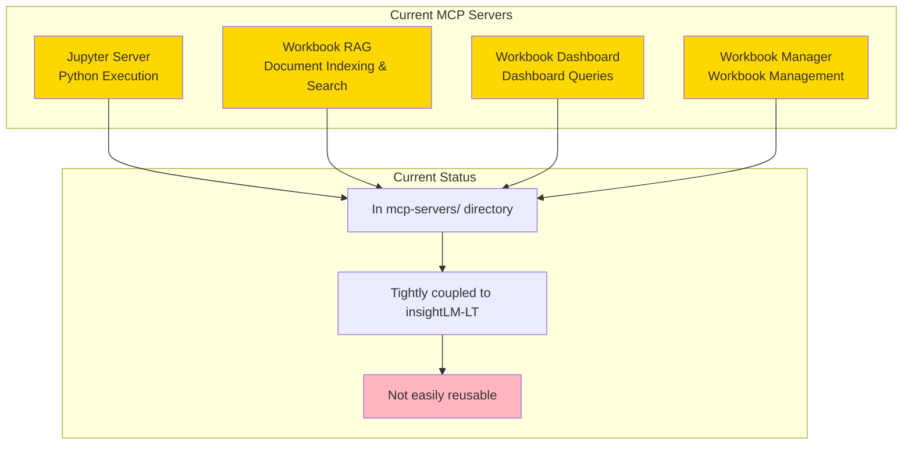
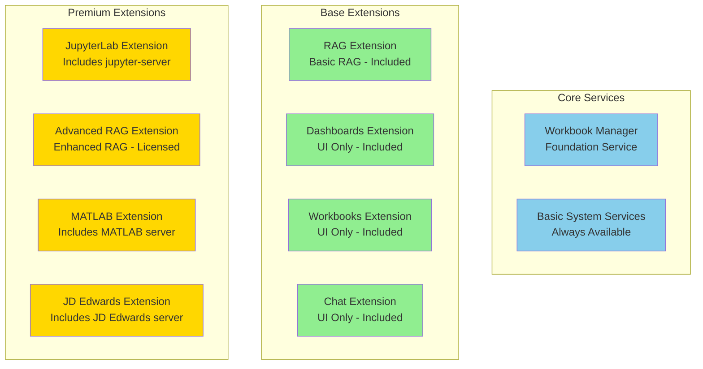
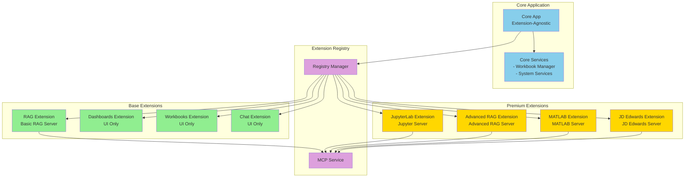
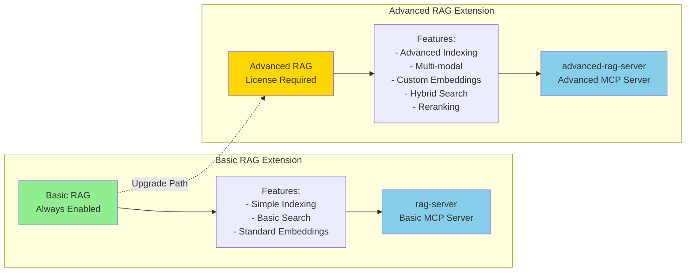
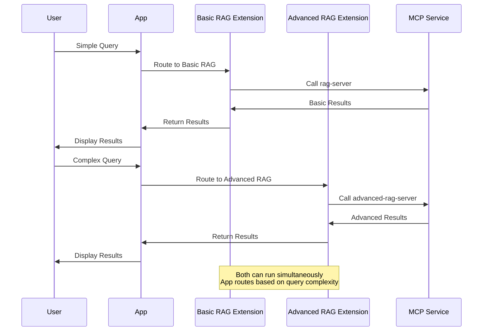
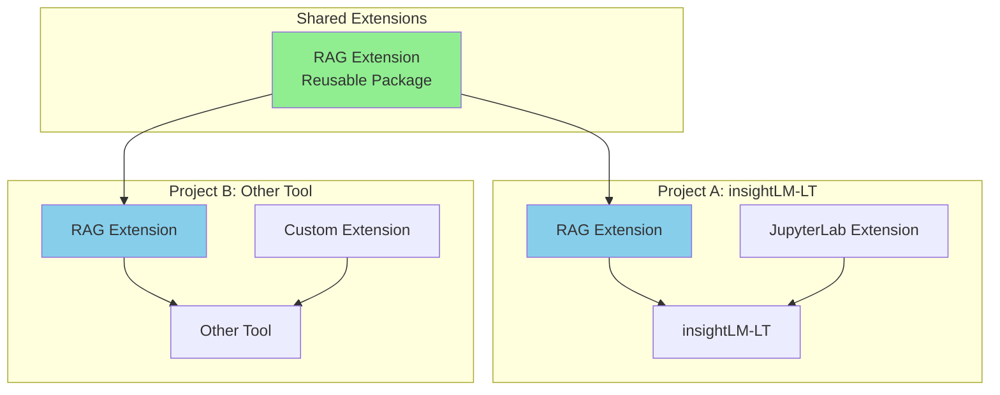
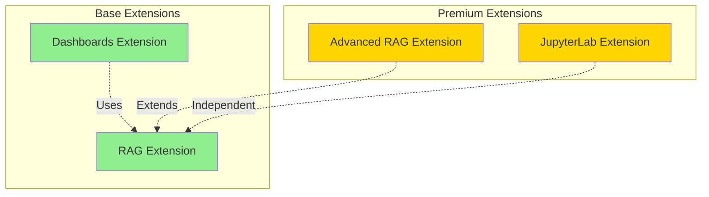

# MCP Server Extension Strategy

## Overview

This document outlines the strategy for converting MCP servers into extensions, determining which servers should remain as core services versus becoming extensions, and establishing a clear architecture for reusability across multiple projects.

## Core Principle

**Maximize Reusability**: MCP servers that provide reusable functionality should be bundled as extensions, making them portable across projects while maintaining clear boundaries between core services and feature extensions.

## Current MCP Servers Analysis

### Existing MCP Servers



## Categorization Strategy

### Core Services vs Extensions



## Detailed Categorization

### Core Services (Not Extensions)

**Workbook Manager**
- **Purpose**: Foundational file and workbook management
- **Reason**: Core infrastructure, always needed
- **Status**: Stays as core service
- **Location**: `electron/services/workbookService.ts`

**Rationale**: This is the foundation of the application. Without it, nothing works. It's not a feature, it's infrastructure.

### Base Extensions (Always Enabled, No License)

#### 1. RAG Extension (Basic)

**Structure:**
```
rag-extension/
├── manifest.json
├── src/
│   └── (UI components if needed)
└── mcp-server/
    ├── server.py
    ├── config.json
    └── requirements.txt
```

**Features:**
- Basic document indexing
- Simple search and retrieval
- Standard embeddings
- Basic query processing

**MCP Server:**
- `rag-server` (basic)
- Handles document indexing
- Provides search/retrieval tools

**Why Extension:**
- Reusable across projects
- Can be upgraded to Advanced RAG
- Clear feature boundaries
- Portable to other tools

#### 2. Dashboards Extension

**Structure:**
```
dashboards-extension/
├── manifest.json
└── src/
    └── DashboardView.tsx
```

**Features:**
- Dashboard UI components
- Visualization components
- Dashboard management

**MCP Server:**
- None (uses existing RAG/LLM services)

**Why Extension:**
- UI-only extension
- Can be enhanced with premium features
- Clear separation from core

#### 3. Workbooks Extension

**Structure:**
```
workbooks-extension/
├── manifest.json
└── src/
    └── WorkbooksView.tsx
```

**Features:**
- Workbook UI components
- File management UI
- Workbook organization

**MCP Server:**
- None (uses core workbook service)

**Why Extension:**
- UI-only extension
- Can add premium workbook features
- Consistent with extension model

#### 4. Chat Extension

**Structure:**
```
chat-extension/
├── manifest.json
└── src/
    └── ChatView.tsx
```

**Features:**
- Chat UI components
- LLM integration UI
- Conversation management

**MCP Server:**
- None (uses LLM API directly)

**Why Extension:**
- UI-only extension
- Can add premium chat features
- Consistent architecture

### Premium Extensions (License Required)

#### 1. JupyterLab Extension

**Structure:**
```
jupyterlab-extension/
├── manifest.json
├── src/
│   ├── NotebookViewer.tsx
│   └── components/
└── mcp-server/
    ├── server.py
    ├── config.json
    └── requirements.txt
```

**Features:**
- Notebook UI (NotebookViewer)
- Python execution
- Cell management
- Rich output display

**MCP Server:**
- `jupyter-server`
- Python kernel execution
- Notebook file handling

**Status:** Currently being migrated

#### 2. Advanced RAG Extension

**Structure:**
```
advanced-rag-extension/
├── manifest.json
├── src/
│   └── (Advanced RAG UI if needed)
└── mcp-server/
    ├── server.py
    ├── config.json
    └── requirements.txt
```

**Features:**
- Advanced indexing strategies
- Multi-modal RAG
- Custom embeddings
- Advanced query processing
- Hybrid search
- Reranking

**MCP Server:**
- `advanced-rag-server`
- Enhanced RAG capabilities
- Can extend or replace basic RAG

**Upgrade Path:**
- Users with Basic RAG can upgrade
- Advanced RAG extends basic functionality
- Can run both (basic for simple, advanced for complex)

#### 3. MATLAB Extension

**Structure:**
```
matlab-extension/
├── manifest.json
├── src/
│   └── MATLABView.tsx
└── mcp-server/
    ├── server.m
    ├── config.json
    └── requirements.txt
```

**Features:**
- MATLAB script execution
- MATLAB file handling
- MATLAB-specific UI

**MCP Server:**
- `matlab-server`
- MATLAB execution engine

#### 4. JD Edwards Extension

**Structure:**
```
jd-edwards-extension/
├── manifest.json
├── src/
│   └── JDEdwardsView.tsx
└── mcp-server/
    ├── server.py
    ├── config.json
    └── requirements.txt
```

**Features:**
- JD Edwards integration
- ERP data access
- JD Edwards-specific UI

**MCP Server:**
- `jd-edwards-server`
- JD Edwards API integration

## Architecture Overview

### Complete Extension Architecture



## RAG Extension Strategy

### Basic vs Advanced RAG



### RAG Extension Interaction



## Migration Strategy

### Phase 1: Core Services Identification

**Tasks:**
- [ ] Identify truly foundational services
- [ ] Keep Workbook Manager as core service
- [ ] Document core vs extension criteria
- [ ] Establish core service boundaries

**Criteria for Core Services:**
- Required for application to function
- Not a feature, but infrastructure
- Cannot be disabled
- No alternative implementations

### Phase 2: RAG Extension Migration

**Tasks:**
- [ ] Create `rag-extension/` directory structure
- [ ] Move `mcp-servers/workbook-rag/` to `rag-extension/mcp-server/`
- [ ] Create RAG extension manifest
- [ ] Update Extension Registry to load RAG extension
- [ ] Test basic RAG functionality
- [ ] Verify RAG is portable/reusable

**Migration Path:**
```
mcp-servers/workbook-rag/
    ↓
extensions/rag-extension/
    ├── manifest.json
    └── mcp-server/
        └── (moved files)
```

### Phase 3: Dashboard Extension Migration

**Tasks:**
- [ ] Create `dashboards-extension/` directory
- [ ] Move dashboard UI components to extension
- [ ] Create dashboard extension manifest
- [ ] Update to use RAG extension for queries
- [ ] Test dashboard functionality

**Note:** Dashboard MCP server (`workbook-dashboard`) may be merged into RAG extension or become part of dashboard extension, depending on functionality.

### Phase 4: UI-Only Extensions

**Tasks:**
- [ ] Create `workbooks-extension/` for UI components
- [ ] Create `chat-extension/` for UI components
- [ ] Move UI components to respective extensions
- [ ] Update manifests
- [ ] Test all UI extensions

### Phase 5: Premium Extensions

**Tasks:**
- [ ] Complete JupyterLab extension (in progress)
- [ ] Plan Advanced RAG extension structure
- [ ] Design MATLAB extension (future)
- [ ] Design JD Edwards extension (future)

## Reusability Strategy

### Extension Portability



### Distribution Methods

**Option 1: Git Submodules**
- Extension as separate git repository
- Projects include as submodule
- Version controlled

**Option 2: npm/pypi Packages**
- Publish extensions as packages
- Install via package manager
- Version managed by registry

**Option 3: Extension Registry**
- Central extension registry
- Install via `extension-manager install rag-extension`
- Handles dependencies and updates

**Recommended: Hybrid**
- Public extensions → npm/pypi
- Private extensions → Git submodules
- Development → Local paths

## Extension Dependencies

### Dependency Model



**Dependency Rules:**
- Extensions can depend on base extensions
- Premium extensions can extend base extensions
- Extensions cannot depend on premium extensions (to avoid licensing issues)
- Core services available to all extensions

## Implementation Roadmap

### Immediate (Current Sprint)

1. **JupyterLab Extension**
   - [ ] Complete MCP server bundling
   - [ ] Implement enable/disable
   - [ ] Move UI contributions

### Short Term (Next Sprint)

2. **RAG Extension**
   - [ ] Create extension structure
   - [ ] Move MCP server
   - [ ] Create manifest
   - [ ] Test portability

3. **Dashboard Extension**
   - [ ] Create extension structure
   - [ ] Move UI components
   - [ ] Integrate with RAG extension

### Medium Term (Future)

4. **UI-Only Extensions**
   - [ ] Workbooks extension
   - [ ] Chat extension
   - [ ] Complete base extension set

5. **Advanced RAG Extension**
   - [ ] Design advanced features
   - [ ] Create extension structure
   - [ ] Implement upgrade path

### Long Term (Future)

6. **Premium Extensions**
   - [ ] MATLAB extension
   - [ ] JD Edwards extension
   - [ ] Other domain-specific extensions

## Benefits Summary

### Reusability
✅ RAG extension portable to other projects
✅ JupyterLab extension reusable
✅ Clear extension boundaries
✅ Independent versioning

### Architecture
✅ Consistent extension model
✅ Clear core vs extension separation
✅ Scalable extension system
✅ Easy to add new extensions

### Commercial
✅ Clear licensing boundaries
✅ Upgrade paths (Basic → Advanced)
✅ Feature-based pricing
✅ Modular commercial model

### Development
✅ Independent development per extension
✅ Clear ownership
✅ Easier testing
✅ Better maintainability

## Questions for Discussion

1. **Dashboard MCP Server**
   - Should `workbook-dashboard` MCP server be part of Dashboard extension or RAG extension?
   - Or should it be merged into RAG extension?

2. **Advanced RAG Upgrade**
   - Should Advanced RAG replace Basic RAG or extend it?
   - Can both run simultaneously?

3. **Core Services**
   - Are there other services that should stay core?
   - Is Basic RAG too foundational to be an extension?

4. **Extension Dependencies**
   - How strict should dependency rules be?
   - Should extensions be able to depend on other extensions?

5. **Distribution**
   - Preferred distribution method for reusable extensions?
   - How to handle private/commercial extensions?

## Success Criteria

The MCP server extension strategy is successful when:

✅ All feature-specific MCP servers are bundled with extensions
✅ RAG extension is portable to other projects
✅ Core services are minimal and clearly defined
✅ Extension model is consistent across all extensions
✅ Enable/disable works for all extensions
✅ Extensions can be developed and distributed independently
✅ Clear upgrade paths exist (Basic → Advanced)

---

*Document Version: 1.0*
*Last Updated: 2025-01-15*


