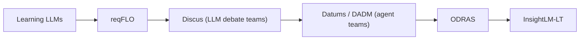
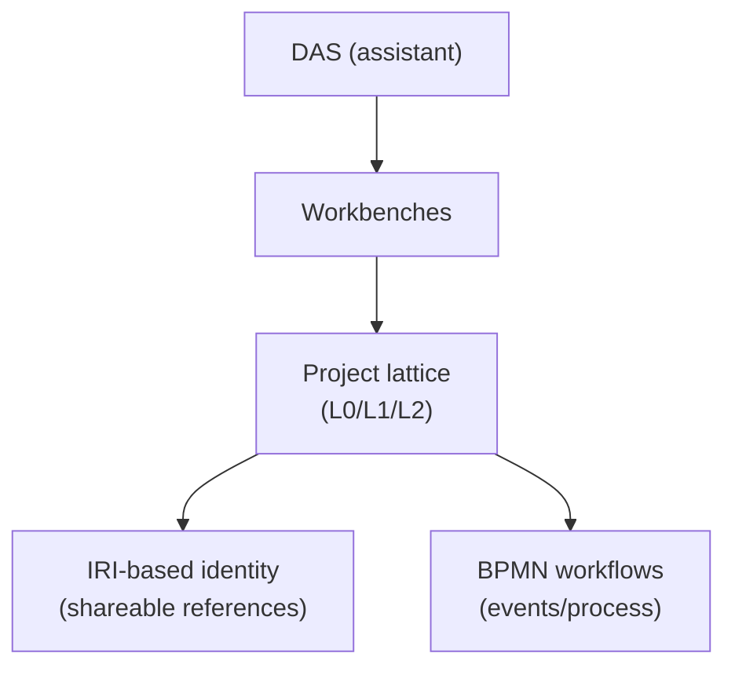
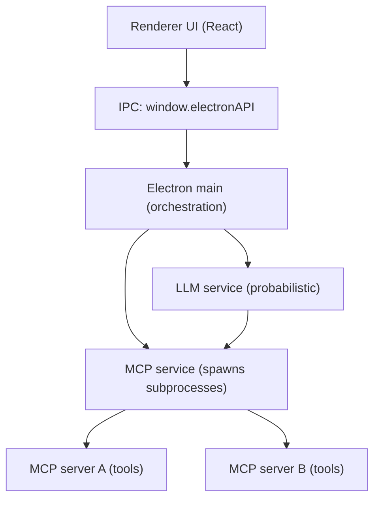

# InsightLM-LT - Software Description Document (SDD)
**Document Version:** 0.1.1  
**Last Updated:** 2025-12-24  
**Status:** Draft (living document; written to be readable by non-specialists)  

---

## Purpose (why this document exists)

This document explains **what InsightLM-LT is**, **how it behaves from the user’s standpoint**, and **how the system is assembled internally** (at a high level) so that:

- Stakeholders can understand what the tool does and why it is structured the way it is.
- Engineers (current or future) can orient quickly: where core capabilities live, how extensibility works, and how testing proves workflows.
- We maintain a shared vocabulary for terms like “workbook”, “context”, “tool”, “MCP server”, “extension”, and “canvas”.

This SDD is intentionally **more communicative than formal**. It does include architecture, but always in service of explaining user-visible behavior and operational guarantees.

---

## Executive summary (for busy readers)

InsightLM-LT is a lightweight desktop application that combines:

- a **workbook/document workspace** (file management + viewers + editing),
- an **AI chat** surface that can reference your local content,
- **dashboards** driven by questions and structured results,
- and an extensibility model based on **pluggable tools** (MCP servers) and **extensions**.

The “monumental shift” this enables is not a single feature - it is a different way of working:

- Instead of “tools scattered across your desktop + memory in your head,” you get a single canvas where
  - documents, notes, configurations, and results live together,
  - the AI is bounded by context/scoping,
  - and deterministic tooling can be invoked when correctness matters.

This document’s job is to help new team members catch up quickly and to guide the next phase of development.

---

## Current state snapshot (what’s real today vs what’s next)

### What’s real today (implemented)

- **Electron desktop app** (main process + React renderer)
- **Workbooks and documents**: create, browse, add files, view, edit
- **Contexts + scoping toggle** (All vs Scoped)
- **Chat** with tool-aware behavior (LLM service + tool registry)
- **Dashboards** (query tiles; formatter decoupled from prompt creation)
- **Extensions** (e.g., Jupyter, Spreadsheet) with enable/disable wiring
- **MCP servers as local subprocesses** (tool discovery + fail-soft startup)
- **Automation-centric testing**: selector-only `data-testid` + CDP smoke

### What’s next (planned / under active design)

- **Teams (planning)** as a first-class capability (moderator + SMEs + rapporteur, convergence/C3, repeatable plan artifacts)
- Additional workbenches beyond File/Insight (Data/Analysis/Event) as real experiences
- **Data Workbench (datasets + refresh + events)**: a first-class place to define datasets from remote sources (web, SQL, RDF, etc.), keep them updated, and emit events that can trigger downstream workflows (notebook reruns, dashboard refresh)
- Expanded security posture documentation (toward Navy/DoD review needs)

---

## How to use this document (as a team)

This SDD is both:

- a **shared explanation** (“what is going on here?”), and
- a **coordination artifact** (what to build next, and why).

Recommended workflow:

- Keep the SDD updated when:
  - a workflow changes,
  - a new capability becomes “real,”
  - or a decision materially affects architecture/testing/security posture.
- Prefer writing sections that are:
  - **audience-safe** (non-specialists can follow),
  - **testable** (tie claims to deterministic behavior),
  - **grounded** (backed by code paths and existing docs).

---

## Intended audience

- **Primary**: product owner(s), program stakeholders, testers, and new engineers.
- **Secondary**: extension authors / MCP server authors.

---

## Scope (what we cover)

- The **desktop application**: Electron main process + React renderer.
- The **UI canvas**: the “base application surface” users interact with (activity bar, sidebar, document viewer).
- **Core capabilities**: workbooks, documents, search, chat, dashboards, contexts/scoping, archiving.
- **Extensibility**: extensions + MCP server model, tool discovery and routing.
- **Testing**: deterministic UI smoke (CDP), integration tests, unit tests, and the automation selector contract.
- Representative **use cases** that map user intent → system behavior.
- **Security posture**: Electron security boundaries (renderer vs main), IPC surface, local subprocess model for MCP servers, and testing/guardrails.

Non-goals for this first document:

- Full Navy/DoD security package (STIG, RMF artifacts, complete threat model). We *will* document the current posture and the controls we already use.
- Full API reference for every tool/server (we’ll reference the existing docs and code).

---

## Assumptions & constraints (so readers don’t infer the wrong thing)

This document describes a system that is intentionally **simple on the surface** but **capable under the hood**. To keep discussions productive, we make the current assumptions explicit.

### Assumptions (current reality)

- **Local-first**: user work primarily lives on the local machine.
- **Desktop app**: the primary surface is an Electron application (not a web SaaS).
- **Pluggable capabilities**: specialized operations are expected to be provided via tools/servers (MCP) rather than hardcoded into the UI.
- **Deterministic testing is mandatory**: we treat automation-safe UX as part of product quality, not an afterthought.
- **Mixed audience**: non-technical and technical team members must both be able to follow the narrative.

### Constraints (design boundaries for LT)

- **Simplicity over “full IDE”**: InsightLM-LT intentionally avoids the overhead of embedding a full IDE experience.
- **Fail-soft behavior**: missing tools/servers should degrade capability, not crash the app.
- **Security posture matters early**: we must be able to explain trust boundaries and IPC surfaces (especially for Navy/DoD discussions), even before a full accreditation package exists.

### Open questions (expected to evolve)

- **Teams**: how team planning is invoked, how C3 is measured, and how we persist/replay “plan artifacts”.
- **Cloud / federation**: what parts remain local-first vs what becomes shareable across org boundaries.

---

## How to read this document

- If you want a “what can I do?” overview: start with **User Mental Model** and **Core Workflows**.
- If you want “how is it built?”: read **System Overview** and **Architecture**.
- If you want “how do we know it works?”: read **Testing & Automation**.
- If you want “how did we get here?”: start with **History & Lineage**.
- If you are new to the project and need to get unblocked fast: read **0, 1, 2, 3, 8, 10** in order.

---

## Table of contents (long-form)

This Table of Contents is the intended structure. Some sections are drafted out of order while we work, but the numbering reflects where the content ultimately lives. If a section exists only as a heading or short outline, it is a placeholder we will fill in later.

### 0. History & lineage (how we got here)
0.1 Origins: learning LLMs and building intuition  
0.2 ReqFLO (“RecFlow”): requirements extraction + analysis  
0.3 Discus: debate-team LLM for ontology extraction + reporting  
0.4 Datums / DADM: agent teams, ontology-guided memory, structured outputs  
0.5 ODRAS: ontology-driven workflows and higher-order structure  
0.6 InsightLM-LT: what we kept, what we simplified, and why  

### 1. Product overview
1.1 What InsightLM-LT is (in one page)  
1.2 What problems it solves  
1.3 Design principles (simplicity, extensibility, deterministic testing)  

### 2. Terminology & mental model (shared vocabulary)
2.1 Key nouns (workbook, document, dashboard, context, workbench)  
2.2 “Canvas” definition: the base UI surface  
2.3 Tools and servers (MCP, tool registry, tool providers)  
2.4 What “scoping” means (All vs Scoped)  
2.5 Teams (planning teams): moderator + SMEs + rapporteur  

### 3. User experience: the canvas and core navigation
3.1 App layout: activity bar + sidebar + document viewer  
3.2 Workbenches (File/Insight today; others as placeholders)  
3.3 Sidebar stacked views (Dashboards, Contexts, Workbooks, Chat)  
3.4 Document viewer tabs + empty states  
3.5 Deterministic UI patterns (dialogs, toasts, empty states)  

### 4. Core capabilities (what the app does)
4.1 Workbooks: create/rename/delete/archive; structure and storage  
4.2 Documents: add/view/edit/move/rename; drag-and-drop  
4.3 Viewers: Markdown (incl. Mermaid), CSV, PDF, text/code, etc.  
4.4 Search (workbooks + content-oriented workflows)  
4.5 Chat: asking questions over documents; references; activity stream  
4.6 Dashboards: tiles, queries, refresh, “explain” and sources  
4.7 Contexts + scoping: focus control for the system and for the AI  
4.8 Configuration (YAML-based)  

### 5. Extensibility model
5.1 Extensions (UI contributions + optional MCP server lifecycle)  
5.2 File handlers and notebook/spreadsheet extensions  
5.3 Extension enable/disable behavior and persistence  
5.4 Extension-managed MCP servers (e.g., jupyter-server)  

### 6. MCP servers and tool execution
6.1 What MCP is used for in this product  
6.2 Server discovery model (local subprocesses)  
6.3 Tool discovery (`tools/list`) and ToolRegistry  
6.4 Tool routing: provider abstraction and decoupling phases  
6.5 Fail-soft behavior: what happens when servers are missing or crash  

### 7. Data model and persistence (practical, user-oriented)
7.1 Where data lives on disk (APPDATA)  
7.2 Workbooks/documents layout  
7.3 Chat persistence and recovery  
7.4 Archive behavior  

### 8. Testing & quality (a first-class feature)
8.1 Testing philosophy: deterministic UX over cleverness  
8.2 Selector contract: `data-testid` + central `testIds`  
8.3 CDP UI smoke (tests like a user; no screenshots)  
8.4 Integration tests (MCP decoupling suite)  
8.5 Unit tests (Vitest)  
8.6 How to add a new feature safely (Definition of Done)  
8.7 Measuring “Team Planning” quality: why Teams must outperform single-shot  
8.8 Probabilistic responses and convergence (UQ mindset)  
8.9 Capability validation suites (ANSYS-style verification, but for InsightLM)  

### 9. Use cases (end-to-end stories)
9.1 UC-01: Create workbook → add documents → view/edit  
9.2 UC-02: Ask a question in chat with scoped context  
9.3 UC-03: Build a dashboard tile from a deterministic fixture  
9.4 UC-04: Enable Jupyter extension → execute a cell  
9.5 UC-05: Work offline / partial feature availability (fail-soft)  
9.6 UC-06: Plan with a Team (moderated) → produce a structured plan artifact  
9.7 UC-07: Data Workbench dataset refresh → event → notebook workflow rerun → dashboard update (future use case)  
9.8 UC-08: Conceptualization from a requirements document (CDD) (future use case)  
9.9 Potential additional use cases (titles + one-liners)  

### 10. Security (practical, review-ready)
10.1 Security boundaries: Electron main vs renderer  
10.2 IPC attack surface: what is exposed and why  
10.3 Web security controls: context isolation, node integration, navigation rules  
10.4 Local data + secrets handling (YAML config, API keys, logs)  
10.5 Local subprocesses: MCP servers (trust, isolation, fail-soft behavior)  
10.6 Testing as a control: deterministic automation + regression gates  
10.7 Known gaps / future hardening items (for Navy review discussions)  

### 11. Appendix
A. Glossary (expanded)  
B. “Where is it in the code?” mapping (modules and ownership)  
C. References to existing docs in this repo  

---

## 0. History & lineage (how we got here)

This section exists because the “why” behind InsightLM-LT matters as much as the “what”.

If you’re new to the project, you can treat this as a short guided tour of how the product philosophy evolved:

- from experimenting with large language models,
- to building workflow-oriented prototypes,
- to learning the hard lessons about deterministic operations, context, and structure,
- to landing on the current InsightLM-LT architecture.

### 0.1 A simplified lineage map (one diagram)

**How to read this**:

- Each step introduced a new “hard-won lesson” that shaped what we build today.
- InsightLM-LT is not a sudden invention; it is the condensed result of that iteration.

### 0.2 Origins: learning LLMs and building intuition

**Problem observed**: LLMs are powerful, but they are also probabilistic. Without careful boundaries (data scope, deterministic tools, validation), they can produce confident nonsense.

**Lesson learned**: the “magic” comes from pairing LLM reasoning with:

- deterministic tool execution (math, dates, parsing),
- strong context control (what the model is allowed to consider),
- and a workflow that forces validation and repeatability.

### 0.3 ReqFLO (“RecFlow”): requirements extraction + analysis

The `reqFLO` repository is a Python-based **requirements extraction and analysis system** focused on turning PDF content into structured artifacts suitable for engineering workflows.

Core capabilities (as implemented in the repo):

- **Requirement extraction** from PDF text
- **Classification** of requirements (functional / performance / physical, etc.)
- **Constraint extraction** (mathematical and logical constraints)
- **LLM-assisted evaluation and improvement** of requirement statements
- **Graph database integration** (Neo4j) for relationships and querying
- **Vector database integration** (Qdrant) for similarity retrieval

Key lesson carried forward:

- “Chat” alone isn’t enough - engineering work needs **structured outputs** (classifications, constraints, relationships) and **retrieval** that can be queried repeatedly.

### 0.4 Discus: debate-team LLM for ontology extraction + reporting

The `discus` / `discus_old` repositories represent an important evolutionary step: using an LLM not as a single chatbot, but as a **structured discussion among multiple expert roles** (plus moderator/rapporteur) to build shared understanding and produce durable outputs.

From the project’s own description:

- Discus runs **multi-round discussions among experts** to extract ontologies from domain documents.
- It supports **consensus checking** and continues rounds until consensus thresholds are met.
- It generates **two durable artifacts**:
  - an OWL ontology file, and
  - a “white paper” summarizing the discussion and ontology.

#### “Teams” in Discus (why it matters for Insight)

Discus introduced a practical pattern that we carry forward: **Teams**.

- A *team* is a named set of roles (e.g., “Requirements Lead”, “Systems Analyst”, “Validation Specialist”), each with a role description and an assigned model.
- Teams are persisted in a human-editable JSON file (`config/teams.json`) and can be selected in the UI to run a discussion.

Key lesson carried forward:

- Role-based multi-agent workflows are a repeatable way to get better structure than a single model, and they naturally align with how real engineering teams work.

#### Teams as the planning layer (the “why” behind Teams)

The deeper lesson from Discus (and reinforced by later systems) is that **Teams are where planning happens**:

- a **moderator** keeps the discussion on target and prevents drift,
- a **rapporteur** captures and synthesizes what was decided (not just what was said),
- and the SMEs provide diverse viewpoints that produce a more robust plan than a single “best guess” output.

This matters because, once the base platform is stable, people will be tempted to label any one-shot chain as an “agent workflow.” The design intent here is stronger:

> Use Teams as the planning and governance step that produces a plan artifact we can inspect and test.

### 0.5 Datums / DADM: agent teams, ontology-guided memory, structured outputs

The `dadm` repository (Decision Analysis and Decision Management) captures the “Datums-era” move toward **formalizing** multi-agent workflows:

- Teams become **coordinator + specialist agents** following a known process.
- Memory becomes **distributed and durable**, not just the chat transcript.
- Outputs become **machine-usable first**, with human-readable views as secondary.

In DADM, the team architecture is explicitly defined in `config/teams.json` and described in `docs/agent_architecture.md`.

Key elements (as implemented):

- **Coordinator-specialist model**:
  - Decision Process Coordinator orchestrates the workflow
  - Specialists cover framing, objectives, alternatives, evaluation
- **Interaction protocols**:
  - sequential workflow
  - feedback loops
  - coordinator-driven consensus
  - ontology-based knowledge sharing
- **Memory model**:
  - distributed persistence across stores (RDF triplestore, graph DB, vector DB)
  - ontology-guided recall strategy
- **Output formats**:
  - RDF triples as primary
  - JSON-LD as an alternative
  - Mermaid for visualization

Key lesson carried forward:

- “Teams” is not just a UI feature - done properly it becomes an **execution and governance model** (who does what, how memory is shared, and what artifacts are produced).

### 0.6 ODRAS (ontology-driven workflows)

ODRAS is a “full-scale” expression of the same core idea InsightLM-LT is aiming at: **turn messy documents into structured, traceable engineering knowledge**, and then use that structure to support workflows, decision-making, and automation.

From the ODRAS repo itself, the key architectural ideas are:

- **Problem-agnostic platform**: assemble project-specific environments from a shared core (see `ODRAS/docs/ODRAS_OVERVIEW.md`).
- **Project lattice with levels (L0/L1/L2)**: enterprise programs → campaign plans → execution projects (see `ODRAS/docs/ODRAS_OVERVIEW.md`).
- **Workbench model**: capabilities are exposed as “workbenches” (knowledge/requirements/ontology/CQMT/DAS) rather than one giant UI (see `ODRAS/docs/ODRAS_OVERVIEW.md`).
- **DAS (Decision Assistance System)** as an intelligence layer (see `ODRAS/README.md` and `ODRAS/docs/ODRAS_OVERVIEW.md`).
- **BPMN workflows + event-driven coordination** (see `ODRAS/docs/ODRAS_OVERVIEW.md` and the `ODRAS/bpmn/` directory).
- **Federation-ready identity** via an installation-specific **IRI system** (see `ODRAS/docs/IRI_SYSTEM_OVERVIEW.md`).
- **Security foundations** like password hashing and token-based auth (see `ODRAS/docs/AUTHENTICATION_SYSTEM.md`).

#### A small conceptual picture (kept intentionally simple)

#### Why ODRAS matters to InsightLM-LT (what we carry forward)

ODRAS makes the “non-negotiables” obvious for engineering-scale use:

- **Structure matters**: ontologies + relationships + traceability are required for anything beyond “chat over files”.
- **Determinism matters**: engineering workflows need repeatable operations (extraction, parsing, counting, date math) with stable artifacts.
- **Extensibility matters**: capabilities should be modular “workbenches” / extensions, not a monolith.
- **Identity matters**: stable identifiers (like IRIs) unlock cross-project and cross-organization linking and governance.

#### A key convergence point: MCP servers as “intelligent APIs”

ODRAS explicitly documents a migration path toward a distributed architecture of **MCP servers paired with extensions** (see `ODRAS/docs/architecture/MCP_SERVER_ARCHITECTURE.md`). That aligns directly with InsightLM-LT’s current approach:

- a small core app,
- pluggable tool servers,
- dynamic tool discovery,
- and an extension-managed server lifecycle when needed.

### 0.7 InsightLM-LT (where we landed)

InsightLM-LT is the current “lightweight desktop” incarnation of these lessons:

- **Desktop-first, local by default** (Electron + file-backed workbooks)
- **Extensible capability model** (MCP servers + tool discovery)
- **Focus and scoping controls** (Contexts + All vs Scoped)
- **Automation-centric quality gates** (deterministic CDP smoke tests)

### 0.8 Inputs we still need to make this history complete

We now have local source repos for:

- ReqFLO (`C:\Users\JohnDeHart\Documents\GitHub\reqFLO`)
- Discus (`C:\Users\JohnDeHart\Documents\GitHub\discus*`)
- DADM/Datums (`C:\Users\JohnDeHart\Documents\GitHub\dadm`)
- ODRAS (`\\wsl.localhost\Ubuntu\home\jdehart\working\ODRAS`)

The remaining inputs that would make this lineage even stronger (optional, but high value) are:

- Any **bridge artifacts** you consider authoritative (slides, internal white papers, decision memos) that explain why InsightLM-LT is the “LT” cut of the broader vision.
- A short statement of intent for **“Teams in InsightLM”**: what the MVP version of Teams *must* do (even if no one is using it yet).

---

## 1. Product overview

### 1.1 What InsightLM-LT is (in one page)

InsightLM-LT is a **lightweight desktop application** for:

- managing **workbooks** (containers of files and folders),
- viewing and editing **documents** (Markdown, PDF, CSV, text, etc.),
- asking questions in an **AI chat** panel that can reference your content,
- building **dashboards** driven by questions and structured results,
- extending capabilities via **pluggable MCP servers** (local subprocesses).

The application is desktop-first (Electron) to keep user data local by default, while still supporting advanced integrations through tool servers.

### 1.2 What problems it solves (draft)

InsightLM-LT exists because knowledge work at scale fails in predictable ways:

- **Context sprawl**: the “truth” is scattered across documents, vendors, emails, conversations, and tribal knowledge.
- **Decision-making without structure**: people talk, but they don’t externalize a decision-grade context that can be queried, compared, and reused.
- **Tool fragmentation**: the work is spread across many tools that don’t share a common model of “what’s in scope”.
- **Non-technical users are excluded**: the moment the workflow requires an IDE mindset, many subject-matter experts disengage.

InsightLM-LT’s thesis is straightforward:

> If we can manage context (world → view → window) and make it usable for both humans and tools, we can make better decisions faster, with less rework and less hand-waving.

### 1.3 Design principles (draft)

- **Prune to a canvas (simplicity is earned)**
  - Early in a design, it is normal for things to look messy because you are exploring many possible directions at once. The core InsightLM-LT approach is to explore, then prune aggressively until what remains is a small, stable canvas that people can actually use every day. The “simplicity” people see at the end is not because the problem was simple. It is because the complexity was pushed to the right boundaries (extensions and tools) and the core was forced to stay clean.
  - A helpful metaphor is a painting canvas: the app is the canvas, and extensions are the paints and brushes. The goal is not to ship a massive stack. The goal is to ship a stable surface where different users can add the right capabilities for their domain without turning the product into a tangled monolith.

- **Context management first**
  - The system must help users form and maintain a clear context view and prevent “everything everywhere all at once.”
  - Scoping is a first-class control (ALL vs SCOPED).

- **Local-first, low overhead**
  - “LT” is about keeping the surface light: fast startup, simple mental model, minimal configuration UI.

- **Extensible by tools**
  - Complex capabilities should be attachable via MCP servers and extensions, not baked into the core.
  - The core must stay decoupled from server naming/routing where possible.

- **Fail-soft, explicit states**
  - Missing data/tools should produce explicit empty/error states, not silent failure or crashes.

- **Automation-centric UX**
  - Stable `data-testid` selectors and deterministic smoke tests are part of the product definition.

- **Security explainability**
  - Even before full hardening, we must be able to explain trust boundaries (main vs renderer) and the curated IPC surface.

---

## 2. Terminology & mental model (shared vocabulary)

### 2.1 Key nouns

- **Workbook**: a top-level container the user creates to organize files and folders for a given effort.
- **Document**: a file inside a workbook (or folder) that can be viewed, edited, moved, renamed, and deleted.
- **Dashboard**: a collection of “tiles” (counter/graph/table/etc.) that summarize information by running queries.
- **Chat**: the conversational interface that can call tools and reference workbook content.
- **Context**: a named grouping and/or focus mechanism that determines what data is “in scope” for the user and the system.
- **Workbench**: a mode of the application (e.g., “File/Insight” vs “Data/Analysis/Event” placeholders) that affects which sidebar views are present.

### 2.2 “Canvas” (the base application surface)

In this document, **canvas** means:

> The persistent application surface composed of the **activity bar**, **sidebar (stacked views)**, and the **main document viewer area** where users spend most of their time.

This usage matches how tools like IDEs describe the “workbench canvas”: a stable surface where different panels and editors appear.

### 2.3 Tooling terms (MCP + tools)

- **MCP (Model Context Protocol)**: the protocol used to expose LLM-callable tools from separate processes.
- **MCP server**: a local subprocess that exposes “tools” via JSON-RPC over stdio.
- **Tool**: a callable capability (function) with a schema the system can discover and invoke.
- **Tool discovery**: querying a server for the tools it provides (e.g., `tools/list`).
- **ToolRegistry**: the in-app registry that tracks available tools by server and supports dynamic add/remove.
- **Tool provider**: an abstraction that can execute tools from different backends (MCP today; designed for decoupling).

### 2.3.1 "Model" (overloaded term - we name it explicitly)

In this document, the word "model" can mean very different things depending on context. To avoid confusion, we will try to use more specific terms:

- **LLM / AI model**: the language model we are talking to (for example, an OpenAI or Claude model). When we mean this, we will usually say "LLM" rather than just "model".
- **ML model**: a non-LLM machine learning model (classifier/regressor, etc.), if we ever include one.
- **Simulation model / engineering model**: domain models like AFSIM, ANSYS, Simulink models, or any physics-based model.
- **Data model**: how the application's data is structured (workbooks, documents, dashboards, persistence).
- **Mental model**: the conceptual model a user holds in their head (how they think the system works).

### 2.4 Scoping terms

- **Scoped**: only the active context’s workbooks are considered “in scope”.
- **All**: context scoping is disabled; all workbooks are in scope.

### 2.4.1 Context in LLM terms (to avoid terminology confusion)

In LLM work, “context” is often used imprecisely. To keep the project language clean, we split it into three layers:

- **World context**: everything that exists (all your books, files, conversations, vendor facts, etc.). This is the “water” you described - it is always there, and it is always too big.
- **Context window**: the bounded set of information actually provided to the LLM for a specific moment (system prompt + recent conversation + retrieved snippets + tool results). This is constrained by model limits and by what the system chooses to include.
- **Context view**: the *user-facing* representation of what is currently “in scope” and therefore eligible to be pulled into the context window (e.g., “these workbooks are active”, “scope is SCOPED”, “these references are pinned”).

So:

> We live in the world context, we operate through a context view, and we feed the LLM through a context window.

This is the core **context management** loop: shaping the view so the right window can be built repeatedly.

#### “View” vs “scoping” (and why both terms exist)

In this document:

- **Context view** is the broader concept: the current “lens” and working surface (what you have available/eligible to pull from).
- **Scoping** is a *specific control* inside that view: a narrowing filter that decides whether we’re considering “everything” vs “a focused subset”.

Practical mapping to InsightLM-LT:

- The **Context View** includes things like “active context”, “which workbooks are included”, and any pinned references.
- The **Scope mode** (ALL vs SCOPED) is one of the most important “dial settings” on that view.

### 2.5 Teams (planning teams)

In this document, **Teams** means:

> A repeatable planning workflow where a named group of tested “expert personas” (SMEs) collaborates under a **moderator** and produces a durable output captured by a **rapporteur**.

This is explicitly different from “one-shot” agent workflows:

- **One-shot**: model answers once; often high variance and hard to validate.
- **Team planning**: multiple perspectives + moderation + synthesis; produces a plan you can inspect, critique, and test.

The key requirement is not just “multiple agents talking” - it is that Teams are:

- **selectable** (different teams for different situations),
- **repeatable** (same inputs should lead to similar plans),
- **testable** (we can measure whether Teams outperform single-shot on defined tasks),
- **grounded** (teams rely on good retrieval/context and deterministic tools when appropriate).

Teams are also not intended to be "always on." A practical rule of thumb is to use Teams when the problem is ambiguous, when the work crosses multiple domains, or when the decision is high-stakes and you want a plan that is more robust than a single pass. In those cases, the moderator role is not optional. It is what keeps the group focused and helps the discussion converge into an output artifact instead of drifting.

#### Conversational convergence criteria (“C3”) - why consensus is hard

One of the hardest parts of “Teams” is not role definition; it is **convergence**.

In practice, a teaming run can fail if it cannot reach an acceptable level of consensus in a bounded amount of time. This is both a UX issue (“the team never lands the plane”) and a technical issue (the system needs a stopping rule).

We capture this as a first-class concept:

- **C3 (Conversational Convergence Criteria)**: a set of explicit rules that determine whether the team has converged enough to produce a stable plan artifact.

Notes:

- Convergence is not guaranteed; disagreement is sometimes real and valid.
- Bad convergence logic can “break” the teaming event (infinite loops, unstable outputs, or premature closure).
- C3 will eventually need to be testable (see Section 8.7).

---

## 3. User experience: the canvas and core navigation (draft)

This section describes what the user sees and how the interface stays consistent as they work. It intentionally avoids code-level detail except where it clarifies behavior.

### 3.1 The canvas: three persistent regions

At a high level, InsightLM-LT is built around a stable “canvas” with three persistent regions:

- **Activity Bar (left edge)**: the workbench switcher (a set of modes).
- **Sidebar (left panel)**: stacked, collapsible sections (Dashboards, Contexts, Workbooks, Chat).
- **Main content area (right)**: a tabbed document viewer (and empty state when nothing is open).

Users generally “live” in the sidebar and the main content area. The activity bar changes *what* the sidebar contains (because different workbenches may contribute different views).

### 3.2 Workbenches (modes)

The application supports multiple workbenches. Today, the **File/Insight** workbench is the primary implemented experience; other workbenches exist as placeholders for future expansion.

Practically:

- When **File/Insight** is active, the sidebar presents the stacked views (Dashboards/Contexts/Workbooks/Chat).
- When a different workbench is active, the app may show “Coming soon” placeholders for that mode.

### 3.3 Sidebar: stacked views that act like “sections of your desk”

In the primary workbench, the sidebar is composed of four stacked sections that can be collapsed and resized:

- **Dashboards**: create/select dashboards; dashboards summarize what’s in your data via “tiles”.
- **Contexts**: manage and activate contexts; toggle whether scoping is enabled.
- **Workbooks**: create, browse, and manage the workbook tree (folders + documents).
- **Chat**: ask questions and receive answers that can reference your local data and tools.

Each section header supports collapse/expand, and the app preserves sizes so the sidebar behaves like a personalized workspace.

### 3.4 Main content area: Document Viewer + tabs

When a user selects a document (or opens chat/dashboard/config tabs), the main area shows a tabbed viewer.

If there are no open tabs, the app renders an explicit empty state (example: “Click a document to view it”). This is a deliberate design choice to keep the UI deterministic and automation-friendly.

### 3.5 Deterministic UI patterns (important for both users and automation)

InsightLM-LT is built with “deterministic UX” as a principle:

- **No alert/prompt/confirm**: instead we use explicit dialog/toast patterns.
- **Explicit empty states**: “no data” is displayed intentionally, not as a blank area.
- **Automation-safe selectors**: interactive controls used by automation have stable `data-testid` attributes (centralized in `src/testing/testIds.ts`).

These choices matter operationally: they reduce ambiguity for users and dramatically reduce flaky testing.

---

## 4. Core capabilities (what the app does today)

This section describes the current “day one” capabilities of InsightLM-LT in plain language. The goal is not to oversell future ideas; it is to be crystal clear about what is implemented now and how a user experiences it on the canvas. Wherever possible, we describe capabilities in terms of stable user actions and the durable artifacts they produce (files, dashboards, and persisted state).

### 4.1 Workbooks (your working surface for context management)

A **workbook** is the primary container a user creates to gather and organize the materials for a decision or analysis. Practically, a workbook is a named place where documents live, where folders can be created, and where the UI can reliably show “what’s in the workspace right now.” Workbooks are the simplest answer to a common problem: without a container, context becomes an unbounded pile of files and links.

In the Workbooks panel, users can create a workbook, rename it, delete it, and (importantly) **archive** it. Archiving is a “reduce noise” action: archived workbooks are kept, but they are removed from the active list so they don’t keep showing up in day-to-day work. That matters for context management because “everything is available” is not the same as “everything is useful right now.”

Inside a workbook, users can create folders and keep documents either at the top level or inside folders. The workbook tree is meant to feel like a familiar file explorer, but with a few extra guarantees that support reliable workflows: actions use explicit dialogs (not browser popups), and operations that would overwrite a file trigger a collision-resolution flow (skip / overwrite / rename). This is intentionally designed to be deterministic both for humans and for automation.

### 4.2 Documents (add, create, move, rename, delete; drag-and-drop)

Documents are simply files inside a workbook, but InsightLM-LT treats them as first-class workspace objects rather than “random files somewhere on disk.” A user can bring documents into a workbook in multiple ways: importing through a file picker, dragging files in from the OS, or creating new Markdown files directly from the workbook UI. The experience is designed to be fast and low-friction: a document is immediately visible in the workbook tree and can be opened into the main tabbed viewer.

Once documents exist, users can manage them like real workspace assets. They can be renamed, deleted, moved between folders, and even moved across workbooks. Drag-and-drop supports both “move a file to a folder” and “move a folder to another workbook,” and the UI provides explicit feedback about the drop target (so the user knows what will happen before it happens). When a move or import would cause a filename collision, the user is prompted to choose how to resolve it; the system does not silently overwrite.

### 4.3 Viewers and editing (tabs, file-type viewers, Ctrl+S)

The main content area is a tabbed **Document Viewer**. Opening a document creates (or focuses) a tab. Tabs are not just a convenience; they are part of the user’s working context, and InsightLM-LT persists open tabs so a user can return to what they were doing. This is especially important for “slow thinking” work where a user is iterating across multiple sources over time.

InsightLM-LT uses built-in viewers for common types and falls back safely when needed. Markdown files open in a Markdown viewer (including Mermaid support where applicable), CSV files open in a CSV viewer, PDF files open in a PDF viewer, and other text-like files open in a text viewer. Editing is supported for text-like formats and is guarded by file-type checks so we don’t pretend that a binary file is editable. When a user edits a file, the system tracks unsaved changes and provides a save affordance; saving is also wired to the familiar keyboard habit: **Ctrl+S / Cmd+S**.

It is important to say what this is *not*. InsightLM-LT is **not** a replacement for Microsoft Word or Excel, and it is not trying to become a general Office suite. Office files may still appear in a workbook (because that is how real-world programs operate), and the system can treat them as part of the context being managed. However, the core product goal is to manage and work with decision context, not to recreate Microsoft’s editing experience. Where Office content needs to be used, the intended direction is to **extract or reference** what matters (via tools and workflows) while keeping the authoring of Word/Excel artifacts in their native domain.

If you need an Office editor, use Office. InsightLM-LT is for managing the decision context *around* those artifacts. In practice, that often means: **export to a text-friendly format** (plain text/Markdown/CSV/PDF as appropriate) and bring the resulting artifact into the workbook so it can be referenced, searched, and analyzed.

The viewer layer is also extension-aware. If an extension registers a file handler for a given file type, that handler can take over rendering/editing for that file. This is one of the main ways the core stays light while allowing richer “workbench” capabilities through extensions.

### 4.4 Search (workbook tree search as the current baseline)

Today, the most direct search capability is the Workbooks panel search, which filters across workbook names, folder names, and document names/paths. The search behavior is intentionally simple and visible: the UI expands what matches and collapses back when the query is cleared. This is not “semantic search” yet; it is the baseline that makes navigating a large workspace possible and predictable.

Over time, we expect search to become a broader first-class capability across the canvas (for example: searching dashboards, contexts, and chat history, as well as content itself). Those are **future additions** and will be described when they exist, but the key principle will remain the same: search must be predictable, scoping-aware, and automation-safe.

### 4.5 Chat (scoped conversation with references and durable history)

Chat is the conversational surface, but it is not meant to be a free-floating chatbot detached from the workspace. In the current implementation, chat is explicitly tied to **Context + scoping**: if there is no active Context (or if scoping is enabled but no workbooks are in scope), Chat shows an explicit empty state that tells the user what to fix. This is a deliberate guardrail because chat without scope quickly becomes misleading.

Another plain statement helps set expectations: if you want generic chitchat (e.g., “tell me about a book I read” or “how do I handle my mother-in-law”), use a general-purpose chat tool. InsightLM-LT chat exists to **build and use a context view**: referencing the workspace, shaping scope, and producing answers that are grounded in the artifacts you are managing, not to be a universal small-talk assistant.

Within chat, a user can reference workbooks, folders, and files using “@ mentions.” Under the hood, those references are encoded as stable `workbook://...` identifiers so the system can preserve which sources were referenced without relying on fuzzy text matching later. Chat also maintains a lightweight “activity” trace while the model is working (including tool usage when applicable), which is useful both for user trust and for debugging.

Chat can also be "popped out" from the sidebar into its own main tab in the document viewer. This is purely a layout preference (some users want more room), and it does not change the core behavior: chat remains tied to the context view and the current scoping rules.

Chat history is persisted per active Context (one thread per context in the current model). That means conversations are not just transient; they become part of the context view over time, which aligns with the broader context-management goal.

### 4.6 Dashboards (questions → tiles → refreshable results)

Dashboards are the first “structured output surface” beyond chat. A dashboard is a named collection of **queries**, where each query becomes a tile (counter/table/graph depending on query type). A user creates a dashboard from the Dashboards panel and opens it as a tab in the main viewer. From there, they add questions (optionally with the same “@ mention” ability to reference workbooks/files) and the system turns those questions into query objects that can be re-run.

Execution is designed to be fail-soft and extensible. Where available, dashboard queries are executed via an MCP-backed pathway (so the system can generate or run deterministic logic in a decoupled server). If that path is unavailable, dashboards fall back to a simpler local implementation. The important behavioral guarantee is that dashboards can be refreshed (“Refresh All”) to re-run the same queries against the current workspace, which supports repeatable analysis instead of one-off answers.

Dashboards are intentionally **scoping-agnostic** when they are refreshed. In other words, a dashboard should not silently change its outputs just because the user activated a different Context or toggled scope in the UI. This matters because dashboards are meant to be stable, reusable reporting surfaces. If a query needs to be restricted, it should be restricted explicitly by the query itself (for example, by referencing a specific workbook or file), not implicitly by whatever the current context view happens to be.

In the longer-term product direction, the dashboard is not just a convenience UI. It is the place where you turn workspace work into **publishable information**. If an analysis produces a key metric (for example, a margin of safety calculation or the output of an FEA run), the intent is that you can pin that result into a tile and treat it as a reportable artifact. Over time, that creates the basis for other users to subscribe to those published outputs, rather than re-running or re-arguing the same analysis from scratch.

### 4.7 Contexts + scoping (the practical control surface for context management)

Contexts and scoping are how InsightLM-LT makes “the world context” usable. A Context is a named selection of workbooks, and the **scope mode** determines whether the application is operating on “All workbooks” or “Only the active context.” In practice, this is a dial the user can turn depending on what kind of work they are doing: exploring broadly versus staying disciplined inside a bounded slice.

The Contexts panel supports creating, editing, deleting, and activating contexts. It also supports a “Quick: Workbooks” flow that lets a user activate a single workbook as a context without doing any manual context setup. This exists because context management must stay low-friction: if it takes too much effort to get scoped correctly, users will skip it, and the whole system collapses back into “everything everywhere.”

### 4.8 Configuration (YAML-backed, human-editable)

Configuration is treated as a real workspace artifact rather than a hidden preference screen. In the current build, LLM configuration is persisted in YAML and can be edited either through a lightweight settings UI (provider/model/key/base URL) or by opening the raw YAML in a tab for direct editing. This is intentional: teams often need configuration to be inspectable and portable, not trapped in a GUI-only settings dialog.

Because configuration influences model selection and behavior, it also ties into repeatability. If we want the same question to produce comparable results across machines or teams, we need to be able to say, “these were the config inputs,” and YAML is a practical starting point for that.

---

## 5. Extensibility model (how we avoid a ball of twine)

InsightLM-LT is designed to stay small at the core while still being able to cover many very different use cases over time. The extensibility model exists for one primary reason: if we hardcode every feature directly into the app, we eventually create an unmaintainable ball of twine that becomes too risky to change. Extensions give us a structured way to add new capabilities, new file experiences, and new tool servers without rewriting the core.

In practical terms, the core provides the stable canvas and the workflow primitives (workbooks, documents, contexts, chat, dashboards). Extensions then plug into that core with narrowly scoped contributions. This is how the same product can later support very different work styles (trader, mechanical engineer, program manager, doctor) without turning the UI into a cluttered "everything app" for everyone at once.

### 5.1 Extensions (what an extension is in this product)

An extension is a packaged unit of capability that can contribute UI and behavior to the app. It is not just a theme or a button. An extension can provide a file viewer/editor for a new file type, add workbook actions, and optionally bring its own tool server when it needs deterministic computation or domain-specific behavior.

Today, extensions are registered at application startup via their manifests, and a user can enable or disable them in the UI. The point is to keep the core ignorant of domain specifics. The core asks the extension registry, "do we have a handler for this file type?" instead of hardcoding notebook logic, spreadsheet logic, and so on into the main app.

### 5.2 File handlers (how new document types become first-class)

The most visible extension contribution is the file handler. A file handler says, "for these file extensions, render using this component." When a user opens a document, the Document Viewer first checks whether any enabled extension provides a handler for that file type. If so, that extension owns the viewing and editing experience for that document in the main tabbed viewer.

This is how we keep the core viewer simple while still allowing richer experiences where they matter. For example, the current Jupyter extension registers a handler for `.ipynb` files (notebooks), and the current spreadsheet extension registers a handler for `.is` files (Insight Sheets).

### 5.3 Enable/disable behavior (what "turning an extension on" really does)

Extensions are user-controllable. The UI includes an "Extensions" menu where a user can toggle each registered extension on or off. The enabled state is persisted locally so the app can restore the same environment on restart.

From a design standpoint, enable/disable is more than a UI checkbox. It is a capability gate: when an extension is disabled, its file handlers and actions are no longer offered to the user, and the core falls back to default behavior. That makes the experience controllable and predictable, which matters both for real users and for deterministic testing.

### 5.4 Extension-managed MCP servers (why tool servers pair naturally with extensions)

Some capabilities cannot be implemented safely as pure UI. They require deterministic computation, controlled execution, or domain-specific services that should run out-of-process. For those cases, an extension can bundle an MCP server definition in its manifest, and the main process will start or stop that server when the extension is enabled or disabled.

This pairing is a key decoupling mechanism. It lets us add capabilities like notebook execution or spreadsheet formula evaluation without baking Python execution into the renderer and without coupling every new domain feature to the core app lifecycle. It also keeps failure modes contained. If a server fails to start, the app can continue running with reduced capability.

Future direction (conceptual): role-based bundles. Over time, we can add a higher-level switch that enables a consistent set of extensions and settings for a given role (for example, a trader setup vs a mechanical engineer setup). The key idea is that the canvas stays the same, but the enabled capabilities can change as a deliberate "profile" rather than as one-off manual toggles.

A related idea is that a "persona" does not have to mean a single voice. In some domains, the most useful "persona" may actually be a Team (for example, a systems engineer working with a team of acquisition SMEs), where the tool presents a coherent interface to the user while coordinating multiple expert viewpoints under the hood.

---

## 6. MCP servers and tool execution (how the system does real work)

MCP stands for Model Context Protocol. MCP servers sound scarier than they are. In InsightLM-LT, an MCP server is simply a separate process that exposes a set of callable "tools" with clear inputs and outputs. Those tools can be used by the in-app LLM, which is important because language models are probabilistic, but many operations we care about are not. Reading files, searching content, running a notebook cell, formatting dashboard results, and doing domain calculations are all better treated as deterministic tool calls than as "hope the model reasons it out."

The key mental model is: the LLM does not magically gain superpowers. It gains access to a toolbox. MCP servers are how we build and manage that toolbox without turning the core app into a giant monolith.

### 6.1 What MCP is used for in this product

In InsightLM-LT, MCP is the backbone of the "capability layer." The UI stays focused on context management and presentation. The main process stays focused on security boundaries, file I/O, and orchestration. Specialized capabilities live in tool servers, where they can be implemented, tested, and updated independently.

The practical reasons we use MCP are not academic. They are operational:

You get deterministic operations where determinism matters, you get isolation so failures do not crash the whole app, and you get a clean decoupling boundary so we can add new capabilities without re-threading the core.

It also helps to be explicit about what a "tool" means in practice. Some tools are provided by MCP servers, and some tools can be built into the application ("core tools"). The LLM sees them the same way (a tool name with a schema), but the runtime may execute them in different places. For example, a core tool might list available workbook files, while an MCP tool might execute a notebook cell in a separate Python process. Later sections will enumerate the actual tools, but the key idea is: the tool interface stays consistent even when the implementation is not.

### 6.2 Server discovery model (local subprocesses)

Most MCP servers are discovered from the local `mcp-servers/` directory. Each server has a small `config.json` that describes how it should be started (command, args, and whether it is enabled). On startup, the Electron main process discovers these servers and starts the enabled ones as local subprocesses.

Some servers are extension-managed. In that mode, the extension manifest declares the server, and enabling or disabling the extension starts or stops the server. This is how notebook and spreadsheet capabilities are kept optional, and it is also how we avoid auto-starting domain servers that a given user does not need.

### 6.3 Tool discovery ("tools/list") and ToolRegistry

When a server starts, the app discovers what tools it provides. Tools are self-describing: each tool has a name, a human-readable description, and a JSON schema describing its inputs. The app collects these tools into a central ToolRegistry so the rest of the system can ask a simple question: "what tools exist right now, and which server provides them?"

This is the key to keeping the system decoupled. We do not hardcode a fixed list of tools into the LLM layer. We discover them, register them, and route calls dynamically. If a server is missing or turned off, the tool simply does not exist, and the UI or LLM workflow can fail-soft.

### 6.3.1 How the LLM "decides" to call an MCP tool (the non-magic explanation)

The LLM does not directly call the Jupyter server (or any server). The application is the runtime that orchestrates tool calling.

What the LLM gets is a list of available tools, each with a name, description, and input schema. When using an LLM provider that supports native tool calling, the tool definitions are sent alongside the normal chat messages. The LLM then makes a choice: it can either answer in text, or it can ask the runtime to call one or more tools by returning a structured "tool call" request.

The runtime then does three things:

First, it executes the requested tool by routing to the correct provider (often an MCP server) and collecting the result.

Second, it injects the tool result back into the conversation as a tool result message. This is the key point about "context injection": nothing is telepathic. The result becomes part of the model's next context window because we literally send it back as a message.

Third, it calls the LLM again with the updated message history. The LLM sees its own tool request plus the returned tool output, and then it can either call another tool or produce a final answer.

So the "magic" is just a loop:

LLM -> tool request -> tool execution -> tool result message -> LLM continues.

Two additional clarifiers help remove common confusion:

First, there are two broad ways tools get used in InsightLM-LT. Some tool calls are UI-driven (a user clicks a button like "Run cell" in a notebook). Other tool calls are LLM-driven (the LLM returns a tool call request because the prompt and tool descriptions make that the best next step). In both cases, the execution still happens in the runtime, and the results still become explicit inputs to whatever step happens next.

Second, tool calling is provider-dependent. Some LLM providers support native tool calling with structured tool call messages (the LLM returns a tool call object). Other providers and smaller local models may not, so the runtime can fall back to a stricter convention (for example, instructing the LLM to emit a single JSON object describing a tool request). The principle is the same even when the wire format changes: tool request in, tool result out, then the LLM continues with that result available.

### 6.4 Tool routing (provider abstraction and decoupling phases)

At runtime, when the LLM decides it needs a tool, the app routes that tool call through a provider abstraction. Today, MCP is the primary provider, but the code intentionally supports a ToolProviderRegistry so we can route tool execution through different backends without changing the LLM logic.

This matters because it keeps the tool execution surface stable while we evolve the internal architecture. The core promise is: "a tool is a tool." How it is executed can change behind the scenes as we improve reliability, testing, and separation of concerns.

This also explains "core tools vs MCP tools" in a practical way. From the LLM's perspective, both are just tools. From the runtime's perspective, a core tool might run inside the Electron main process, while an MCP tool runs in a separate subprocess. The reason to keep both is pragmatic: some operations are safer and simpler to keep in-process, while other operations are better isolated and owned by a dedicated server.

### 6.5 Fail-soft behavior (what happens when servers are missing or crash)

InsightLM-LT is built to degrade gracefully when tool servers are unavailable. If a server fails to start, crashes, or is disabled, the rest of the application should keep working. Users can still manage workbooks and documents, dashboards can fall back to simpler execution, and chat can still function with reduced capability.

The goal is not to hide failure. The goal is to keep the app usable and explicit. A missing server should show up as "this capability is unavailable" rather than as a crash or as silent nonsense.

#### A simple "under the hood" picture

#### Example: Jupyter notebook execution (jupyter-server)

The Jupyter capability is a good example because most people understand what a notebook is. In InsightLM-LT, the notebook UI is a normal document viewer experience. A notebook is just an `.ipynb` file stored in a workbook, opened in a specialized viewer. The "specialized" part comes from the extension system: the Jupyter extension registers a file handler for `.ipynb`, so opening a notebook tab renders the Notebook Viewer instead of the default text viewer.

When the Jupyter extension is enabled, it can also start an MCP server called `jupyter-server`. This server runs as a local Python subprocess, and it is responsible for doing the work that should not live in the UI process, like executing a cell. When a user clicks "run" on a code cell, the notebook viewer calls into the Electron API, which forwards a request to the MCP layer. The server executes the code and returns a structured result (outputs) that the notebook viewer writes back into the notebook document as standard Jupyter cell outputs.

The important point for non-specialists is simple: the notebook UI is not "pretending" to execute Python by generating text. It is calling a real tool in a separate process and then displaying the returned outputs.

As a simple mental picture, you can imagine tools like:

- a core tool that does "list files in the workspace" (fast, local, in-process), and
- a domain tool that does "run a margin of safety calculation from an analysis artifact" (best isolated and implemented as an MCP server tool that can be tested and versioned independently).

---

## 7. Data model and persistence (practical, user-oriented) - draft

This section describes where InsightLM-LT stores user data on disk and what persistence guarantees exist (for example, whether chat history survives restarts, how workbook structures map to folders, and what "archive" means in practice). It is intentionally practical: readers should come away knowing what is safe to back up, what can be moved, and what the app reconstructs automatically.

### 7.1 Where data lives on disk (default locations)

InsightLM-LT stores its workspace data under a single "data directory" configured in `config/app.yaml`. If that config is missing or cannot be read, the default location on Windows is `%APPDATA%/insightLM-LT` (which resolves to the user’s roaming AppData directory). This directory is the root for persisted workbooks, chat threads, archives, and user-writable configuration files. The practical takeaway is simple: if you want to back up or move "everything InsightLM knows locally", start by backing up this data directory.

The application also maintains a user-writable configuration subdirectory under the data directory. For example, `llm.yaml` is created (and seeded from the packaged defaults when available) under `<dataDir>/config/llm.yaml`, which keeps provider settings inspectable and portable without requiring an IDE or a registry.

### 7.2 Workbooks and documents (folder layout + metadata)

Workbooks are persisted as folders under `<dataDir>/workbooks/<workbookId>/`. Each workbook folder contains a `workbook.json` metadata file plus a `documents/` folder that holds the actual user files. The workbook id is a UUID, which allows stable identity even when a workbook is renamed. Inside `workbook.json`, each document entry has a stable `docId` plus a canonicalized `path` that is stored in a folder-aware, POSIX-style form under `documents/` (for example, `documents/trade/decision_matrix.is`).

On load, workbook metadata is normalized to stay consistent and robust. The service canonicalizes paths, fills in missing ids, and drops stale entries whose backing files are missing. It also performs a reconciliation pass that discovers files that exist on disk under `documents/` but are missing from `workbook.json`, which is important for workflows where tools create artifacts out-of-band (for example, notebook execution producing results files). The practical meaning is that "what is on disk" and "what is in the workbook index" are continuously brought back into alignment.

### 7.3 Chat persistence (single-thread per context)

Chat history is persisted as JSON sessions under `<dataDir>/chats/`. InsightLM-LT uses a deterministic "single-thread per context" model for the sidebar chat: when the active context changes, the app loads the chat thread for that context id. The session id is derived from the context id in a filesystem-safe way (for example, `context-<contextId>` with unsafe characters replaced), and the persisted file is `<dataDir>/chats/<sessionId>.json`.

Each message is stored with a deterministic sequence number (`seq`) and a stable message id (`m<seq>`), which makes the thread stable across reloads and resilient to older session formats. The practical meaning is that your chat history survives restarts, and it is stored as readable JSON that can be backed up as part of the data directory.

### 7.4 Archive behavior (what "archive" means physically)

Archiving is implemented as a physical move on disk, not a hidden flag in a database. When a workbook is archived, its entire folder `<dataDir>/workbooks/<workbookId>/` is moved to `<dataDir>/archive/<workbookId>/`, and `workbook.json` is updated to mark the workbook as archived. Unarchiving moves the folder back.

Individual files can also be archived within a workbook. In that case, the file is moved into a per-workbook archive folder at `<dataDir>/workbooks/<workbookId>/archive/`, and the corresponding document entry in `workbook.json` is marked as archived. Unarchiving moves the file back into `documents/` and updates the stored document path. The practical meaning is that archived material stays local and recoverable, and the UI can clearly separate active working sets from archived artifacts without deleting anything.

### 7.5 Projects (possible future layer) - draft

Today, InsightLM-LT behaves like a single local workspace rooted at the configured data directory, and the primary organizing concepts are workbooks and contexts. A possible future layer is the idea of a "project" that a user explicitly opens, where a project would contain a bounded set of workbooks and its own persisted state. The key reason to consider projects is user mental model and containment: if the project boundary is small enough, a user can stay in scope mode All inside that project and still get a clean, decision-grade working set.

If we add projects, they should not replace contexts. A project would be a storage and lifecycle boundary (what is open, what is backed up together, what is shared or moved as a unit). In the simplest and most practical framing, Projects may exist primarily for portability and backup packaging, not for day-to-day usability. A context would remain the scoping and view mechanism inside the currently open project (how the user focuses the system and the LLM). In that framing, projects and contexts overlap in purpose, but they operate at different layers and can coexist without blowing up the current context model.

## 8. Testing & quality (a first-class feature) - draft

Testing is not a side activity in InsightLM-LT. It is part of the product’s core value proposition because the app is used to make decisions. We therefore prefer deterministic UX patterns over cleverness, and we invest early in automation-safe behaviors (stable `data-testid` selectors, explicit empty states, and non-ambiguous dialogs) so that the app can be tested the same way a user uses it. This also shapes how we integrate AI and tools: anything that must be correct must be backed by deterministic tool execution, and anything that cannot be made deterministic must be treated probabilistically and validated through repetition and convergence criteria.

## 8.1 Testing philosophy: deterministic UX over cleverness - draft

The testing philosophy is simple: if a workflow matters, we must be able to drive it end-to-end and assert the outcome without fragile UI hooks. That means the UI must expose stable selectors and predictable states, and the system must degrade gracefully when optional capabilities are missing (for example, an MCP server that is disabled or crashed). This is why we treat automation design (test ids, dialogs, empty states, and deterministic interactions) as a first-class engineering constraint, not something bolted on after features ship.

Practically, this means we design UI flows so they can be validated with the same user-level actions every time: stable `data-testid` attributes for interactive elements, explicit empty states instead of ambiguous blank panels, and deterministic dialogs for confirmations and collisions (no hidden side effects and no relying on timing). When we do this, we can build a trustworthy smoke suite that proves the workflows people actually use, and we can evolve features without breaking everything downstream.

## 8.2 Selector contract: `data-testid` + central `testIds` (draft)

InsightLM-LT treats stable selectors as part of the UI contract. Interactive elements that matter to workflows should have deterministic `data-testid` attributes, and those ids should be centralized so they do not drift across refactors. This is not about making tests easier for developers. It is about making the product automation-safe, which means the team can prove that critical workflows still work without relying on brittle visual cues or text matching.

## 8.3 CDP UI smoke (tests like a user; no screenshots) (draft)

The primary smoke test approach is user-level automation through Chrome DevTools Protocol (CDP). The intent is to drive the app the way a user would, click the same buttons, type into the same fields, and then assert outcomes through stable selectors and explicit state. The contract is "no screenshots required." If a test needs screenshots to determine success, the UX is likely not deterministic enough for a decision tool.

## 8.4 Integration tests (MCP decoupling suite) (draft)

The integration layer focuses on the boundaries that make the architecture safe and modular: tool discovery, tool routing, and fail-soft behavior when servers are missing. A core requirement is that the app can start and remain usable even when optional servers are not available, and that the UI surfaces that capability loss explicitly. These tests prove that the system is decoupled rather than a single ball of twine.

## 8.5 Unit tests (Vitest) (draft)

Unit tests exist to keep the lowest-level behavior stable: parsing, formatting, small reducers/stores, and utility logic that should remain deterministic. Unit tests are not a replacement for smoke tests because they do not validate the user workflow, but they help keep core logic correct and maintainable as the product grows.

## 8.6 How to add a new feature safely (Definition of Done) (draft)

New capability is "done" when it is automation-safe and fail-soft. Practically, that means the UI has stable selectors, empty and error states are explicit, and any risky operation uses deterministic dialogs rather than implicit behavior. If the feature depends on tools or servers, it must degrade cleanly when those dependencies are missing, and it must have at least one deterministic end-to-end smoke path that exercises the feature the way a user will.

## 8.7 Measuring “Team Planning” quality (draft)

Team planning is powerful, but it also introduces an important engineering requirement:

> If we claim Teams are better than single-shot, we must be able to **prove it** in repeatable tests.

The core reason is trust: teams are only valuable if the user can rely on them to produce higher-quality, more complete, and more defensible plans.

### Convergence as a requirement (C3)

Team planning introduces a new failure mode that single-shot answers don’t have: **non-convergence**.

We therefore treat convergence as a measurable property:

- **C3 (Conversational Convergence Criteria)**: the explicit stopping rules that decide when the team has converged (or failed to converge) and how to proceed.

Example outcomes C3 must support (conceptual):

- **Converged**: team agrees on the plan structure + key decisions → publish plan artifact.
- **Partially converged**: team agrees on structure but has unresolved disagreements → publish plan + “open disputes” section.
- **Failed to converge**: time/round budget reached with persistent conflict → publish best-effort plan + escalation prompt (or reroute to a different team).

### What “better” means (testable claims)

We treat a planning team as “better” when it increases one or more of:

- **coverage**: it identifies more relevant considerations, risks, and steps
- **structure**: it produces outputs that follow a predictable schema (plan, assumptions, open questions, responsibilities)
- **consensus**: it converges on a stable set of recommendations
- **auditability**: it produces a durable artifact (the “plan”) that can be reviewed later

### How we test it (directional)

At minimum, testing must include:

- **A/B runs**: same prompt + same context; compare team planning vs single-shot outputs
- **deterministic invariants**: assert structure and key fields, not prose
- **fixture-driven tasks**: use known documents/data as input to avoid flakiness

Longer term, we can build a scorecard for “plan quality” with human review loops, but the MVP requirement is: **repeatable tests that show Teams produce better structured outputs**.

## 8.8 Probabilistic responses and convergence (UQ mindset) - draft

LLM outputs are probabilistic. That does not mean they are "hallucinating" in a mystical sense. It means we are sampling a stochastic process, and if we only run it once, we should expect variance, including occasional low-quality results even when the prompt and context are reasonable.

We therefore do not treat an LLM as a deterministic analysis engine. When correctness matters, the system should rely on deterministic tool execution, and when a question is complex, the workflow should be run more than once and converged explicitly rather than trusting a single pass.

For complex problems, the correct posture is closer to uncertainty quantification (UQ) than to one-shot Q and A. Practically, that means we should be able to run the same workflow many times (with controlled variation), collect the resulting answers or plans, and then converge on an outcome using explicit criteria. This concept applies to single-model runs, Teams, and any multi-step tool workflow. If we cannot repeat and measure convergence, we cannot claim the output is decision-grade.

Two related ideas matter for real decision support:

First, convergence may not be to a single answer. Some problems naturally stabilize into a small set of competing recommendations. That is not a failure. It is useful signal, because it tells the user the decision space has multiple local optima.

Second, we care about robustness, not just optimality. Some answers look "best" but are sensitive to small changes in assumptions or input data. Other answers may look slightly worse but remain stable across variation. A future capability of InsightLM is to help users see that difference explicitly by treating repeated runs as data and summarizing sensitivity versus robustness.

## 8.9 Capability validation suites (ANSYS-style verification, but for InsightLM) - draft

InsightLM-LT will only be trusted if its capabilities are validated systematically. In traditional engineering software, this is normal. Tools like ANSYS ship with large verification and validation libraries that cover a wide range of scenarios and expected outcomes. It is a lot of work, but it is also how you earn the right to use the tool for real decisions.

We expect to build the equivalent here: a growing library of end-to-end tests and scenario packs that exercise the product in realistic workflows. This includes not only UI automation and regression tests, but also capability validation in specific domains (for example, acquisition analysis, sensitivity studies, and other structured decision workflows). Over time, this library becomes a durable capture of "how the tool is used" and "what good looks like."

This work cannot be finished all at once, and it should not block early iteration. But it must be treated as a major part of building the product, not as an afterthought. If someone says "just turn it on," the correct response is that trust comes from verified behavior, and verified behavior requires a serious test suite that grows with the tool.

## 9. Use cases (end-to-end stories) - draft

This section captures user workflows as end-to-end stories. The goal is not to describe every button, but to make the expected behavior testable. A use case should read like a user walkthrough and map cleanly to deterministic assertions (what appears, what is created, what persists, and what errors are handled explicitly).

### 9.1 UC-01: Create workbook → add documents → view/edit (draft)

A user creates a workbook for a real effort (for example, a trade study). The workbook immediately appears in the Workbooks view and becomes the container for documents and folders. The user then adds documents either by importing existing files or by creating new ones inside the workbook. When a document is opened, it appears as a tab in the main Document Viewer area and is rendered using an appropriate viewer (Markdown, CSV, PDF, text, or an extension-provided handler for specialized types). If the user edits a text-like document, the app tracks unsaved changes explicitly and saves deterministically (for example, via Ctrl+S), and any name collisions or moves are resolved through explicit dialogs rather than silent overwrites. When the user restarts the app, the workbook structure remains on disk, and the app can reconstruct the working state from the persisted workbook metadata and files.

### 9.2 UC-02: Ask a question in chat with scoped context (draft)

A user selects a Context and sets scope mode to Scoped so that only the workbooks in that context are treated as in-scope for the workflow. The user opens the Chat view and sees the persisted thread associated with that active context. The user asks a question that is meant to be answered against their local materials (for example, “Summarize the key requirements and open risks in this workbook”). The system sends the user message through the LLM runtime with the current scoping rules applied, and the chat UI shows an explicit activity stream as tools are used (for example, listing files, reading a document, or running a deterministic formatter).

If the user switches to a different Context, the chat thread changes with it because chat persistence is keyed to context id. If the user changes scope mode from Scoped to All, the system does not “forget” the context, but it expands what is considered in scope for subsequent requests. The user can reference specific items intentionally using mention and reference mechanisms rather than relying on implied memory, and the result remains a durable conversation history that can be replayed, reviewed, and used as part of the decision record.

### 9.3 UC-03: Build a dashboard tile from a deterministic fixture (draft)

A user wants a repeatable, refreshable output surface rather than a one-off chat answer. They create a dashboard and add a query that is intentionally grounded in a deterministic fixture document (for example, a known JSON or CSV file stored in the workbook). The query is written so the tile can be refreshed against the same underlying artifact, and the result is shown as a stable card/table/graph with explicit empty and error states.

The key behavior is that the dashboard becomes a durable reporting surface. When the fixture changes (for example, a notebook workflow regenerates `results/summary.json`), the user can refresh the dashboard and see the updated output without re-authoring the question. If the tool pathway required for the query is unavailable, the dashboard should fail-soft with a clear "capability unavailable" state rather than producing silent nonsense.

### 9.4 UC-04: Enable Jupyter extension → execute a cell (draft)

A user enables the Jupyter extension from the Extensions UI. Enabling an extension is not just a UI toggle. It is a capability gate that can start or stop an extension-managed MCP server. In the Jupyter case, enabling starts a local `python` subprocess (the `jupyter-server`) with `INSIGHTLM_DATA_DIR` set so the server can locate and operate on the user’s local workspace data.

The user then opens a notebook file (`.ipynb`) from a workbook. Because the Jupyter extension registers a file handler for `.ipynb`, the notebook opens in a specialized Notebook Viewer tab rather than the default text viewer. When the user clicks Run on a code cell, the Notebook Viewer calls `window.electronAPI.mcp.jupyterExecuteCell(...)`, which routes the request to the running MCP server. The server executes the code deterministically and returns structured outputs, and the viewer writes those outputs back into the notebook document as standard Jupyter cell outputs. If execution fails (for example, server unavailable or code error), the UI should show an explicit error state rather than silently inventing results.

Once the notebook produces results, the user promotes those results into a publishable surface by creating a dashboard that points at the artifacts created by the study. Practically, this means the notebook writes durable files into the workbook (for example, `results/summary.json`, `results/study_report.md`, tables as CSV, or a rendered figure), and those files become first-class documents that the user can open, review, and reference. The user then creates a dashboard tile whose query is designed to read and summarize those result artifacts, producing a stable card/table/graph that can be refreshed later without rerunning the entire notebook. This is the intended full workflow loop: run analysis in a notebook, persist the evidence in the workbook, and present decision-grade output in a dashboard.

#### 9.4.1 UC-04 extension: Run an entire notebook as a workflow tool (draft / future direction)

Cell-level execution is the smallest useful unit, but many real studies are notebooks that are meant to be re-run as a whole as inputs change. A common pattern is a "finished" analysis notebook that reads new data (or a refreshed dataset), regenerates intermediate artifacts, and produces a final summary. In that workflow, the user does not want to click Run on cells manually. They want a single "run notebook" action that deterministically executes a defined sequence and updates the outputs and generated files.

This implies a higher-level tool than `execute cell`: a tool that runs an entire notebook (or a defined subset) as a workflow, produces updated artifacts under the workbook (for example, `results/` outputs), and returns a structured run report (what ran, what changed, what failed). Once that exists, the LLM and the UI both gain access to a repeatable workflow primitive. The LLM can request "run the notebook and then refresh the dashboard tile" as an explicit sequence, and the user can trigger the same refresh without needing to understand the internal mechanics. This is also where validation matters: running a notebook-as-workflow should be deterministic in what it touches, explicit about failures, and compatible with the same fail-soft contract as other tool servers.

### 9.5 UC-05: Work offline / partial feature availability (fail-soft) (draft)

A user can continue doing real work even when parts of the system are unavailable. Because workbooks and documents are local-first, the user can still create, browse, and edit local files when offline. If an LLM provider is unreachable (for example, no internet for a hosted provider, or a local provider not running), chat requests should fail in a visible, deterministic way (a clear error message) without destabilizing the rest of the app.

The same principle applies to optional tool servers. If an extension-managed MCP server is disabled or crashes, the app should continue operating with reduced capability. The user can still open documents, view notebooks as files, and manage workbooks, but actions that require the missing server (for example, executing a notebook cell) should surface as “capability unavailable” rather than as a crash or silent corruption. This is a core contract of InsightLM-LT: missing components degrade workflows explicitly, they do not break the workspace.

### 9.6 UC-06: Plan with a Team (moderated) → produce a structured plan artifact (future use case) (draft)

This is a future workflow that reflects the core "Teams are where planning happens" intent. A user starts with an ambiguous or multi-domain problem and assembles the relevant workspace context (workbooks, key documents, and any pinned references). The user then invokes a Team planning run that includes a moderator to keep the discussion on target, multiple SMEs to propose and critique options, and a rapporteur to produce a durable artifact rather than an unstructured transcript.

The output is a structured plan artifact that is saved back into the workspace as a first-class document. At minimum, it should include plan steps, assumptions, constraints, open questions, and a section that captures disagreements or alternative COAs when consensus does not converge cleanly. The system should also record enough trace metadata to make the artifact reviewable later (what sources were referenced, what tools ran, what convergence criteria were applied). This is where C3 becomes operational: the run ends because explicit convergence rules are met, not because the model "feels done."

### 9.7 UC-07: Data Workbench dataset refresh → event → notebook workflow rerun → dashboard update (future use case) (draft)

This is a future workflow that ties together three planned concepts: datasets as first-class objects, events as triggers, and notebooks as refreshable workflows. A user defines a dataset in a Data Workbench by pointing to a remote source (for example, a SQL query, an RDF endpoint, or a web scrape) and giving it a stable name, a refresh policy, and a stored representation inside the project workspace. The system keeps a record of provenance and refresh status so the dataset can be inspected and trusted as an input, not treated as hidden magic.

When the dataset updates (manually, on a schedule, or through a monitored change signal), the Data Workbench emits a structured event like "dataset X updated." That event can trigger dependent workflows. For example, a notebook that is declared to depend on dataset X can be rerun as a notebook-as-workflow operation, producing updated result artifacts under the workbook (summary JSON, tables, and narrative reports). Finally, dashboards that point at those artifacts can be refreshed to present the updated outputs as a publishable decision surface.

The scoping goal for this future capability is to keep it inspectable and deterministic. Users must be able to see what changed, what re-ran, what artifacts were produced, and what failed. A dataset refresh should not silently rewrite the decision record. It should produce explicit versions or snapshots so results remain auditable and comparable over time.

### 9.8 UC-08: Conceptualization from a requirements document (CDD) (future use case) (draft)

This is a future workflow that captures one of the original motivations behind InsightLM: turning a pile of narrative documents into a structured decision context that can be analyzed. A user starts with a capability development document (CDD) or similar requirements-heavy artifact and brings it into a workbook. The user then runs a "requirements extraction" workflow that produces a structured requirements artifact as a first-class document (for example, a sheet/table that can be searched, filtered, and referenced). The goal at this stage is not to build a full requirements management system, but to get to a clean first-level set of requirements with traceable sources.

Next, the user runs a "conceptualization" workflow against those requirements using a simple ontology-driven frame. Conceptually, the ontology answers questions like: a requirement constrains a system, systems are realized by components, components participate in processes, processes realize functions, and components have interfaces and constraints. For each requirement, the system asks the LLM to propose candidate concepts in those terms (what components might exist, what processes they participate in, what functions they realize, and what constraints and interfaces are implied). The output is a structured conceptualization artifact per requirement, not free-form prose, so it can be reviewed, compared, and used in downstream analysis.

Because this is inherently probabilistic, a decision-grade version of this workflow should be able to run with convergence criteria rather than as a one-shot. That means running conceptualization multiple times, clustering the candidate concepts, and converging on a small set of stable solution families per requirement, including explicit disagreements or alternatives. Over time, this capability likely becomes a packaged set of extensions, for example a Requirements extension plus a Conceptualization extension, so users can enable the workflow when needed without bloating the core app.

### 9.9 Potential additional use cases (titles + one-liners) (draft)

These are intentionally broad. They are not commitments, but they help keep the product grounded in real workflows across domains. Each item is written as a "what a user would do" one-liner so it can later be expanded into a full end-to-end use case with testable behavior.

- **Vendor capability mapping for acquisition**: Ingest CDDs, vendor claims, and test reports, then produce a traceable gap map from requirements to evidence and open risks.
- **Program decision memo builder**: Turn a messy set of notes, emails, and briefings into a structured decision memo with assumptions, COAs, and cited sources.
- **Trade study workbook + dashboard publish loop**: Run a repeatable study (notebook/sheets), persist artifacts, and publish decision-grade tiles to a dashboard for refresh and review.
- **Reliability case (FMECA-lite) starter**: Extract failure modes and mitigations from design docs and generate a first-pass structured risk register.
- **Requirements to test matrix (early V and V)**: Extract requirements, generate candidate verification methods, and produce a test matrix with coverage and gaps.
- **Competitive intel dossier (local-first)**: Build a bounded context from public sources and internal notes, then produce a sourced “what we know, what we don’t” report.
- **Incident postmortem package**: Collect logs, tickets, chat transcripts, and runbooks into one context view and produce a timeline, contributing factors, and actions.
- **SOP and checklist generation for operations**: Convert policy documents and tribal knowledge into checklists and role-based SOPs with versioned artifacts.
- **Compliance evidence binder**: Assemble required artifacts, map them to controls, and generate an audit-ready binder with traceable links.
- **Trading research notebook to watch dashboard**: Define datasets, run strategy research notebooks on refresh, and publish summary metrics and exceptions to a dashboard.
- **Portfolio decision journal**: Persist hypotheses, evidence, and outcome tracking so reviews are grounded in what was known at the time.
- **Medical literature review to decision brief**: Build a knowledge pack of vetted references, scope a question, and produce a structured brief with uncertainty notes.
- **Manufacturing process capability snapshot**: Tie specs, measurements, and NCRs into a dashboard that highlights drift, constraints, and corrective actions.
- **R and D technology readiness storyline**: Track TRL claims against evidence, tests, and gaps, then publish a refreshable readiness dashboard.

## 10. Security (practical, review-ready) - draft

This section is written for the inevitable security review conversation: “what’s the trust boundary, what is exposed, and what prevents the UI from becoming an arbitrary-code execution surface?”

### 10.1 Security boundaries: Electron main vs renderer

InsightLM-LT is an Electron desktop application, which naturally separates responsibilities into:

- **Main process**: trusted, privileged Node.js environment (file I/O, process spawning, IPC handlers, service orchestration).
- **Renderer process**: Chromium environment responsible for UI rendering (React).

The core security posture is: **treat the renderer as untrusted** relative to the main process.

### 10.2 Web security controls in Electron

The BrowserWindow is configured to reduce renderer privileges:

- **Context isolation enabled**: the renderer does not share a JavaScript global scope with Electron internals.
- **Node integration disabled**: the renderer cannot `require('fs')`, spawn processes, or access Node APIs directly.

Instead, the renderer calls a **curated API surface** provided via preload (see next section).

### 10.3 IPC surface: explicit, curated `window.electronAPI`

The renderer talks to the main process through a single exposed object:

- `window.electronAPI` is defined in `electron/preload.ts` via `contextBridge.exposeInMainWorld(...)`.
- Each function maps to a specific IPC channel (e.g., `"workbook:create"`, `"file:read"`, `"llm:chat"`, `"mcp:call"`).

Security implication:

- The renderer cannot call arbitrary Electron internals; it can only call the whitelisted IPC endpoints we expose.
- The **attack surface** becomes “the set of IPC handlers” rather than “full Node.js”.

This is the correct mental model for reviewers: **the IPC contract is the API**.

### 10.4 Navigation and external-link behavior

The main process also controls window navigation behavior:

- It prevents `workbook://` protocol links from opening externally or navigating the renderer.
- Other links may open in the system browser (depending on platform behavior).

This reduces the risk of untrusted content inside the app escaping its intended navigation model.

### 10.5 Local subprocesses: MCP servers (trust and isolation)

MCP servers are executed as **local subprocesses** (typically Python). Security posture here is practical:

- **Isolation**: each server runs in its own OS process; a crash or exception is isolated.
- **Trust**: locally installed servers are effectively “trusted code on the machine”. Security review should treat them similarly to plugins.
- **Fail-soft**: if servers fail to start, the app continues operating with reduced capability (no hard crash).

Future hardening (for discussion): sandboxing/permissioning for servers, signing, or allowlists per deployment environment.

### 10.6 Secrets and configuration (YAML-backed)

The application is configured via YAML (e.g., LLM provider settings). From a security review standpoint, the key questions are:

- where secrets are stored (e.g., API keys),
- whether they can be supplied via environment variables,
- how logs avoid leaking secrets.

This document will capture the “current state” and recommend a deployment-friendly posture (env vars, redaction, minimal logging).

### 10.7 Testing as a security-relevant control

Deterministic UI automation and decoupling tests provide an operational control:

- We verify the app’s security-sensitive boundaries don’t regress (IPC routing, tool discovery, fail-soft behavior).
- We verify user workflows without relying on brittle UI heuristics, which helps catch “weird states” early.

### 10.8 Known gaps / future hardening items (pre-review list)

This subsection will be expanded as we complete a first pass, but typical items include:

- explicit Content Security Policy (CSP) for the renderer,
- hardening `window.open` / navigation rules,
- stronger permission model for extensions/MCP servers,
- secure storage for secrets (OS keychain) where appropriate.

---

## 11. Appendix

### A. Glossary (expanded)

This appendix is a quick-reference glossary. It is intentionally short and user-facing. For deeper conceptual framing, see Section 2.

- **Workbook**: a top-level container for organizing files and folders for an effort.
- **Document**: a file inside a workbook that can be viewed and sometimes edited, depending on type.
- **Dashboard**: a named set of refreshable tiles (tables, counters, graphs) driven by queries over workspace artifacts.
- **Context**: a named selection of workbooks used to focus the workspace and control what is considered in scope.
- **Scope mode (All vs Scoped)**: the toggle that decides whether the active context is enforced (Scoped) or whether all workbooks are in scope (All).
- **World context / context view / context window**: world context is everything that exists, the context view is what the user makes eligible, and the context window is what is actually passed to the LLM for a single step.
- **Tool**: a callable capability with a clear schema and deterministic inputs and outputs.
- **MCP server**: a local subprocess that exposes tools via MCP so the runtime can execute deterministic operations out-of-process.
- **Extension**: a packaged unit of capability that can contribute UI, file handlers, and optional MCP server lifecycle behavior.
- **File handler**: an extension-provided viewer/editor that owns rendering for specific file types (for example, `.ipynb`).
- **Team**: a repeatable planning workflow with a moderator, SMEs, and a rapporteur that produces a structured plan artifact.
- **C3 (Conversational Convergence Criteria)**: explicit stopping rules for Team runs, including non-convergence outcomes.
- **Fail-soft**: missing capabilities degrade explicitly (clear errors and empty states) rather than crashing the app.
- **Deterministic UX**: UI behaviors that are predictable and automation-safe (explicit dialogs, empty states, stable selectors).

### B. “Where is it in the code?” mapping (pointers, not code)

This is an onboarding map for engineers. It does not embed code. It points you to the files that own each major capability so you can start reading in the right place.

- **Electron main process entry and IPC orchestration**: `electron/main.ts`
- **Curated renderer API surface (security boundary)**: `electron/preload.ts`
- **MCP server lifecycle and JSON-RPC transport**: `electron/services/mcpService.ts`
- **Tool registration and routing**: `electron/services/toolRegistry.ts`, `electron/services/toolProviderRegistry.ts`
- **LLM runtime orchestration (prompting, tool calls, scoping)**: `electron/services/llmService.ts`
- **Dashboards execution pathway**: `electron/services/dashboardService.ts`, `electron/services/dashboardPromptService.ts`
- **Workbooks persistence and metadata normalization**: `electron/services/workbookService.ts`
- **Archive behavior**: `electron/services/archiveService.ts`, `electron/ipc/archive.ts`
- **Chat persistence (single-thread per context)**: `electron/services/chatService.ts`, `electron/ipc/chat.ts`
- **Canvas shell and navigation**: `src/App.tsx` (and surrounding layout components)
- **Sidebar core views**: `src/components/Sidebar/WorkbooksView.tsx`, `src/components/Sidebar/ContextsView.tsx`, `src/components/Sidebar/Chat.tsx`, `src/components/Sidebar/DashboardView.tsx`
- **Main tabbed viewer**: `src/components/DocumentViewer/DocumentViewer.tsx`
- **Dashboard viewer surface**: `src/components/DocumentViewer/DashboardViewer.tsx`
- **Core state stores**: `src/store/workbookStore.ts`, `src/store/documentStore.ts`, `src/store/dashboardStore.ts`
- **Extension manifests and enable/disable UI**: `src/extensions/*/manifest.ts`, `src/components/Extensions/ExtensionToggle.tsx`
- **Jupyter notebook viewer and wiring**: `src/extensions/jupyter/NotebookViewer.tsx`, `mcp-servers/jupyter-server/server.py`
- **Automation conventions and smoke testing docs**: `docs/Automation/*`

### C. References (existing repo docs that this SDD will unify)

- `README.md` - product summary and dev workflow
- `insightlm_spec.md` - architecture specification and roadmap discussion
- `docs/Automation/AUTOMATION_SMOKE_TESTING.md` - deterministic CDP smoke philosophy and rules
- `docs/Automation/ELECTRON_MCP_UI_AUTOMATION.md` - selector map (`data-testid`) for automation
- `docs/Decoupling/*` - multi-phase MCP/tool routing decoupling plan and results
- `docs/MCP/*` - MCP server dev guides and extension strategy
