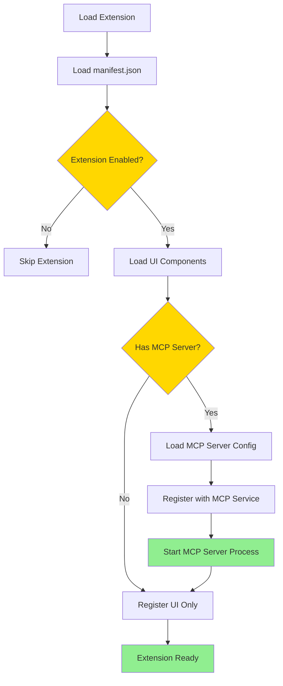

# Extension MCP Server Bundling Architecture

## Overview

This document outlines the architecture for bundling MCP (Model Context Protocol) servers directly with extensions. This approach ensures that MCP servers are not standalone components floating in the codebase, but are tightly coupled with their corresponding extension functionality. Each extension becomes a self-contained unit that includes both UI components and backend MCP server capabilities.

## Core Principle

**Extension = UI + MCP Server + Configuration**

Every extension is a complete, self-contained feature that includes:
- Frontend UI components (React components, views, etc.)
- Backend MCP server (if needed for execution/processing)
- Extension manifest (metadata, configuration)
- File handlers, contributions, and other extension features

## Architecture

### Extension Package Structure

```
extension-name/
├── README.md
├── LICENSE
├── package.json
├── manifest.json              # Extension metadata and configuration
├── src/                       # Frontend/UI code
│   ├── components/
│   │   └── MainComponent.tsx
│   ├── manifest.ts
│   └── index.ts
├── mcp-server/                # Backend MCP server (optional)
│   ├── server.py              # Or server.js, server.ts, etc.
│   ├── config.json            # MCP server configuration
│   ├── requirements.txt       # Python dependencies (if applicable)
│   └── package.json          # Node dependencies (if applicable)
└── dist/                      # Built/compiled files
```

### Extension Manifest Structure

```json
{
  "id": "jupyterlab",
  "name": "JupyterLab Extension",
  "version": "1.0.0",
  "description": "Python notebook execution and visualization",
  "licenseRequired": true,
  "enabled": true,

  "mcpServer": {
    "enabled": true,
    "name": "jupyter-server",
    "command": "python",
    "args": ["mcp-server/server.py"],
    "configPath": "mcp-server/config.json",
    "env": {
      "INSIGHTLM_DATA_DIR": "${INSIGHTLM_DATA_DIR}"
    }
  },

  "fileHandlers": [
    {
      "extension": "ipynb",
      "component": "./src/components/NotebookViewer"
    }
  ],

  "contributions": {
    "toolbarButtons": [
      {
        "id": "create-notebook",
        "label": "New Notebook",
        "icon": "📓",
        "handler": "./src/handlers/createNotebook"
      }
    ],
    "menuItems": [
      {
        "id": "new-notebook",
        "label": "New Notebook",
        "context": "workbook"
      }
    ]
  }
}
```

## MCP Server Integration

### MCP Server Declaration

Extensions declare their MCP server in the manifest:

```typescript
interface ExtensionManifest {
  // ... other fields
  mcpServer?: {
    enabled: boolean;
    name: string;
    command: string;
    args: string[];
    configPath?: string;
    env?: Record<string, string>;
  };
}
```

### MCP Server Discovery

The extension registry discovers and loads MCP servers:

1. **Extension Discovery**
   - Scan `extensions/` directory
   - Load each extension's `manifest.json`
   - Check for `mcpServer` declaration

2. **MCP Server Registration**
   - If extension is enabled and has `mcpServer`:
     - Resolve MCP server path relative to extension directory
     - Load MCP server configuration
     - Register with MCP Service
     - Start MCP server process

3. **Extension-MCP Binding**
   - Extension ID is associated with MCP server name
   - UI components can call MCP server via extension ID
   - MCP server lifecycle tied to extension lifecycle

## Extension Registry Enhancements

### Extension Loading Flow



### MCP Service Integration

The MCP Service must be enhanced to:

1. **Accept Extension-Registered Servers**
   - Extension registry registers MCP servers
   - MCP Service manages their lifecycle
   - Servers are identified by extension ID

2. **Extension-Aware Server Management**
   - Start server when extension enabled
   - Stop server when extension disabled
   - Restart server when extension updated

3. **IPC Integration**
   - Extension UI calls MCP via `window.electronAPI.mcp.call(extensionId, ...)`
   - MCP Service routes to correct server based on extension ID

## Extension Types

### Type 1: UI-Only Extensions (No MCP Server)

**Example: Dashboards Extension**

```json
{
  "id": "dashboards",
  "name": "Dashboards Extension",
  "mcpServer": null,  // No MCP server needed
  "contributions": {
    "views": ["DashboardView"]
  }
}
```

- Pure UI extension
- No backend processing required
- Uses existing APIs/services

### Type 2: UI + MCP Server Extensions

**Example: JupyterLab Extension**

```json
{
  "id": "jupyterlab",
  "name": "JupyterLab Extension",
  "mcpServer": {
    "name": "jupyter-server",
    "command": "python",
    "args": ["mcp-server/server.py"]
  },
  "fileHandlers": [".ipynb"],
  "contributions": {
    "toolbarButtons": ["create-notebook"]
  }
}
```

- UI components for notebook viewing/editing
- MCP server for Python execution
- Tightly coupled functionality

### Type 3: Backend-Only Extensions (Future)

**Example: Data Processing Extension**

```json
{
  "id": "data-processor",
  "name": "Data Processing Extension",
  "mcpServer": {
    "name": "data-processor-server"
  },
  "contributions": {
    "backgroundServices": ["data-processing"]
  }
}
```

- No UI, just backend processing
- Provides MCP tools for other extensions to use

## Implementation Details

### Extension Directory Structure

```
extensions/
├── jupyterlab/
│   ├── manifest.json
│   ├── src/
│   │   ├── manifest.ts
│   │   ├── NotebookViewer.tsx
│   │   └── components/
│   └── mcp-server/
│       ├── server.py
│       ├── config.json
│       └── requirements.txt
├── matlab/
│   ├── manifest.json
│   ├── src/
│   └── mcp-server/
│       └── server.m
└── dashboards/
    ├── manifest.json
    └── src/
        └── DashboardView.tsx
```

### Extension Registry Updates

**Current State:**
- Discovers extensions from `src/extensions/`
- Loads UI components
- MCP servers discovered separately from `mcp-servers/`

**Target State:**
- Discovers extensions from `extensions/` or `src/extensions/`
- Loads UI components
- Discovers MCP servers from extension's `mcp-server/` directory
- Registers MCP server with extension ID binding

### MCP Service Updates

**Current State:**
- Discovers MCP servers from `mcp-servers/` directory
- Each server has its own config.json
- Servers identified by name

**Target State:**
- Accepts MCP server registrations from Extension Registry
- Servers identified by extension ID
- Server lifecycle tied to extension lifecycle
- Configuration loaded from extension's mcp-server directory

### IPC API Updates

**Current API:**
```typescript
window.electronAPI.mcp.jupyterExecuteCell(...)
```

**New Extension-Aware API:**
```typescript
// Option 1: Extension-scoped calls
window.electronAPI.mcp.call(extensionId, method, params)

// Option 2: Direct extension API (cleaner)
window.electronAPI.extensions.call(extensionId, method, params)
```

## Migration Strategy

### Phase 1: Refactor Current Structure

1. **Move Jupyter MCP Server**
   - Move `mcp-servers/jupyter-server/` → `extensions/jupyterlab/mcp-server/`
   - Update paths in extension manifest
   - Update MCP Service to load from extension directory

2. **Update Extension Manifest**
   - Add `mcpServer` declaration to JupyterLab extension manifest
   - Update file handlers and contributions

3. **Update Extension Registry**
   - Enhance to discover MCP servers from extensions
   - Register MCP servers with extension ID

### Phase 2: Update MCP Service

1. **Extension-Aware Registration**
   - Accept MCP server registrations from Extension Registry
   - Map extension ID to MCP server name
   - Manage server lifecycle with extension lifecycle

2. **IPC Handler Updates**
   - Update IPC handlers to accept extension ID
   - Route calls to correct MCP server
   - Maintain backward compatibility during transition

### Phase 3: Update UI Components

1. **Extension API**
   - Update NotebookViewer to use extension-scoped API
   - Replace direct MCP calls with extension API calls
   - Cleaner, more maintainable code

2. **Error Handling**
   - Handle extension disabled errors
   - Show appropriate messages when MCP server unavailable

## Benefits of This Approach

### 1. Logical Coupling
- UI and backend functionality belong together
- Clear feature boundaries
- Easier to understand and maintain

### 2. Simplified Distribution
- Single package contains everything
- Install extension = get UI + MCP server
- No separate MCP server management

### 3. Unified Licensing
- One license for complete feature
- Enable extension = enable UI + MCP server
- Clear commercial boundaries

### 4. Version Synchronization
- UI and MCP server version together
- No version mismatch issues
- Easier dependency management

### 5. Self-Contained Extensions
- Each extension is independent
- Can be developed, tested, and deployed separately
- Clear ownership and responsibility

## Example: JupyterLab Extension

### Directory Structure

```
extensions/jupyterlab/
├── manifest.json
├── package.json
├── src/
│   ├── manifest.ts
│   ├── NotebookViewer.tsx
│   ├── components/
│   │   └── NotebookCell.tsx
│   └── handlers/
│       └── createNotebook.ts
└── mcp-server/
    ├── server.py
    ├── config.json
    └── requirements.txt
```

### Manifest

```json
{
  "id": "jupyterlab",
  "name": "JupyterLab Extension",
  "version": "1.0.0",
  "licenseRequired": true,
  "mcpServer": {
    "enabled": true,
    "name": "jupyter-server",
    "command": "python",
    "args": ["mcp-server/server.py"],
    "configPath": "mcp-server/config.json"
  },
  "fileHandlers": [
    {
      "extension": "ipynb",
      "component": "./src/components/NotebookViewer"
    }
  ],
  "contributions": {
    "toolbarButtons": [
      {
        "id": "create-notebook",
        "label": "New Notebook",
        "icon": "📓",
        "handler": "./src/handlers/createNotebook"
      }
    ]
  }
}
```

### Usage in UI

```typescript
// In NotebookViewer.tsx
const result = await window.electronAPI.extensions.call(
  'jupyterlab',
  'executeCell',
  { code: cell.source }
);
```

## Extension Lifecycle

### Enable Extension

1. User enables extension (via Extension Manager)
2. Extension Registry loads extension manifest
3. Load UI components
4. If MCP server declared:
   - Load MCP server configuration
   - Register with MCP Service
   - Start MCP server process
5. Register file handlers and contributions
6. Extension ready for use

### Disable Extension

1. User disables extension
2. Extension Registry unregisters file handlers
3. Stop MCP server (if running)
4. Unregister from MCP Service
5. Unload UI components
6. Extension disabled

### Update Extension

1. Extension updated (new version)
2. Disable old version
3. Load new version
4. Restart MCP server with new code
5. Reload UI components
6. Extension updated

## Configuration Management

### Extension-Level Configuration

Each extension can have its own configuration:

```json
{
  "id": "jupyterlab",
  "config": {
    "defaultKernel": "python3",
    "autoSave": true,
    "executionTimeout": 30000
  }
}
```

### MCP Server Configuration

MCP server config lives in extension's mcp-server directory:

```json
{
  "name": "jupyter-server",
  "command": "python",
  "args": ["server.py"],
  "env": {
    "INSIGHTLM_DATA_DIR": "${INSIGHTLM_DATA_DIR}"
  }
}
```

### Environment Variable Resolution

- Extension config can reference environment variables
- Resolved at runtime by Extension Registry
- Supports `${VAR}` syntax

## Testing Strategy

### Unit Testing

- Test extension manifest parsing
- Test MCP server discovery
- Test extension loading/unloading

### Integration Testing

- Test extension + MCP server together
- Test enable/disable lifecycle
- Test IPC communication

### End-to-End Testing

- Test complete user workflows
- Test extension contributions (buttons, menus)
- Test file handler registration

## Security Considerations

### Extension Isolation

- Each extension runs in its own context
- MCP servers isolated by process
- No cross-extension access by default

### MCP Server Security

- MCP servers run with extension's permissions
- Validate MCP server code before execution
- Sandbox MCP server processes (future)

### License Validation

- Extension license validates both UI and MCP server
- Disable extension = disable MCP server
- Clear licensing boundaries

## Future Enhancements

### Shared MCP Servers

If multiple extensions need the same MCP server:

- Option 1: Bundle with each extension (duplication)
- Option 2: Shared MCP server extension (dependency)
- Option 3: Core MCP server (part of base product)

### Extension Dependencies

Extensions can depend on other extensions:

```json
{
  "id": "advanced-jupyter",
  "dependencies": ["jupyterlab"],
  "mcpServer": {
    "extends": "jupyterlab"
  }
}
```

### MCP Server Composition

Multiple MCP servers per extension (advanced use cases):

```json
{
  "mcpServers": [
    {
      "name": "jupyter-execution",
      "command": "python",
      "args": ["mcp-server/execution.py"]
    },
    {
      "name": "jupyter-analysis",
      "command": "python",
      "args": ["mcp-server/analysis.py"]
    }
  ]
}
```

## Migration Checklist

- [ ] Move `mcp-servers/jupyter-server/` to `extensions/jupyterlab/mcp-server/`
- [ ] Update JupyterLab extension manifest with `mcpServer` declaration
- [ ] Enhance Extension Registry to discover MCP servers from extensions
- [ ] Update MCP Service to accept extension-registered servers
- [ ] Update IPC handlers to use extension-scoped API
- [ ] Update NotebookViewer to use new extension API
- [ ] Test enable/disable extension functionality
- [ ] Test MCP server lifecycle with extension
- [ ] Update documentation

## Questions for Discussion

1. **Directory Structure**
   - Keep `mcp-server/` subdirectory or flatten?
   - Naming convention for MCP server directory?

2. **Configuration**
   - Separate configs for extension and MCP server?
   - Or unified configuration?

3. **Shared Servers**
   - How to handle MCP servers needed by multiple extensions?
   - Dependency model or duplication?

4. **Development Workflow**
   - Develop UI and MCP server in same repo?
   - Or separate repos that get bundled?

5. **Distribution**
   - Single package file or separate packages?
   - How to handle MCP server dependencies?

---

*Document Version: 1.0*
*Last Updated: 2025-01-15*


