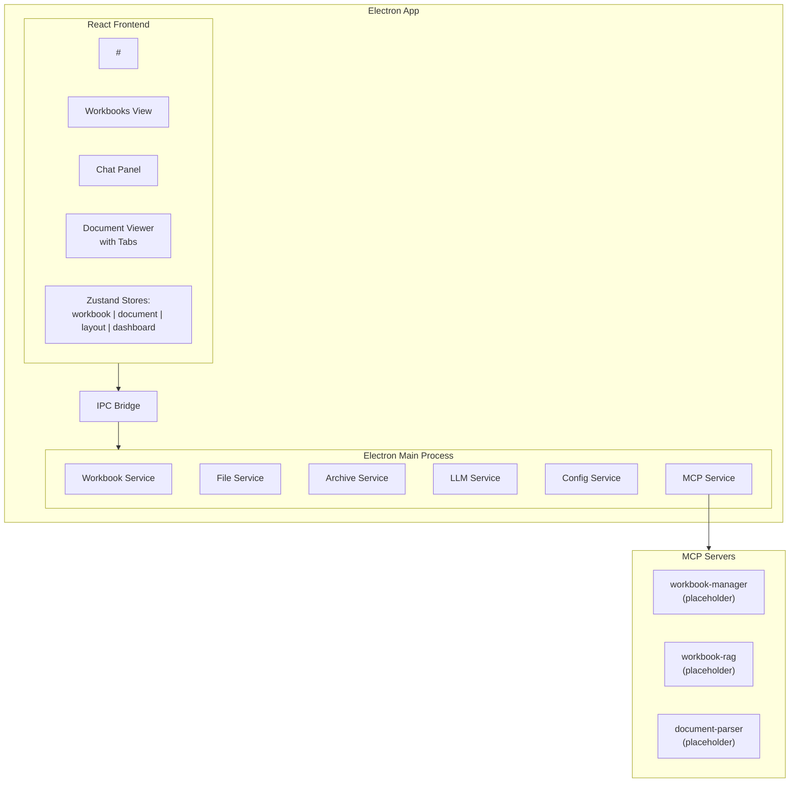
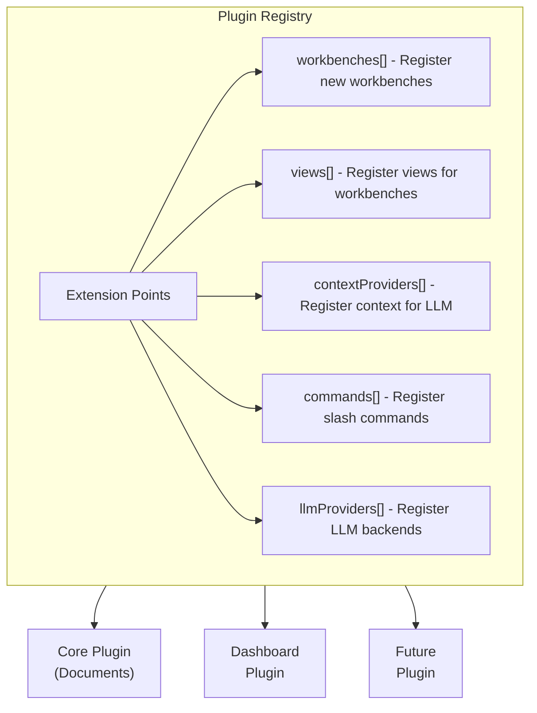
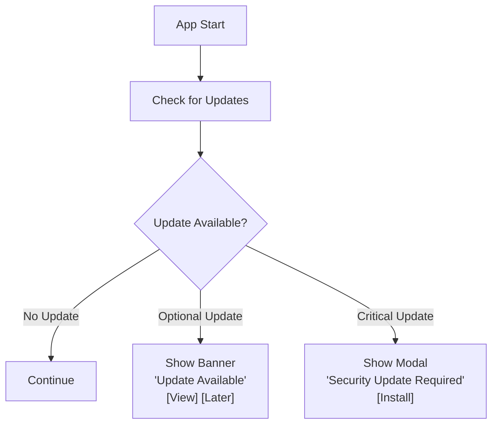
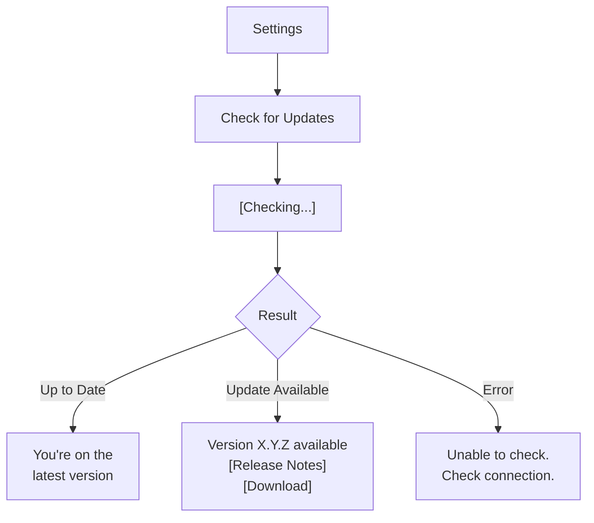
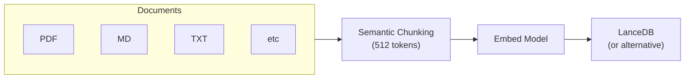
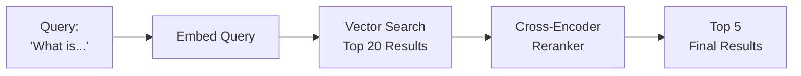
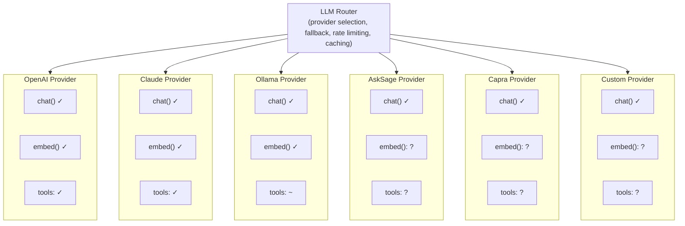
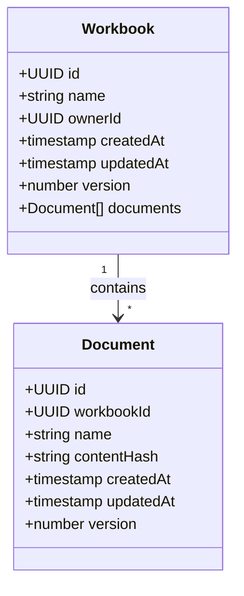
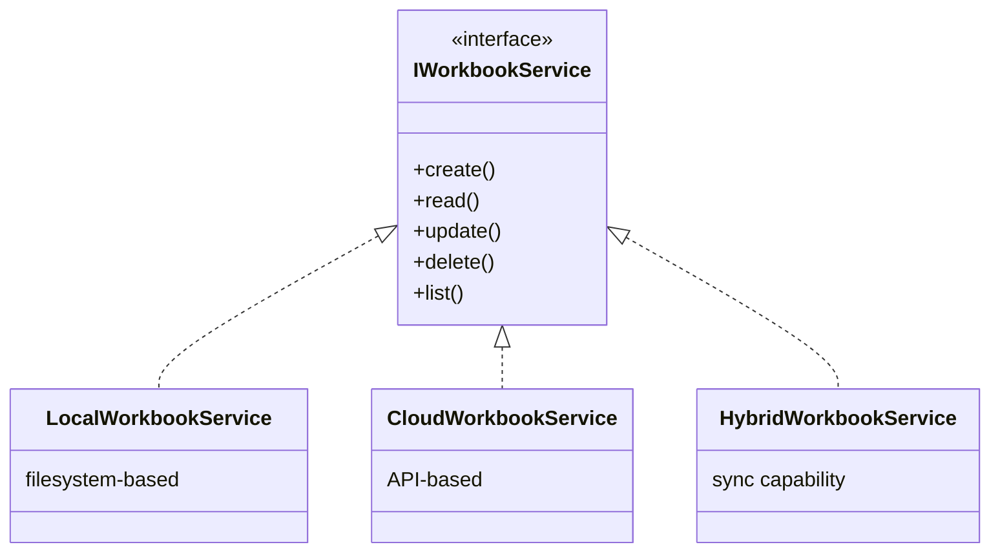
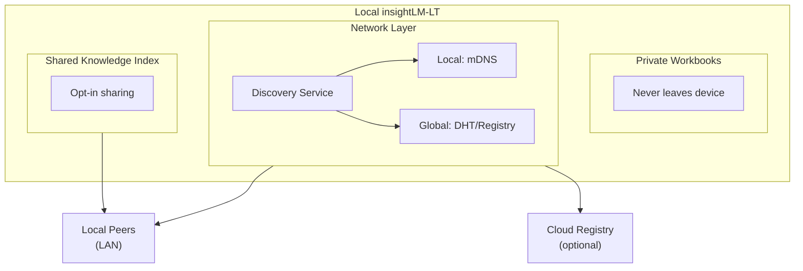

# insightLM-LT Architecture Specification

**Document Version:** 0.1.1
**Last Updated:** December 3, 2024
**Status:** Draft - Active Discussion

---

## Document Purpose

This specification defines the foundational architecture for insightLM-LT, focusing on four core pillars:

1. Extensible & Pluggable Architecture
2. Remote Update System
3. Comprehensive RAG Capability
4. Desktop → Cloud → Decentralized Evolution

The document follows an iterative development approach where questions, answers, and decisions are captured inline for traceability.

---

## Table of Contents

1. [Current State Summary](#1-current-state-summary)
2. [Extensible & Pluggable Architecture](#2-extensible--pluggable-architecture)
3. [Remote Update System](#3-remote-update-system)
4. [Comprehensive RAG Capability](#4-comprehensive-rag-capability)
5. [Desktop → Cloud → Decentralized](#5-desktop--cloud--decentralized)
6. [Appendix A: Q&A Archive](#appendix-a-qa-archive)
7. [Appendix B: Use Cases](#appendix-b-use-cases)
8. [Appendix C: Assumptions](#appendix-c-assumptions)
9. [Appendix D: Architectural Decision Records](#appendix-d-architectural-decision-records)

---

## 1. Current State Summary

### 1.1 Technology Stack

| Layer              | Technology                      |
| ------------------ | ------------------------------- |
| Desktop Framework  | Electron                        |
| Frontend           | React + TypeScript              |
| Bundler            | Vite                            |
| Styling            | Tailwind CSS                    |
| State Management   | Zustand (4 stores)              |
| Backend Services   | Node.js (Electron main process) |
| Extension Protocol | MCP (Model Context Protocol)    |
| LLM Providers      | OpenAI, Claude, Ollama          |
| Update System      | electron-updater (basic)        |

### 1.2 Current Architecture Diagram



### 1.3 Identified Gaps

1. **Hard-coded Views**: `App.tsx` has fixed view types (`"documents" | "dashboard"`)
2. **Tight Coupling**: Services are instantiated directly in `main.ts`
3. **Basic Update UI**: No user-facing update controls or notifications
4. **Placeholder RAG**: `workbook-rag` MCP server has no actual implementation
5. **No Data Model Abstraction**: Filesystem paths embedded throughout

---

## 2. Extensible & Pluggable Architecture

### 2.1 Overview

The goal is to create an architecture where new workbenches, views, and capabilities can be added without modifying core application code.

### 2.2 Terminology

| Term                | Definition                                                                               |
| ------------------- | ---------------------------------------------------------------------------------------- |
| **Workbench**       | A complete mode of operation (e.g., Document Analysis, Dashboard Builder, Admin Console) |
| **View**            | A component within a workbench (e.g., WorkbooksTree, Chat, DocumentViewer)               |
| **Panel**           | A dockable area within a view that can host content                                      |
| **Extension Point** | A defined location where plugins can inject functionality                                |
| **Plugin**          | A discrete unit of functionality that registers with extension points                    |

### 2.3 Plugin Registry Pattern

The most successful extensible systems (VSCode, Eclipse, Continue.dev) use a **plugin registry** pattern:



### 2.4 Continue.dev's Approach (Reference Model)

Continue.dev uses a lightweight extensibility model through `config.json`/`config.ts`:

- **Context Providers**: What information to include in LLM context
- **Slash Commands**: User-invokable actions
- **Models**: LLM configuration
- **Custom Prompts**: System prompts for different scenarios

This approach doesn't require full plugin isolation but provides meaningful extensibility.

### 2.5 Proposed Extension Points

| Extension Point    | Purpose                      | Example                                 |
| ------------------ | ---------------------------- | --------------------------------------- |
| `workbenches`      | Register new workbench modes | Dashboard Builder, Report Generator     |
| `views`            | Register UI components       | Custom file viewers, specialized panels |
| `contextProviders` | Provide context to LLM       | Code analyzer, document summarizer      |
| `commands`         | Slash commands and actions   | /summarize, /export, /analyze           |
| `llmProviders`     | LLM backend integrations     | AskSage, Capra, custom endpoints        |
| `fileHandlers`     | Custom file type handlers    | .dwg viewer, .msg parser                |

---

### 2.6 Questions & Discussion

> **Q2.1**: Do you want plugins to be **first-party only** (shipped with app) or **third-party** (loaded at runtime from external sources)?
>
> **Context**: First-party is simpler and more secure but limits community contribution. Third-party requires sandboxing, permissions, and a distribution mechanism.

**A2.1**: [Your answer here]

---

> **Q2.2**: Should plugins have **isolated state** or **share a global store**?
>
> **Context**: Isolated state prevents plugins from interfering with each other but makes cross-plugin communication harder. Shared state is simpler but risks tight coupling.

**A2.2**: [Your answer here]

---

> **Q2.3**: How should plugins **communicate** with each other and the core?
>
> Options:
>
> - **Events**: Pub/sub event bus (loose coupling)
> - **Shared Services**: Dependency injection (medium coupling)
> - **Direct Calls**: Import and call (tight coupling)

**A2.3**: [Your answer here]

---

> **Q2.4**: Should we adopt Continue.dev's `config.ts` pattern for configuration, or build a full plugin manifest system?
>
> **Context**: `config.ts` is user-editable and flexible. Manifest system is more structured but requires tooling.

**A2.4**: [Your answer here]

---

> **Q2.5**: What workbenches do you envision beyond Documents and Dashboard?
>
> **Context**: Understanding the roadmap helps design the right abstraction level.

**A2.5**: [Your answer here]

---

## 3. Remote Update System

### 3.1 Overview

insightLM-LT needs the ability to be remotely updated from development releases to end users, with appropriate user notification and control.

### 3.2 Current State

The application uses `electron-updater` with basic `checkForUpdatesAndNotify()` functionality. There is no UI for:

- Viewing available updates
- Reading release notes
- Manually checking for updates
- Controlling when updates are applied

### 3.3 Update Distribution Options

| Option                   | Pros                                             | Cons                  | Best For                         |
| ------------------------ | ------------------------------------------------ | --------------------- | -------------------------------- |
| **GitHub Releases**      | Free, native electron-updater support, automatic | Public visibility     | Open source, public apps         |
| **S3/Azure Blob**        | Private, scalable, CDN support                   | Requires setup, costs | Enterprise, private distribution |
| **Custom Update Server** | Full control, approval workflows                 | Development effort    | Staged rollouts, enterprise      |

### 3.4 User Experience Flows

#### 3.4.1 Automatic Update Notification



#### 3.4.2 Manual Update Check



### 3.5 Release Channels

| Channel     | Purpose                   | Audience        |
| ----------- | ------------------------- | --------------- |
| **Stable**  | Production-ready releases | All users       |
| **Beta**    | Feature-complete, testing | Opt-in users    |
| **Nightly** | Latest development        | Developers only |

### 3.6 Enterprise Considerations

For government/DoD environments:

- **Offline Update**: Package updates for USB/network share deployment
- **Approval Workflow**: Admin approves updates before user visibility
- **Airgapped Deployment**: Support environments with no external network
- **Audit Trail**: Log all update activities

### 3.7 Versioning Strategy

Recommended: **Semantic Versioning** (Major.Minor.Patch)

- **Major**: Breaking changes, significant new features
- **Minor**: New features, backward compatible
- **Patch**: Bug fixes, security updates

---

### 3.8 Questions & Discussion

> **Q3.1**: What is your target deployment environment?
>
> Options:
>
> - Consumer/public (GitHub releases fine)
> - Enterprise/private (need private hosting)
> - Airgapped/government (need offline support)
> - All of the above

**A3.1**: [Your answer here]

---

> **Q3.2**: Do you need **staged rollouts** (release to 10% of users first, then expand)?
>
> **Context**: Staged rollouts catch issues before affecting all users but require infrastructure.

**A3.2**: [Your answer here]

---

> **Q3.3**: Should users be able to **decline** non-critical updates indefinitely, or should there be a "force update after X versions" policy?

**A3.3**: [Your answer here]

---

> **Q3.4**: Do you need **rollback** capability (revert to previous version if update breaks something)?

**A3.4**: [Your answer here]

---

> **Q3.5**: Where will your update artifacts be hosted initially?
>
> Options: GitHub Releases, AWS S3, Azure Blob, Self-hosted server

**A3.5**: [Your answer here]

---

## 4. Comprehensive RAG Capability

### 4.1 Overview

insightLM-LT needs a comprehensive RAG (Retrieval-Augmented Generation) system that:

- Indexes all information in the system
- Supports reranking for improved relevance
- Integrates with Continue.dev patterns
- Works with MCP protocol
- Supports multiple LLM providers

Reference: [Continue.dev Custom Code RAG Guide](https://docs.continue.dev/guides/custom-code-rag)

### 4.2 RAG Pipeline Architecture

#### Indexing Pipeline



#### Retrieval Pipeline



### 4.3 What Gets Indexed

| Content Type           | Source                          | Priority |
| ---------------------- | ------------------------------- | -------- |
| Workbook Documents     | PDF, MD, TXT, DOCX in workbooks | High     |
| Chat History           | Previous conversations          | Medium   |
| System Configuration   | YAML configs, MCP configs       | Low      |
| External Documentation | Linked references               | Optional |
| Code Files             | Source code in workbooks        | High     |

### 4.4 Chunking Strategies

| Strategy       | Description                           | Best For            |
| -------------- | ------------------------------------- | ------------------- |
| **Fixed-size** | Split at N tokens (e.g., 512)         | General purpose     |
| **Semantic**   | Split at paragraph/section boundaries | Documents, markdown |
| **Code-aware** | Split at function/class boundaries    | Source code         |
| **Recursive**  | Hierarchical splitting with overlap   | Long documents      |

### 4.5 Embedding Models

| Model                    | Type         | Dimensions | Notes                        |
| ------------------------ | ------------ | ---------- | ---------------------------- |
| `text-embedding-3-small` | OpenAI API   | 1536       | High quality, cost per call  |
| `text-embedding-3-large` | OpenAI API   | 3072       | Highest quality, higher cost |
| `all-MiniLM-L6-v2`       | Local        | 384        | Fast, runs locally           |
| `nomic-embed-text`       | Ollama       | 768        | Local, good quality          |
| Custom                   | Configurable | Varies     | For enterprise requirements  |

### 4.6 Vector Stores

| Store          | Type            | Pros                       | Cons                      |
| -------------- | --------------- | -------------------------- | ------------------------- |
| **LanceDB**    | Embedded        | Serverless, fast, columnar | Newer, smaller community  |
| **ChromaDB**   | Embedded        | Python-native, simple      | Slower for large datasets |
| **SQLite-VSS** | Embedded        | SQLite extension, familiar | Limited features          |
| **Qdrant**     | Server/Embedded | Fast, Rust-based           | More complex setup        |
| **Pinecone**   | Cloud           | Managed, scalable          | Cloud dependency, cost    |

### 4.7 Reranking Options

| Option                                 | Type        | Quality  | Speed           |
| -------------------------------------- | ----------- | -------- | --------------- |
| `cross-encoder/ms-marco-MiniLM-L-6-v2` | Local model | Good     | Fast            |
| `BAAI/bge-reranker-base`               | Local model | Better   | Medium          |
| Cohere Rerank API                      | Cloud API   | Best     | API latency     |
| LLM-based reranking                    | LLM call    | Variable | Slow, expensive |

### 4.8 LLM Provider Abstraction



### 4.9 MCP Integration

The RAG system should be exposed as an MCP server:

```json
{
  "name": "workbook-rag",
  "methods": {
    "rag/index": "Index a document or workbook",
    "rag/search": "Search indexed content",
    "rag/reindex": "Re-index all content",
    "rag/status": "Get indexing status"
  }
}
```

### 4.10 Continue.dev Integration Points

- **@codebase**: Search indexed workbook content
- **@docs**: Search indexed documentation
- **Context Providers**: Feed RAG results into LLM context
- **Slash Commands**: /index, /search, /reindex

---

### 4.11 Questions & Discussion

> **Q4.1**: What content should be indexed? All workbook documents? Chat history? System files?
>
> **Context**: More content = better recall but larger index and slower queries.

**A4.1**: [Your answer here]

---

> **Q4.2**: Should embedding be **local** (privacy, offline) or **remote** (higher quality, simpler)?
>
> **Context**: Local requires shipping models (~100MB+). Remote requires API calls and has privacy implications.

**A4.2**: [Your answer here]

---

> **Q4.3**: Which **vector store** should we use?
>
> - LanceDB (current placeholder) - serverless, embedded
> - ChromaDB - Python-native, popular
> - Other?

**A4.3**: [Your answer here]

---

> **Q4.4**: Should **reranking** be required or optional?
>
> **Context**: Reranking significantly improves relevance but adds latency and complexity.

**A4.4**: [Your answer here]

---

> **Q4.5**: For AskSage/Capra/other enterprise LLMs:
>
> - Do they support function/tool calling?
> - Do they provide embedding endpoints?
> - What authentication do they require?

**A4.5**: [Your answer here]

---

> **Q4.6**: Should the RAG system support **hybrid search** (keyword + vector)?
>
> **Context**: Hybrid search combines BM25 keyword matching with vector similarity for better results on exact terms.

**A4.6**: [Your answer here]

---

> **Q4.7**: How should we handle **document updates**? Re-index on change? Scheduled re-index? Manual trigger?

**A4.7**: [Your answer here]

---

## 5. Desktop → Cloud → Decentralized

### 5.1 Overview

insightLM-LT starts as a desktop application but should be architected with a path toward:

1. **Cloud deployment** (hosted SaaS)
2. **Decentralized knowledge sharing** (Napster-like model)

### 5.2 Desktop-First Advantages

Starting desktop-first allows:

- Rapid iteration without infrastructure costs
- Real user testing before scaling
- Core product development without distributed systems complexity
- Privacy by default (data stays local)

### 5.3 Cloud Migration Path

#### 5.3.1 Data Model Requirements

For cloud-readiness, the data model must be:

- **Location-agnostic**: No hardcoded filesystem paths
- **Identity-aware**: UUIDs for all entities
- **Versioned**: Timestamps and version numbers on everything
- **Conflict-aware**: Designed for eventual consistency



#### 5.3.2 Service Abstraction

Services should have **interface + implementation** pattern:



#### 5.3.3 Authentication Preparation

Even desktop should have user identity concepts:

- Local: Simple user profile (name, preferences)
- Cloud: OAuth/SSO ready (identity provider abstraction)

### 5.4 Decentralized/P2P Knowledge Sharing

#### 5.4.1 Vision

Knowledge created on desktop versions becomes available to the network:

- Users contribute knowledge (indexed documents, curated insights)
- Users discover and consume knowledge from peers
- Privacy controls determine what's shared vs. private
- No central server required (but optional registry for discovery)

#### 5.4.2 Architectural Considerations



#### 5.4.3 Key Challenges

| Challenge         | Options                                               |
| ----------------- | ----------------------------------------------------- |
| **Discovery**     | mDNS (local), DHT (global), Central registry (hybrid) |
| **Trust**         | Reputation system, Verified publishers, Web of trust  |
| **Privacy**       | User-controlled sharing levels, Encryption            |
| **Sync/Conflict** | CRDTs, Last-write-wins, Manual resolution             |
| **Incentives**    | Access requires contribution, Reputation rewards      |

---

### 5.5 Questions & Discussion

> **Q5.1**: Is cloud deployment a **near-term** goal (next 6-12 months) or **long-term** aspiration?
>
> **Context**: This affects how much we invest in abstraction now vs. later.

**A5.1**: [Your answer here]

---

> **Q5.2**: For the decentralized model, is this a **vision** to keep in mind or something to **actively architect** for now?

**A5.2**: [Your answer here]

---

> **Q5.3**: What **sharing granularity** makes sense?
>
> Options:
>
> - Entire workbooks
> - Individual documents
> - Knowledge snippets/insights
> - RAG index chunks

**A5.3**: [Your answer here]

---

> **Q5.4**: Should there be a **central registry** for discovery, or purely peer-to-peer?
>
> **Context**: Central registry is simpler but creates dependency. Pure P2P is more resilient but harder to bootstrap.

**A5.4**: [Your answer here]

---

> **Q5.5**: What **privacy model** do you envision?
>
> Options:
>
> - Everything private by default, explicit opt-in to share
> - Public by default, explicit opt-out
> - Tiered: Private → Team → Organization → Public

**A5.5**: [Your answer here]

---

> **Q5.6**: For **multi-user/team** scenarios, how should permissions work?
>
> - Role-based (Admin, Editor, Viewer)
> - Capability-based (specific permissions per resource)
> - Simple owner/shared model

**A5.6**: [Your answer here]

---

## Appendix A: Q&A Archive

_This section will be populated as questions are answered and discussions conclude. Each entry will include:_

- Question ID
- Original Question
- Answer/Decision
- Date
- Rationale

---

## Appendix B: Use Cases

_Document key use cases that drive architectural decisions._

### UC-1: [Use Case Name]

**Actor**: [Who performs this]
**Preconditions**: [What must be true before]
**Flow**:

1. Step 1
2. Step 2
3. ...

**Postconditions**: [What is true after]

---

## Appendix C: Assumptions

_List assumptions made during specification development._

| ID  | Assumption   | Impact if Wrong |
| --- | ------------ | --------------- |
| A-1 | [Assumption] | [Impact]        |

---

## Appendix D: Architectural Decision Records

_Document significant architectural decisions._

### ADR-001: [Decision Title]

**Status**: [Proposed | Accepted | Deprecated | Superseded]
**Context**: [Why is this decision needed?]
**Decision**: [What was decided?]
**Consequences**: [What are the implications?]

---

## Document History

| Version | Date       | Author       | Changes                                    |
| ------- | ---------- | ------------ | ------------------------------------------ |
| 0.1.0   | 2024-12-02 | AI Assistant | Initial draft from discussion              |
| 0.1.1   | 2024-12-03 | AI Assistant | Converted ASCII diagrams to Mermaid format |
