# insightLM-LT Architecture Specification

**Document Version:** 0.1.7
**Last Updated:** December 3, 2024
**Status:** Draft - Active Discussion

---

## Document Purpose

This specification defines the foundational architecture for insightLM-LT, focusing on four core pillars:

1. Extensible & Pluggable Architecture
2. Remote Update System
3. Comprehensive RAG Capability
4. Desktop → Cloud → Decentralized Evolution

The document follows an iterative development approach where questions, answers, and decisions are captured inline for traceability.

---

## Table of Contents

1. [Current State Summary](#1-current-state-summary)
2. [Extensible & Pluggable Architecture](#2-extensible--pluggable-architecture)
3. [Remote Update System](#3-remote-update-system)
4. [Comprehensive RAG Capability](#4-comprehensive-rag-capability)
5. [Desktop → Cloud → Decentralized](#5-desktop--cloud--decentralized)
6. [Appendix A: Q&A Archive](#appendix-a-qa-archive)
7. [Appendix B: Use Cases](#appendix-b-use-cases)
8. [Appendix C: Assumptions](#appendix-c-assumptions)
9. [Appendix D: Architectural Decision Records](#appendix-d-architectural-decision-records)

---

## 1. Current State Summary

### 1.1 Technology Stack

| Layer              | Technology                      |
| ------------------ | ------------------------------- |
| Desktop Framework  | Electron                        |
| Frontend           | React + TypeScript              |
| Bundler            | Vite                            |
| Styling            | Tailwind CSS                    |
| State Management   | Zustand (4 stores)              |
| Backend Services   | Node.js (Electron main process) |
| Extension Protocol | MCP (Model Context Protocol)    |
| LLM Providers      | OpenAI, Claude, Ollama          |
| Update System      | electron-updater (basic)        |

### 1.2 Current Architecture Diagram

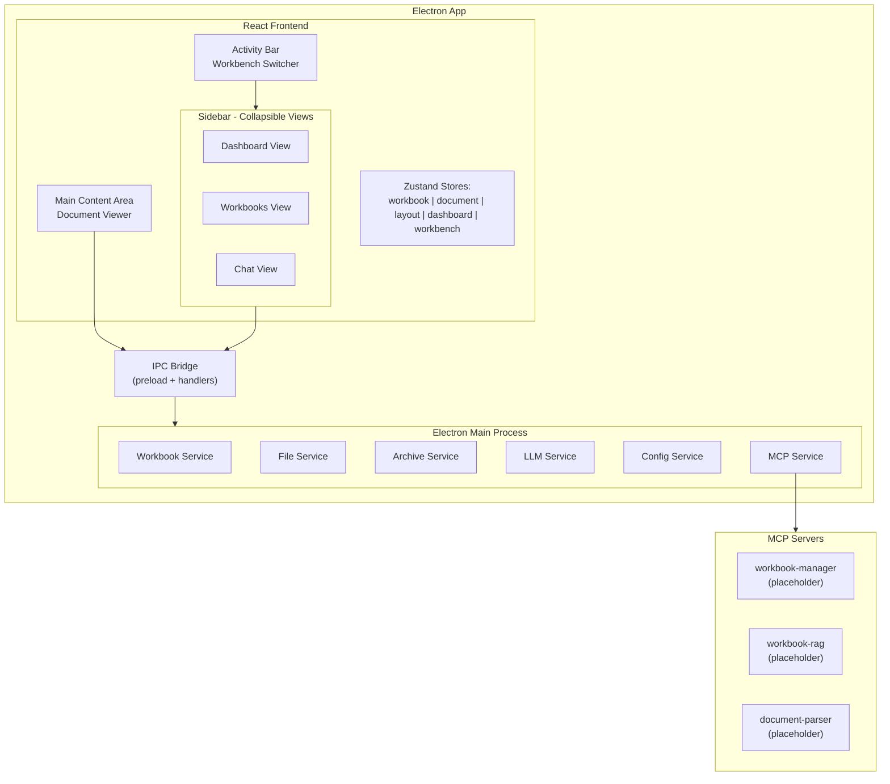
```mermaid
graph TB
    subgraph Electron["Electron App"]
        subgraph Frontend["React Frontend"]
            AB[Activity Bar<br/>Workbench Switcher]

            subgraph Sidebar["Sidebar - Collapsible Views"]
                DV["Dashboard View"]
                WV["Workbooks View"]
                CV["Chat View"]
            end

            MCA["Main Content Area<br/>Document Viewer"]

            Stores["Zustand Stores:<br/>workbook | document | layout | dashboard | workbench"]
        end

        IPC["IPC Bridge<br/>(preload + handlers)"]

        subgraph Main["Electron Main Process"]
            WS[Workbook Service]
            FS[File Service]
            AS[Archive Service]
            LS[LLM Service]
            CS[Config Service]
            MS[MCP Service]
        end
    end

    subgraph MCP["MCP Servers"]
        WM["workbook-manager<br/>(placeholder)"]
        WR["workbook-rag<br/>(placeholder)"]
        DP["document-parser<br/>(placeholder)"]
    end

    AB --> Sidebar
    Sidebar --> IPC
    MCA --> IPC
    IPC --> Main
    MS --> MCP
```

**Architecture Notes:**

- **Activity Bar**: Vertical bar for switching between workbenches (Insight, Data, Analysis, Event)
- **Sidebar Views**: Three collapsible/resizable views stacked vertically:
  - **Dashboard View**: Dashboard management and builder
  - **Workbooks View**: Workbook and document tree
  - **Chat View**: LLM chat interface
- **Workbench System**: Manages different workbench modes, each with configurable views. Currently supports "Insight Workbench" (file) with all three views; other workbenches are placeholders for future expansion.
- **IPC Bridge**: Electron IPC communication layer connecting React frontend (renderer process) to Electron main process. Implemented via:
  - **Preload Script** (`preload.ts`): Exposes safe APIs to frontend via `contextBridge` (creates `window.electronAPI`)
  - **IPC Handlers** (`ipc/*.ts`): Main process handlers registered with `ipcMain.handle()` that execute backend operations
  - **Frontend Calls**: React components invoke `window.electronAPI.*` methods which use `ipcRenderer.invoke()` to communicate with main process

### 1.3 Workspace & Project Concept

**Status**: Conceptual - Not yet implemented

#### 1.3.1 Overview

A **Workspace** is the top-level container that captures the complete state of a user's work environment, similar to a physical workspace (like a garage or office). Within a workspace, users organize their work into **Projects** - goal-oriented efforts that may use different workbenches and tools.

**Workspace** enables:

- **State Persistence**: Save entire workspace configuration
- **Portability**: Export/import complete workspace setups
- **Organization**: Group related projects together
- **Multi-workspace Support**: Switch between different workspaces
- **Collaboration**: Share complete workspace configurations
- **Version Control**: Track workspace changes over time

**Project** (within a workspace) enables:

- **Goal-oriented organization**: Focus on specific deliverables (e.g., "Temperature Sensor", "Data Analysis Report")
- **Workbench selection**: Each project can use different workbenches
- **Context isolation**: Projects keep their own workbooks, notebooks, and chat history
- **Progress tracking**: Track project milestones and completion

#### 1.3.2 Workspace Structure

A workspace contains everything needed to recreate a work environment:

```
Workspace (My Development Workspace)
├── metadata.json              # Workspace config, name, description, created/modified dates
├── projects/                 # Projects within this workspace
│   ├── temperature-sensor/
│   │   ├── metadata.json     # Project metadata (goal, status, dates)
│   │   ├── workbenches/      # Workbenches used for this project
│   │   │   ├── soldering-workbench.json
│   │   │   ├── electronics-workbench.json
│   │   │   └── testing-workbench.json
│   │   ├── workbooks/        # Workbooks for this project
│   │   │   ├── schematics/
│   │   │   ├── notes/
│   │   │   └── analysis/
│   │   ├── notebooks/        # Jupyter notebooks for this project
│   │   │   ├── sensor-calibration.ipynb
│   │   │   └── temperature-tests.ipynb
│   │   ├── dashboards/       # Dashboards for this project
│   │   │   └── sensor-monitoring.json
│   │   └── chat-history/     # LLM conversations for this project
│   │       └── conversations.jsonl
│   └── data-analysis/
│       └── ...
├── shared-workbooks/         # Workbooks shared across projects
├── plugins/                   # Activated plugins/extensions for this workspace
│   └── enabled-plugins.json
└── config/                    # Workspace-specific configurations
    ├── llm-config.yaml        # Workspace-specific LLM settings
    └── mcp-config.json        # Workspace-specific MCP server configs
```

#### 1.3.3 Workspace & Project Hierarchy

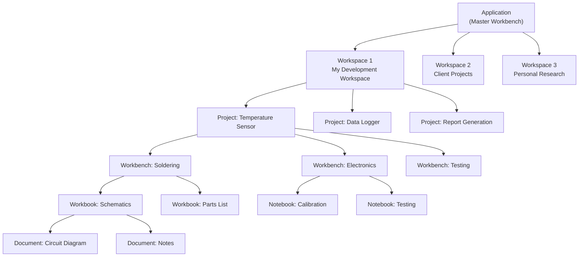
```mermaid
graph TB
    App["Application<br/>(Master Workbench)"]

    App --> WS1["Workspace 1<br/>My Development Workspace"]
    App --> WS2["Workspace 2<br/>Client Projects"]
    App --> WS3["Workspace 3<br/>Personal Research"]

    WS1 --> P1["Project: Temperature Sensor"]
    WS1 --> P2["Project: Data Logger"]
    WS1 --> P3["Project: Report Generation"]

    P1 --> WB1["Workbench: Soldering"]
    P1 --> WB2["Workbench: Electronics"]
    P1 --> WB3["Workbench: Testing"]

    WB1 --> WK1["Workbook: Schematics"]
    WB1 --> WK2["Workbook: Parts List"]

    WB2 --> NB1["Notebook: Calibration"]
    WB2 --> NB2["Notebook: Testing"]

    WK1 --> DOC1["Document: Circuit Diagram"]
    WK1 --> DOC2["Document: Notes"]
```

**Relationship Model:**

- **Application** = Master workbench (the entire insightLM-LT app)
- **Workspace** = Complete work environment (like a physical workspace/garage)
- **Project** = Goal-oriented work effort (what you're building/working on)
- **Workbench** = Specialized tool set (soldering, electronics, analysis)
- **Workbook/Notebook** = Information containers (documents, notes, analysis)
- **Documents** = Individual files/content

#### 1.3.4 Workspace Capabilities

| Capability  | Description                                 | Use Case                              |
| ----------- | ------------------------------------------- | ------------------------------------- |
| **Save**    | Persist workspace state to disk             | Auto-save or manual save              |
| **Export**  | Package workspace as portable archive (ZIP) | Share with team, backup               |
| **Import**  | Load workspace from archive                 | Restore backup, open shared workspace |
| **Switch**  | Change active workspace                     | Work in different environments        |
| **Clone**   | Duplicate workspace                         | Create workspace template             |
| **Archive** | Move workspace to archive                   | Keep but don't actively use           |

#### 1.3.5 Project Capabilities (within Workspace)

| Capability   | Description                          | Use Case                           |
| ------------ | ------------------------------------ | ---------------------------------- |
| **Create**   | Start a new project within workspace | Begin new goal-oriented work       |
| **Complete** | Mark project as finished             | Track project status               |
| **Archive**  | Move project to archive              | Keep completed projects            |
| **Share**    | Export individual project            | Share specific project with others |

#### 1.3.6 Benefits

**Workspace Benefits:**

1. **Environment Preservation**: Complete work environment stays together
2. **Multi-project Organization**: Multiple projects can coexist in one workspace
3. **State Management**: Workspace configuration, plugins, preferences all saved
4. **Collaboration**: Export workspace → share → import on another machine
5. **Experimentation**: Clone workspace to try different configurations
6. **Professional Workflow**: Matches how professionals organize complex work environments

**Project Benefits:**

1. **Goal Focus**: Clear purpose and deliverables for each project
2. **Context Isolation**: Each project has its own workbenches, workbooks, chat history
3. **Progress Tracking**: Track project status, milestones, completion
4. **Workbench Selection**: Different projects can use different workbenches
5. **Portability**: Export individual projects for sharing

#### 1.3.7 Implementation Considerations

- **Data Migration**: Need to migrate existing workbooks to workspaces/projects
- **Default Workspace**: Should there be a "default" workspace for existing users?
- **Workspace Isolation**: Should workspaces be completely isolated or share some resources?
- **Storage Location**: `%APPDATA%/insightLM-LT/workspaces/` vs. user-specified locations
- **File References**: Workspaces should use relative paths for portability
- **Project Scope**: Projects are scoped to a workspace (can't exist outside a workspace)

#### 1.3.8 Questions & Discussion

> **Q1.1**: Should workspaces be **required** (always working in a workspace) or **optional** (can work without a workspace)?
>
> **Context**:
>
> - **Required**: Simpler model, always organized, but may be overkill for simple tasks
> - **Optional**: More flexible, but adds complexity (global vs. workspace-scoped resources)
>
> **Recommendation**: Start with optional, default to a "Default Workspace" for existing users.

**A1.1**: I like the idea of a default workspace, I would like to comment that a workspace could have preconfigured personas like a systems, mechanical, electrcial, controls, etc. engineering workspaces or other like supply chain, already prebuild to default configuration for any 'type' of users.

---

> **Q1.2**: Should projects be **required** within a workspace, or can a workspace exist without projects?
>
> **Context**:
>
> - **Required**: Every workspace must have at least one project (more structured)
> - **Optional**: Workspace can exist with just shared workbooks/resources (more flexible)
>
> **Recommendation**: Optional - allow workspace-level workbooks that aren't part of any project.

**A1.2**: Yes lets make it optional this will be more intue when buidling from the desktop version that is not needed to connect to ther projects so no project needed for the desktop.

---

> **Q1.3**: How should **workspace switching** work?
>
> **Options**:
>
> - **Single workspace at a time**: Close current workspace, open new one (simpler, cleaner state)
> - **Multiple workspaces open**: Tabs or windows for different workspaces (more complex, but more flexible)
>
> **Context**: Single workspace is simpler but less flexible. Multiple workspaces enable cross-workspace workflows.

**A1.3**: Im unsure this is a streach feature and I like the idea of worfklows acress workspaces but and from project to project also.

---

> **Q1.4**: Should **plugins/extensions** be workspace-specific or global?
>
> **Context**:
>
> - **Workspace-specific**: Each workspace can have different plugins enabled (more flexible, matches workspace metaphor)
> - **Global**: Plugins installed once, available everywhere (simpler, but less flexible)
>
> **Hybrid Option**: Plugins installed globally, but enabled/disabled per-workspace.

**A1.4**: Plugins installed globally, but enabled/disabled per-workspace. I like the hybrid method for sure.

---

> **Q1.5**: What should happen to **chat history** - workspace-scoped or project-scoped?
>
> **Options**:
>
> - **Project-scoped**: Each project has its own chat history (recommended - matches goal-oriented nature)
> - **Workspace-scoped**: Chat history shared across all projects in workspace (simpler but less organized)
>
> **Context**: Project-scoped makes more sense - each project is a separate work context with its own goals.

**A1.5**: Project only and maybe we add a workspace mcp to allow projects to access external workspace contex.

---

> **Q1.6**: Should **export format** be a single ZIP file or a directory structure?
>
> **Context**:
>
> - **ZIP**: Single file, easier to share, but requires extraction
> - **Directory**: Can browse directly, but harder to share (multiple files)
>
> **Recommendation**: Support both - ZIP for sharing, directory for local workspaces.

**A1.6**: I like to support both this seems like a best practice.

---

### 1.4 Identified Gaps

1. **Workspaces & Projects Not Implemented**: No workspace/project-level organization - all workbooks/workbenches are global
2. **Tight Coupling**: Services are instantiated directly in `main.ts`
3. **Basic Update UI**: No user-facing update controls or notifications
4. **Placeholder RAG**: `workbook-rag` MCP server has no actual implementation
5. **No Data Model Abstraction**: Filesystem paths embedded throughout
6. **JupyterLab Integration**: Planned but not yet implemented - notebook support needed for data analysis workflows
7. **Workbench Extensibility**: Workbench system exists but plugin architecture not yet implemented for adding new workbenches/views

---

## 2. Extensible & Pluggable Architecture

### 2.1 Overview

The goal is to create an architecture where new workbenches, views, and capabilities can be added without modifying core application code.

### 2.2 Terminology

| Term                | Definition                                                                               |
| ------------------- | ---------------------------------------------------------------------------------------- |
| **Workbench**       | A complete mode of operation (e.g., Document Analysis, Dashboard Builder, Admin Console) |
| **View**            | A component within a workbench (e.g., WorkbooksTree, Chat, DocumentViewer)               |
| **Panel**           | A dockable area within a view that can host content                                      |
| **Extension Point** | A defined location where plugins can inject functionality                                |
| **Plugin**          | A discrete unit of functionality that registers with extension points                    |

### 2.3 Plugin Registry Pattern

The most successful extensible systems (VSCode, Eclipse, Continue.dev) use a **plugin registry** pattern:

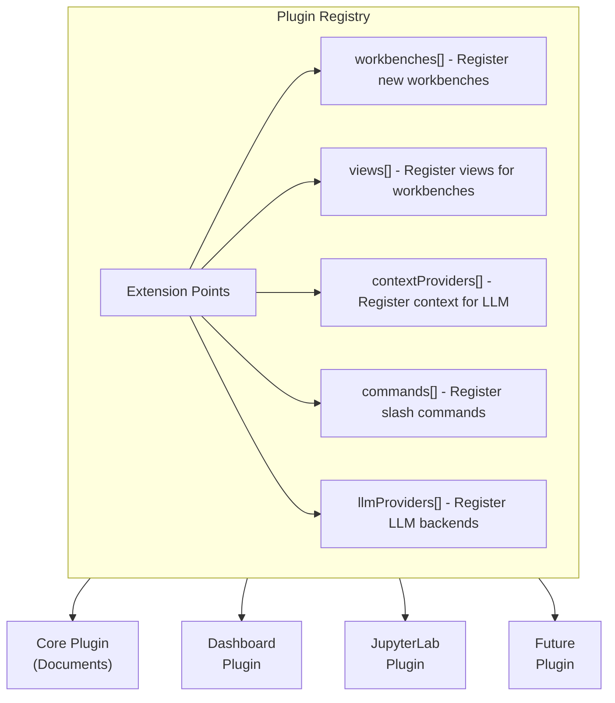
```mermaid
graph TB
    subgraph Registry["Plugin Registry"]
        EP["Extension Points"]
        WB["workbenches[] - Register new workbenches"]
        VW["views[] - Register views for workbenches"]
        CTX["contextProviders[] - Register context for LLM"]
        CMD["commands[] - Register slash commands"]
        LLM["llmProviders[] - Register LLM backends"]

        EP --> WB
        EP --> VW
        EP --> CTX
        EP --> CMD
        EP --> LLM
    end

    Registry --> CorePlugin["Core Plugin<br/>(Documents)"]
    Registry --> DashPlugin["Dashboard<br/>Plugin"]
    Registry --> JupyterPlugin["JupyterLab<br/>Plugin"]
    Registry --> FuturePlugin["Future<br/>Plugin"]
```

### 2.4 Continue.dev's Approach (Reference Model)

Continue.dev uses a lightweight extensibility model through `config.json`/`config.ts`:

- **Context Providers**: What information to include in LLM context
- **Slash Commands**: User-invokable actions
- **Models**: LLM configuration
- **Custom Prompts**: System prompts for different scenarios

This approach doesn't require full plugin isolation but provides meaningful extensibility.

### 2.5 Proposed Extension Points

| Extension Point     | Purpose                      | Example                                                       |
| ------------------- | ---------------------------- | ------------------------------------------------------------- |
| `workbenches`       | Register new workbench modes | Dashboard Builder, Report Generator, JupyterLab               |
| `views`             | Register UI components       | Custom file viewers, specialized panels, Notebook viewer      |
| `contextProviders`  | Provide context to LLM       | Code analyzer, document summarizer, notebook results provider |
| `commands`          | Slash commands and actions   | /summarize, /export, /analyze, /run-notebook                  |
| `llmProviders`      | LLM backend integrations     | AskSage, Capra, custom endpoints                              |
| `fileHandlers`      | Custom file type handlers    | .dwg viewer, .msg parser, .ipynb notebook handler             |
| `notebookProviders` | Notebook execution backends  | Jupyter kernel, Python runtime, R runtime                     |

### 2.6 JupyterLab Integration

#### 2.6.1 Overview

JupyterLab will be integrated as a pluggable workbench feature, similar to VSCode extensions. This allows users to:

- Create and edit Jupyter notebooks within insightLM-LT
- Execute notebook cells and view results
- Access notebook outputs and results in the LLM context
- Share notebooks as part of workbooks

#### 2.6.2 Architecture

JupyterLab integration follows the plugin pattern:

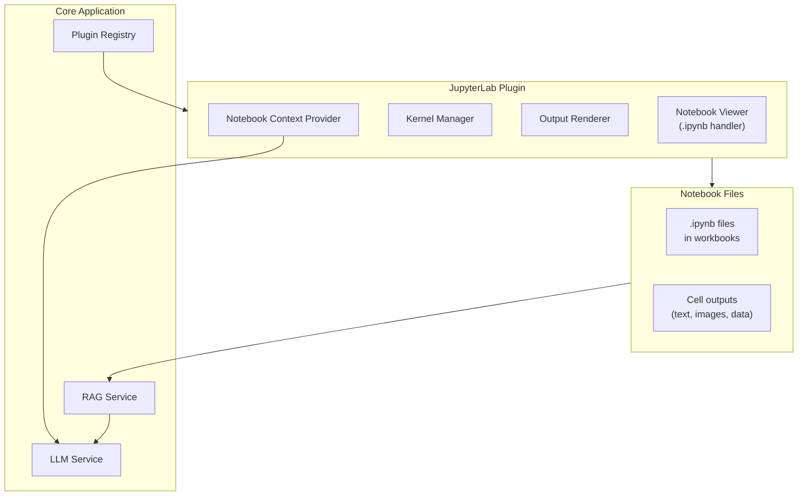
```mermaid
graph TB
    subgraph Core["Core Application"]
        Registry["Plugin Registry"]
        LLMService["LLM Service"]
        RAGService["RAG Service"]
    end

    subgraph JupyterPlugin["JupyterLab Plugin"]
        NotebookViewer["Notebook Viewer<br/>(.ipynb handler)"]
        KernelManager["Kernel Manager"]
        OutputRenderer["Output Renderer"]
        NotebookContext["Notebook Context Provider"]
    end

    subgraph Notebooks["Notebook Files"]
        IPYNB[".ipynb files<br/>in workbooks"]
        Outputs["Cell outputs<br/>(text, images, data)"]
    end

    Registry --> JupyterPlugin
    JupyterPlugin --> Notebooks
    NotebookContext --> LLMService
    Notebooks --> RAGService
    RAGService --> LLMService
```

#### 2.6.3 Key Requirements

1. **Notebook Execution**: Support for executing notebook cells with various kernels (Python, R, Julia, etc.)
2. **Output Capture**: All notebook cell outputs (text, images, plots, data) must be accessible to the LLM
3. **RAG Integration**: Notebook outputs should be indexed in the RAG system for retrieval
4. **Context Provider**: Notebook results should be available as a context provider for LLM queries
5. **Workbook Integration**: Notebooks are stored as `.ipynb` files within workbooks

#### 2.6.4 Implementation Approach

Similar to VSCode's Jupyter extension:

- **Embedded Jupyter Server**: Run Jupyter server as a subprocess or embedded service
- **React Components**: Use JupyterLab React components for notebook rendering
- **Kernel Management**: Manage kernels through Jupyter's kernel gateway or direct kernel spawning
- **Output Storage**: Store notebook outputs alongside `.ipynb` files for RAG indexing

#### 2.6.5 LLM Access to Notebook Results

Notebook outputs will be accessible to the LLM through:

1. **RAG Index**: Notebook outputs are indexed and searchable
2. **Context Provider**: `@notebook` or `@results` context provider includes recent notebook outputs
3. **Tool Calling**: LLM can request to execute notebook cells via tool calls
4. **Direct Access**: LLM can read `.ipynb` files and parse outputs directly

---

### 2.7 Questions & Discussion

> **Q2.1**: Do you want plugins to be **first-party only** (shipped with app) or **third-party** (loaded at runtime from external sources)?
>
> **Context**: First-party is simpler and more secure but limits community contribution. Third-party requires sandboxing, permissions, and a distribution mechanism.

**A2.1**: Its going to be two steps, first party for the base plugins (worbooks, notebooks, data worbench, events workbench, etc.), and as we development more complex plugins we provided via a thridparty mechansim (for instance the ontology workbench, constptualizer, process modeleing workbnech, etc.)

---

> **Q2.2**: Should plugins have **isolated state** or **share a global store**?
>
> **Context**: Isolated state prevents plugins from interfering with each other but makes cross-plugin communication harder. Shared state is simpler but risks tight coupling.

**A2.2**: I think we go with isolated state right out of the box and use the data workbench to integrate. This is debatable so we can adjust if we get into problems.

---

> **Q2.3**: How should plugins **communicate** with each other and the core?
>
> Options:
>
> - **Events**: Pub/sub event bus (loose coupling)
> - **Shared Services**: Dependency injection (medium coupling)
> - **Direct Calls**: Import and call (tight coupling)

**A2.3**: This answer plays on the last and I say we use a pub/sub mechanism to communcate. We can use shared services for the base capabilities but a pub/sub for isolated growth.

---

> **Q2.4**: Should we adopt Continue.dev's `config.ts` pattern for configuration, or build a full plugin manifest system?
>
> **Context**: `config.ts` is user-editable and flexible. Manifest system is more structured but requires tooling.

**A2.4**: Lets do a simple editied file like config.ts as we have a built in editor so users can just edit the file.

---

> **Q2.5**: What workbenches do you envision beyond Documents and Dashboard?
>
> **Context**: Understanding the roadmap helps design the right abstraction level.

**A2.5**:

Examples:

- Data Workbench: User can create data objects (similar to workbooks) with the help of the llm to pull from external sources, web, other workbenchs, workbooks, notebooks, etc. These can be integtated in to federations for use with the llm and user analysis in notebooks. Should work similar to the dashboard where a user can ask for data and get it, we connect data sources via mcp servers.

- Ontology workbnech: Import and create ontologie models, generates cytoscape graphs and owl code, used in higher level projects to define sematically, allowes data from other placed to be mapped internally, see ODRAS. Users can create individuals

- Requirements Workbench: Create, import requirements directly, perferform requirements analysis.

- Requirements Extraction Workbench: Extract requirements from documents.

- Conceptualizer Workbnech: Using requirements and ontologies conctualize the objects, conponents, functions, processes, etc. needed to fullfil a set of requirements. This is a gray concpetual/logical set of objects that can be used for early product systhesis or can operate as tracables between the requriemetns and definitions in sysml.

- SysMLv2 Lite: Users can build sysmlv2 models similar to the ontology workbnech and can 'execute' them as a part of a workflow system to perform archtiecture, functional, logical, physical decompositon, tradesudies, requirements tracability.

- Others Potential Workbenches:

### Potential Workbenches Table

| Workbench Name                     | Description                                                                                                                                                                                                |
| ---------------------------------- | ---------------------------------------------------------------------------------------------------------------------------------------------------------------------------------------------------------- |
| **DAS Workbench**                  | Distributed Autonomous System workbench providing tools for managing autonomous agents, their interactions, and system-wide coordination. Includes LLM-powered Q&A, suggestions, and proactive assistance. |
| **Ontology Workbench**             | Tools for managing, editing, and querying ontologies. Includes ontology import/export, SPARQL query interface, visualization, namespace management, and inheritance system.                                |
| **CQMT Workbench**                 | Competency Question and Microtheory workbench implementing Test-Driven Ontology Development (TDOD). Enables evaluation of ontology effectiveness through executable competency questions.                  |
| **Requirements Workbench**         | Tools for managing, analyzing, and tracking requirements. Includes structured authoring, traceability, publishing pipelines, and RAG integration for requirements extraction.                              |
| **Knowledge Management Workbench** | Tools for managing knowledge assets, documents, and information retrieval. Includes document management, knowledge base integration, RAG query interface, and document chunking/indexing.                  |
| **Process Workbench**              | Tools for managing BPMN workflows and process execution. Includes workflow management, process execution engine, external task worker, and process monitoring.                                             |
| **Conceptualizer Workbench**       | AI-powered system conceptualization workbench. Proposes components and functions with traceability to requirements and ontology elements.                                                                  |
| **Configurator Workbench**         | Manual configuration capabilities workbench. Provides UI for configuring system settings, project parameters, and workbench-specific options.                                                              |
| **Tabularizer Workbench**          | Transforms ontology individuals into structured tables. Enables viewing and editing individuals in tabular format with inheritance support.                                                                |
| **Thread Manager Workbench**       | DAS conversation thread management workbench. Provides tools for viewing, managing, and debugging DAS conversation threads and prompts.                                                                    |
| **Event Management Workbench**     | Event flow management and monitoring workbench. Provides visualization and management of system events, event history, and event-driven workflows.                                                         |
| **Data Management Workbench**      | Central data orchestration and integration workbench. Manages data connectors, data pipelines, data subscriptions, and cross-workbench data flow.                                                          |
| **Publishing Workbench**           | Publishing and network collaboration workbench. Handles requirements publishing, document generation, ReqIF export, and network-based collaboration features.                                              |
| **PubSub Workbench**               | Publish/subscribe messaging management workbench. Manages pub/sub channels, subscriptions, message routing, and event distribution across the system.                                                      |
| **Project Workbench**              | Project management and visualization workbench. Displays project lattice/structure, hierarchical project relationships, and project metadata.                                                              |
| **Files Workbench**                | File management workbench. Provides file upload, organization, versioning, and storage management. Integrates with Minio for file storage.                                                                 |
| **Graph Workbench**                | Graph visualization and analysis workbench. Provides advanced graph visualization, graph analysis tools, and graph-based navigation of ontology and project data.                                          |
| **RAG Workbench**                  | RAG query interface and management workbench. Provides direct access to RAG queries, vector search, knowledge retrieval, and RAG system configuration.                                                     |
| **Thread Workbench**               | Thread management and debugging workbench. Alternative or complementary to Thread Manager, focused on conversation thread analysis and debugging.                                                          |
| **Playground Workbench**           | Testing and experimentation workbench. Provides a sandbox environment for testing queries, experimenting with ontologies, and prototyping new features.                                                    |
| **Analysis Workbench**             | Analysis and reporting workbench. Provides tools for impact analysis, traceability analysis, compliance mapping, trade studies, and decision support.                                                      |
| **Settings Workbench**             | System settings and configuration workbench. Provides user interface for system-wide settings, preferences, and configuration management.                                                                  |
| **Admin Workbench**                | Administrative functions workbench. Provides tools for user management, system administration, monitoring, and administrative operations.                                                                  |
| **Events Workbench**               | Event monitoring and management workbench. Alternative or complementary to Event Management, focused on real-time event monitoring and event history.                                                      |
| **Suppliers Workbench**            | Supplier management workbench. Manages supplier data, supplier relationships, and supplier-related requirements and traceability.                                                                          |

---

> **Q2.6**: How should JupyterLab be integrated - embedded Jupyter server or full JupyterLab application?
>
> **Context**:
>
> - **Embedded Server**: Lighter weight, more control, but requires building UI components
> - **Full JupyterLab**: Complete functionality out of the box, but larger footprint and less customization
>
> **Options**:
>
> - Embedded Jupyter server with custom React components (like VSCode)
> - Full JupyterLab application in iframe/webview
> - Hybrid: Jupyter server + JupyterLab React components

**A2.6**: Embedded server for now We need first order fucntionality simiar to the vscode extension. We can grow later.

---

> **Q2.7**: Which kernels should be supported initially?
>
> **Context**: Python is most common, but R, Julia, and others have use cases. Each kernel adds complexity.

**A2.7**: Python and R for sure, an important part will be building machine learning models.

---

> **Q2.8**: How should notebook outputs be stored and indexed for RAG?
>
> **Context**: Options include:
>
> - Store outputs inline in `.ipynb` file (standard format)
> - Extract outputs to separate files for better indexing
> - Store both: inline for portability, extracted for RAG
>
> **Considerations**: Large outputs (images, data) can bloat `.ipynb` files but are needed for context.

**A2.8**: Store both: inline for portability, extracted for RAG

---

> **Q2.9**: Should the LLM be able to execute notebook cells directly, or only read existing outputs?
>
> **Context**: Allowing execution enables autonomous data analysis but requires security considerations and resource management.

**A2.9**: Ohh I like this, lets add the ability for the LLM to run notebooks cells and entire notebooks... this is great, may need a jupyter mcp server.

---

## 3. Remote Update System

### 3.1 Overview

insightLM-LT needs the ability to be remotely updated from development releases to end users, with appropriate user notification and control.

### 3.2 Current State

The application uses `electron-updater` with basic `checkForUpdatesAndNotify()` functionality. There is no UI for:

- Viewing available updates
- Reading release notes
- Manually checking for updates
- Controlling when updates are applied

### 3.3 Update Distribution Options

| Option                   | Pros                                             | Cons                  | Best For                         |
| ------------------------ | ------------------------------------------------ | --------------------- | -------------------------------- |
| **GitHub Releases**      | Free, native electron-updater support, automatic | Public visibility     | Open source, public apps         |
| **S3/Azure Blob**        | Private, scalable, CDN support                   | Requires setup, costs | Enterprise, private distribution |
| **Custom Update Server** | Full control, approval workflows                 | Development effort    | Staged rollouts, enterprise      |

### 3.4 User Experience Flows

#### 3.4.1 Automatic Update Notification

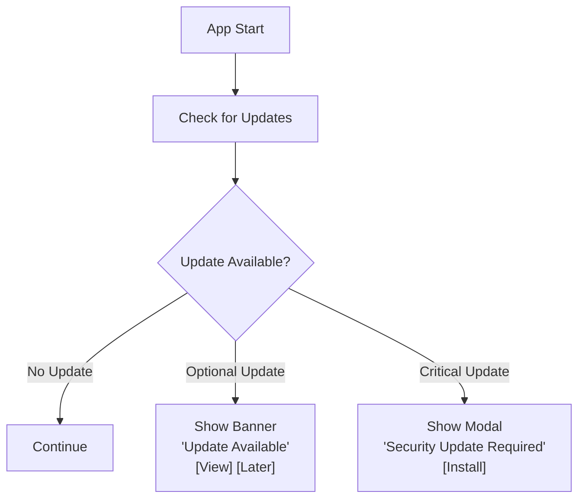
```mermaid
flowchart TD
    A[App Start] --> B[Check for Updates]
    B --> C{Update Available?}

    C -->|No Update| D[Continue]
    C -->|Optional Update| E["Show Banner<br/>'Update Available'<br/>[View] [Later]"]
    C -->|Critical Update| F["Show Modal<br/>'Security Update Required'<br/>[Install]"]
```

#### 3.4.2 Manual Update Check

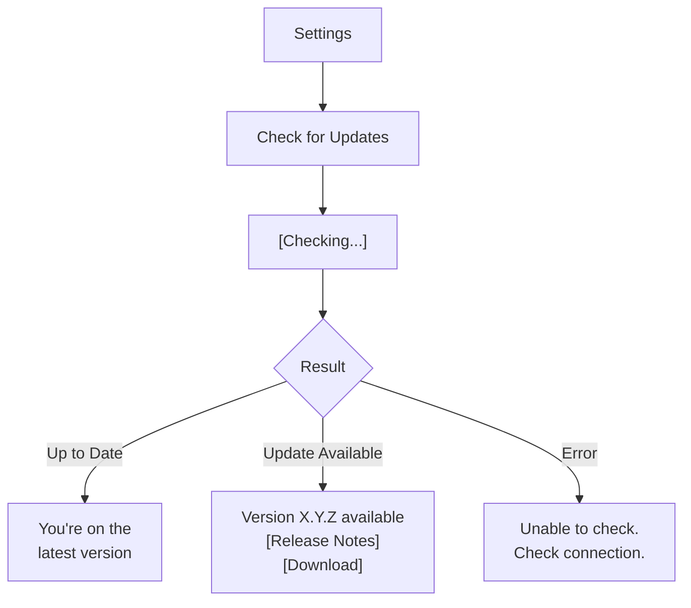
```mermaid
flowchart TD
    A[Settings] --> B[Check for Updates]
    B --> C["[Checking...]"]
    C --> D{Result}

    D -->|Up to Date| E["You're on the<br/>latest version"]
    D -->|Update Available| F["Version X.Y.Z available<br/>[Release Notes]<br/>[Download]"]
    D -->|Error| G["Unable to check.<br/>Check connection."]
```

### 3.5 Release Channels

| Channel     | Purpose                   | Audience        |
| ----------- | ------------------------- | --------------- |
| **Stable**  | Production-ready releases | All users       |
| **Beta**    | Feature-complete, testing | Opt-in users    |
| **Nightly** | Latest development        | Developers only |

### 3.6 Enterprise Considerations

For government/DoD environments:

- **Offline Update**: Package updates for USB/network share deployment
- **Approval Workflow**: Admin approves updates before user visibility
- **Airgapped Deployment**: Support environments with no external network
- **Audit Trail**: Log all update activities

### 3.7 Versioning Strategy

Recommended: **Semantic Versioning** (Major.Minor.Patch)

- **Major**: Breaking changes, significant new features
- **Minor**: New features, backward compatible
- **Patch**: Bug fixes, security updates

---

### 3.8 Questions & Discussion

> **Q3.1**: What is your target deployment environment?
>
> Options:
>
> - Consumer/public (GitHub releases fine)
> - Enterprise/private (need private hosting)
> - Airgapped/government (need offline support)
> - All of the above

**A3.1**: All of the above we can start with conc

---

> **Q3.2**: Do you need **staged rollouts** (release to 10% of users first, then expand)?
>
> **Context**: Staged rollouts catch issues before affecting all users but require infrastructure.

**A3.2**: [Your answer here]

---

> **Q3.3**: Should users be able to **decline** non-critical updates indefinitely, or should there be a "force update after X versions" policy?

**A3.3**: [Your answer here]

---

> **Q3.4**: Do you need **rollback** capability (revert to previous version if update breaks something)?

**A3.4**: [Your answer here]

---

> **Q3.5**: Where will your update artifacts be hosted initially?
>
> Options: GitHub Releases, AWS S3, Azure Blob, Self-hosted server

**A3.5**: [Your answer here]

---

## 4. Comprehensive RAG Capability

### 4.1 Overview

insightLM-LT needs a comprehensive RAG (Retrieval-Augmented Generation) system that:

- Indexes all information in the system
- Supports reranking for improved relevance
- Integrates with Continue.dev patterns
- Works with MCP protocol
- Supports multiple LLM providers

Reference: [Continue.dev Custom Code RAG Guide](https://docs.continue.dev/guides/custom-code-rag)

### 4.2 RAG Pipeline Architecture

#### Indexing Pipeline

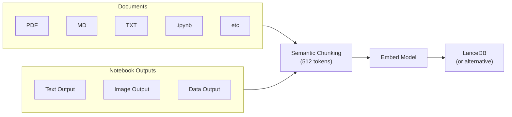
```mermaid
flowchart LR
    subgraph Documents
        PDF[PDF]
        MD[MD]
        TXT[TXT]
        IPYNB[.ipynb]
        ETC[etc]
    end

    subgraph NotebookOutputs["Notebook Outputs"]
        TextOut[Text Output]
        ImageOut[Image Output]
        DataOut[Data Output]
    end

    Documents --> Chunking["Semantic Chunking<br/>(512 tokens)"]
    NotebookOutputs --> Chunking
    Chunking --> Embedding["Embed Model"]
    Embedding --> VectorStore["LanceDB<br/>(or alternative)"]
```

#### Retrieval Pipeline

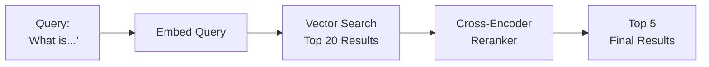
```mermaid
flowchart LR
    Query["Query:<br/>'What is...'"] --> EmbedQuery["Embed Query"]
    EmbedQuery --> VectorSearch["Vector Search<br/>Top 20 Results"]
    VectorSearch --> Reranker["Cross-Encoder<br/>Reranker"]
    Reranker --> Final["Top 5<br/>Final Results"]
```

### 4.3 What Gets Indexed

| Content Type           | Source                                                    | Priority |
| ---------------------- | --------------------------------------------------------- | -------- |
| Workbook Documents     | PDF, MD, TXT, DOCX in workbooks                           | High     |
| Jupyter Notebooks      | .ipynb files in workbooks                                 | High     |
| Notebook Outputs       | Cell outputs (text, images, data) from executed notebooks | High     |
| Chat History           | Previous conversations                                    | Medium   |
| System Configuration   | YAML configs, MCP configs                                 | Low      |
| External Documentation | Linked references                                         | Optional |
| Code Files             | Source code in workbooks                                  | High     |

#### 4.3.1 Notebook Output Handling

Notebook outputs require special handling in the RAG system:

1. **Output Extraction**: Parse `.ipynb` files to extract cell outputs (text, images, data tables, plots)
2. **Output Types**:
   - **Text Output**: Standard text output from print statements, markdown cells
   - **Image Output**: Plots, charts, visualizations (may need OCR or description)
   - **Data Output**: DataFrames, arrays, structured data (convert to text representation)
   - **Error Output**: Error messages and stack traces (valuable for debugging context)
3. **Metadata**: Include cell execution order, timestamps, and associated code context
4. **Chunking Strategy**: Notebook outputs should be chunked with their associated code cells for context

**Example**: A notebook cell that generates a plot should have both the code and the plot description indexed together, allowing the LLM to understand what analysis was performed.

### 4.4 Chunking Strategies

| Strategy           | Description                                     | Best For            |
| ------------------ | ----------------------------------------------- | ------------------- |
| **Fixed-size**     | Split at N tokens (e.g., 512)                   | General purpose     |
| **Semantic**       | Split at paragraph/section boundaries           | Documents, markdown |
| **Code-aware**     | Split at function/class boundaries              | Source code         |
| **Notebook-aware** | Split at cell boundaries, include code + output | Jupyter notebooks   |
| **Recursive**      | Hierarchical splitting with overlap             | Long documents      |

### 4.5 Embedding Models

| Model                    | Type         | Dimensions | Notes                        |
| ------------------------ | ------------ | ---------- | ---------------------------- |
| `text-embedding-3-small` | OpenAI API   | 1536       | High quality, cost per call  |
| `text-embedding-3-large` | OpenAI API   | 3072       | Highest quality, higher cost |
| `all-MiniLM-L6-v2`       | Local        | 384        | Fast, runs locally           |
| `nomic-embed-text`       | Ollama       | 768        | Local, good quality          |
| Custom                   | Configurable | Varies     | For enterprise requirements  |

### 4.6 Vector Stores

| Store          | Type            | Pros                       | Cons                      |
| -------------- | --------------- | -------------------------- | ------------------------- |
| **LanceDB**    | Embedded        | Serverless, fast, columnar | Newer, smaller community  |
| **ChromaDB**   | Embedded        | Python-native, simple      | Slower for large datasets |
| **SQLite-VSS** | Embedded        | SQLite extension, familiar | Limited features          |
| **Qdrant**     | Server/Embedded | Fast, Rust-based           | More complex setup        |
| **Pinecone**   | Cloud           | Managed, scalable          | Cloud dependency, cost    |

### 4.7 Reranking Options

| Option                                 | Type        | Quality  | Speed           |
| -------------------------------------- | ----------- | -------- | --------------- |
| `cross-encoder/ms-marco-MiniLM-L-6-v2` | Local model | Good     | Fast            |
| `BAAI/bge-reranker-base`               | Local model | Better   | Medium          |
| Cohere Rerank API                      | Cloud API   | Best     | API latency     |
| LLM-based reranking                    | LLM call    | Variable | Slow, expensive |

### 4.8 LLM Provider Abstraction

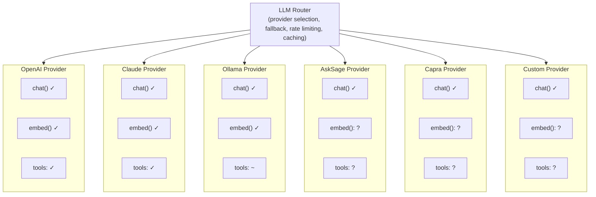
```mermaid
graph TB
    subgraph Router["LLM Router<br/>(provider selection, fallback, rate limiting, caching)"]
        direction LR
    end

    Router --> OpenAI
    Router --> Claude
    Router --> Ollama
    Router --> AskSage
    Router --> Capra
    Router --> Custom

    subgraph OpenAI["OpenAI Provider"]
        O1["chat() ✓"]
        O2["embed() ✓"]
        O3["tools: ✓"]
    end

    subgraph Claude["Claude Provider"]
        C1["chat() ✓"]
        C2["embed() ✓"]
        C3["tools: ✓"]
    end

    subgraph Ollama["Ollama Provider"]
        OL1["chat() ✓"]
        OL2["embed() ✓"]
        OL3["tools: ~"]
    end

    subgraph AskSage["AskSage Provider"]
        A1["chat() ✓"]
        A2["embed(): ?"]
        A3["tools: ?"]
    end

    subgraph Capra["Capra Provider"]
        CA1["chat() ✓"]
        CA2["embed(): ?"]
        CA3["tools: ?"]
    end

    subgraph Custom["Custom Provider"]
        CU1["chat() ✓"]
        CU2["embed(): ?"]
        CU3["tools: ?"]
    end
```

### 4.9 MCP Integration

The RAG system should be exposed as an MCP server:

```json
{
  "name": "workbook-rag",
  "methods": {
    "rag/index": "Index a document or workbook",
    "rag/search": "Search indexed content",
    "rag/reindex": "Re-index all content",
    "rag/status": "Get indexing status"
  }
}
```

### 4.10 Continue.dev Integration Points

- **@codebase**: Search indexed workbook content
- **@docs**: Search indexed documentation
- **@notebook** or **@results**: Search notebook outputs and execution results
- **Context Providers**: Feed RAG results into LLM context (including notebook outputs)
- **Slash Commands**: /index, /search, /reindex, /run-notebook, /notebook-results

---

### 4.11 Questions & Discussion

> **Q4.1**: What content should be indexed? All workbook documents? Chat history? System files?
>
> **Context**: More content = better recall but larger index and slower queries.

**A4.1**: [Your answer here]

---

> **Q4.2**: Should embedding be **local** (privacy, offline) or **remote** (higher quality, simpler)?
>
> **Context**: Local requires shipping models (~100MB+). Remote requires API calls and has privacy implications.

**A4.2**: [Your answer here]

---

> **Q4.3**: Which **vector store** should we use?
>
> - LanceDB (current placeholder) - serverless, embedded
> - ChromaDB - Python-native, popular
> - Other?

**A4.3**: [Your answer here]

---

> **Q4.4**: Should **reranking** be required or optional?
>
> **Context**: Reranking significantly improves relevance but adds latency and complexity.

**A4.4**: [Your answer here]

---

> **Q4.5**: For AskSage/Capra/other enterprise LLMs:
>
> - Do they support function/tool calling?
> - Do they provide embedding endpoints?
> - What authentication do they require?

**A4.5**: [Your answer here]

---

> **Q4.6**: Should the RAG system support **hybrid search** (keyword + vector)?
>
> **Context**: Hybrid search combines BM25 keyword matching with vector similarity for better results on exact terms.

**A4.6**: [Your answer here]

---

> **Q4.7**: How should we handle **document updates**? Re-index on change? Scheduled re-index? Manual trigger?

**A4.7**: [Your answer here]

---

## 5. Desktop → Cloud → Decentralized

### 5.1 Overview

insightLM-LT starts as a desktop application but should be architected with a path toward:

1. **Cloud deployment** (hosted SaaS)
2. **Decentralized knowledge sharing** (Napster-like model)

### 5.2 Desktop-First Advantages

Starting desktop-first allows:

- Rapid iteration without infrastructure costs
- Real user testing before scaling
- Core product development without distributed systems complexity
- Privacy by default (data stays local)

### 5.3 Cloud Migration Path

#### 5.3.1 Data Model Requirements

For cloud-readiness, the data model must be:

- **Location-agnostic**: No hardcoded filesystem paths
- **Identity-aware**: UUIDs for all entities
- **Versioned**: Timestamps and version numbers on everything
- **Conflict-aware**: Designed for eventual consistency
- **Workspace-centric**: Workspaces become the primary organizational unit (replacing global workbooks)
- **Project-oriented**: Projects within workspaces provide goal-oriented organization

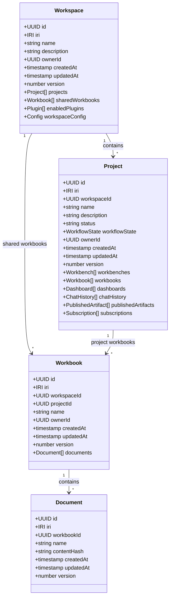
```mermaid
classDiagram
    class Workspace {
        +UUID id
        +IRI iri
        +string name
        +string description
        +UUID ownerId
        +timestamp createdAt
        +timestamp updatedAt
        +number version
        +Project[] projects
        +Workbook[] sharedWorkbooks
        +Plugin[] enabledPlugins
        +Config workspaceConfig
    }

    class Project {
        +UUID id
        +IRI iri
        +UUID workspaceId
        +string name
        +string description
        +string status
        +WorkflowState workflowState
        +UUID ownerId
        +timestamp createdAt
        +timestamp updatedAt
        +number version
        +Workbench[] workbenches
        +Workbook[] workbooks
        +Dashboard[] dashboards
        +ChatHistory[] chatHistory
        +PublishedArtifact[] publishedArtifacts
        +Subscription[] subscriptions
    }

    class Workbook {
        +UUID id
        +IRI iri
        +UUID workspaceId
        +UUID projectId
        +string name
        +UUID ownerId
        +timestamp createdAt
        +timestamp updatedAt
        +number version
        +Document[] documents
    }

    class Document {
        +UUID id
        +IRI iri
        +UUID workbookId
        +string name
        +string contentHash
        +timestamp createdAt
        +timestamp updatedAt
        +number version
    }

    Workspace "1" --> "*" Project : contains
    Workspace "1" --> "*" Workbook : shared workbooks
    Project "1" --> "*" Workbook : project workbooks
    Workbook "1" --> "*" Document : contains
```

#### 5.3.1.1 IRI (Internationalized Resource Identifier) Management

**Status**: Architectural Requirement - Critical for cloud/decentralized scenarios

##### Overview

All entities in insightLM-LT (workspaces, projects, workbenches, workbooks, documents, notebooks, dashboards, etc.) must have globally unique, resolvable identifiers using IRIs (Internationalized Resource Identifiers). IRIs enable:

- **Cross-workspace references**: Link to resources in other workspaces
- **Cloud/decentralized access**: Resolve resources across network boundaries
- **Import/export portability**: Maintain references when moving data
- **Publish/subscribe**: Reference published artifacts across projects
- **Version control**: Track resource versions and changes

##### IRI Format

IRIs follow a hierarchical scheme that encodes the resource type and location:

```
insightlm://{authority}/{resource-type}/{workspace-id}/{project-id?}/{resource-id}
```

**IRI Components:**

| Component         | Description                                                   | Example                                                                 |
| ----------------- | ------------------------------------------------------------- | ----------------------------------------------------------------------- |
| `insightlm://`    | Scheme identifier                                             | `insightlm://`                                                          |
| `{authority}`     | Workspace owner/domain (optional for local)                   | `user@example.com` or `local`                                           |
| `{resource-type}` | Type of resource                                              | `workspace`, `project`, `workbook`, `document`, `notebook`, `dashboard` |
| `{workspace-id}`  | UUID of workspace                                             | `550e8400-e29b-41d4-a716-446655440000`                                  |
| `{project-id}`    | UUID of project (optional, only for project-scoped resources) | `6ba7b810-9dad-11d1-80b4-00c04fd430c8`                                  |
| `{resource-id}`   | UUID of the resource itself                                   | `6ba7b811-9dad-11d1-80b4-00c04fd430c8`                                  |

**Examples:**

```
insightlm://local/workspace/550e8400-e29b-41d4-a716-446655440000
insightlm://local/project/550e8400-e29b-41d4-a716-446655440000/6ba7b810-9dad-11d1-80b4-00c04fd430c8
insightlm://local/workbook/550e8400-e29b-41d4-a716-446655440000/6ba7b810-9dad-11d1-80b4-00c04fd430c8/6ba7b811-9dad-11d1-80b4-00c04fd430c8
insightlm://user@example.com/document/550e8400-e29b-41d4-a716-446655440000/null/6ba7b812-9dad-11d1-80b4-00c04fd430c8
```

**Note**: `null` or empty `{project-id}` indicates workspace-level resource (not project-scoped).

##### IRI Generation

**UUID-Based Identifiers:**

- All resource IDs are UUIDs (v4 recommended for randomness)
- Generated at resource creation time
- Never change (immutable)
- Globally unique

**IRI Construction:**

```typescript
function buildIRI(
  authority: string,
  resourceType: ResourceType,
  workspaceId: UUID,
  projectId: UUID | null,
  resourceId: UUID
): IRI {
  const projectSegment = projectId ? `/${projectId}` : "/null";
  return `insightlm://${authority}/${resourceType}/${workspaceId}${projectSegment}/${resourceId}`;
}
```

##### IRI Resolution

**Resolution Strategy:**

1. **Local Resolution**: Check local workspace/project storage
2. **Cloud Resolution**: Query cloud registry if authority is remote
3. **Decentralized Resolution**: Use DHT/registry for peer-to-peer lookup
4. **Cache**: Cache resolved resources for performance

**Resolution Flow:**

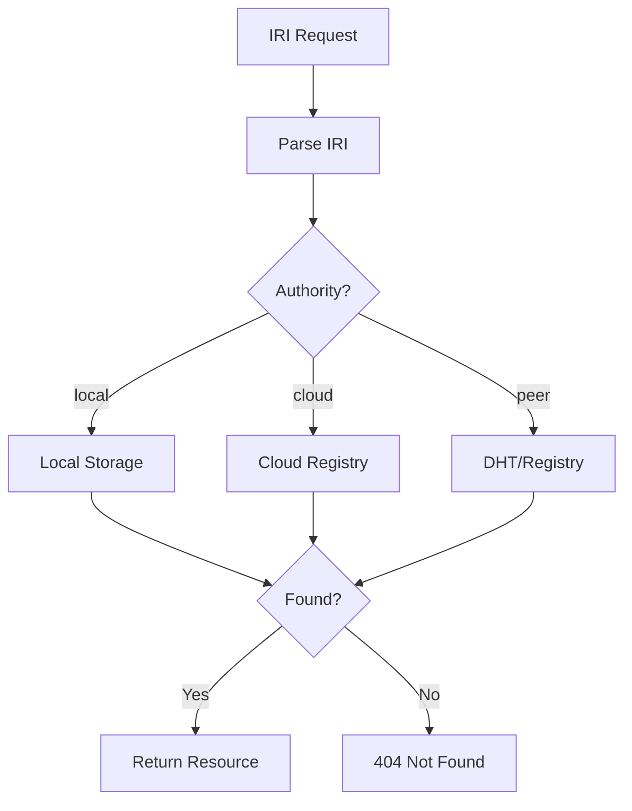
```mermaid
flowchart TD
    IRI[IRI Request] --> Parse[Parse IRI]
    Parse --> Authority{Authority?}

    Authority -->|local| Local[Local Storage]
    Authority -->|cloud| Cloud[Cloud Registry]
    Authority -->|peer| DHT[DHT/Registry]

    Local --> Found{Found?}
    Cloud --> Found
    DHT --> Found

    Found -->|Yes| Return[Return Resource]
    Found -->|No| Error[404 Not Found]
```

##### IRI Storage

**In Data Model:**

Every resource stores its IRI:

```typescript
interface Resource {
  id: UUID; // Internal UUID
  iri: IRI; // Full IRI for external reference
  workspaceId: UUID; // For quick lookup
  projectId?: UUID; // Optional, for project-scoped resources
  // ... other fields
}
```

**IRI Registry:**

Maintain an IRI registry for fast lookups:

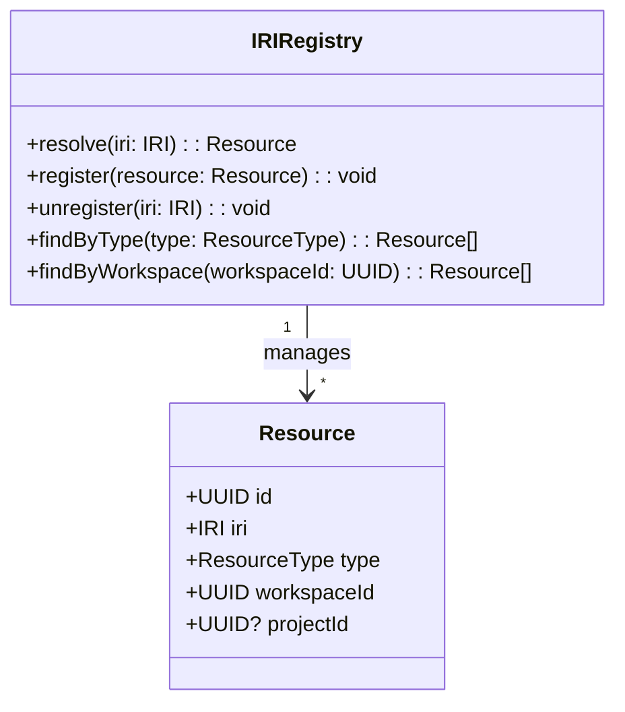
```mermaid
classDiagram
    class IRIRegistry {
        +resolve(iri: IRI): Resource
        +register(resource: Resource): void
        +unregister(iri: IRI): void
        +findByType(type: ResourceType): Resource[]
        +findByWorkspace(workspaceId: UUID): Resource[]
    }

    class Resource {
        +UUID id
        +IRI iri
        +ResourceType type
        +UUID workspaceId
        +UUID? projectId
    }

    IRIRegistry "1" --> "*" Resource : manages
```

##### Cross-Workspace References

**Linking Between Workspaces:**

IRIs enable references across workspace boundaries:

```typescript
// Document in Workspace A references a workbook in Workspace B
{
  id: "doc-uuid",
  iri: "insightlm://local/workbook/workspace-a/project-x/workbook-y",
  references: [
    "insightlm://user@example.com/workbook/workspace-b/project-z/workbook-w"
  ]
}
```

**Resolution:**

- Desktop: Can resolve local IRIs, prompts for cloud/remote access
- Cloud: Can resolve any IRI within accessible workspaces
- Decentralized: Uses DHT to find resource owner

##### IRI Portability

**Export/Import:**

When exporting workspaces/projects:

- IRIs are preserved in exported data
- Relative IRIs can be used for workspace-internal references
- Absolute IRIs maintained for cross-workspace references

**Migration:**

When importing:

- Check if IRI already exists (conflict resolution)
- Option to remap IRIs to new workspace
- Preserve relationships using IRI references

##### IRI in Publish/Subscribe

**Published Artifacts:**

Published artifacts have IRIs that can be subscribed to:

```typescript
{
  artifactId: UUID,
  iri: "insightlm://local/published-artifact/workspace/project/artifact-id",
  projectIRI: "insightlm://local/project/workspace/project-id",
  version: "1.0",
  data: {...}
}
```

**Subscriptions:**

Subscriptions reference published artifacts by IRI:

```typescript
{
  subscriberProjectIRI: "insightlm://local/project/workspace/subscriber-project",
  publishedArtifactIRI: "insightlm://user@example.com/published-artifact/workspace/publisher-project/artifact-id",
  version: "1.0",
  autoUpdate: true
}
```

##### Implementation Considerations

**Desktop:**

- Authority defaults to `local`
- IRIs resolve to local filesystem
- Can reference cloud IRIs but requires network access

**Cloud:**

- Authority is user/domain identifier
- IRIs resolve through cloud registry
- Supports cross-workspace references within accessible scope

**Decentralized:**

- Authority can be peer identifier
- IRIs resolve through DHT/registry
- Requires discovery and trust mechanisms

**Performance:**

- Cache resolved IRIs
- Batch IRI resolution
- Lazy loading for cross-workspace references

##### Questions & Discussion

> **Q5.10**: Should IRIs be **hierarchical** (encode workspace/project path) or **flat** (just UUID with lookup table)?
>
> **Context**:
>
> - **Hierarchical**: Self-describing, can infer location from IRI
> - **Flat**: Simpler, but requires lookup registry
>
> **Recommendation**: Hierarchical - enables better portability and self-description.

**A5.10**: [Your answer here]

---

> **Q5.11**: How should **authority** be determined?
>
> **Options**:
>
> - **User identifier**: `user@example.com`
> - **Domain**: `example.com`
> - **Peer ID**: For decentralized scenarios
> - **Local**: `local` for desktop-only resources
>
> **Context**: Authority determines where to resolve the IRI.

**A5.11**: [Your answer here]

---

> **Q5.12**: Should IRIs support **versioning** in the path?
>
> **Example**: `insightlm://local/document/workspace/project/doc-id/v1.2`
>
> **Context**: Versioning in IRI enables immutable references to specific versions.

**A5.12**: [Your answer here]

---

#### 5.3.2 Service Abstraction

Services should have **interface + implementation** pattern:

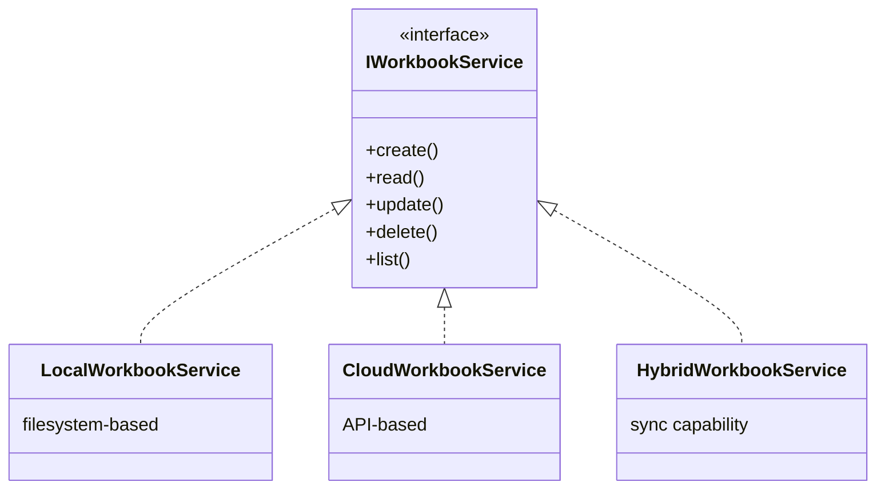
```mermaid
classDiagram
    class IWorkbookService {
        <<interface>>
        +create()
        +read()
        +update()
        +delete()
        +list()
    }

    class LocalWorkbookService {
        filesystem-based
    }

    class CloudWorkbookService {
        API-based
    }

    class HybridWorkbookService {
        sync capability
    }

    IWorkbookService <|.. LocalWorkbookService
    IWorkbookService <|.. CloudWorkbookService
    IWorkbookService <|.. HybridWorkbookService
```

#### 5.3.3 Authentication Preparation

Even desktop should have user identity concepts:

- Local: Simple user profile (name, preferences)
- Cloud: OAuth/SSO ready (identity provider abstraction)

### 5.4 Decentralized/P2P Knowledge Sharing

#### 5.4.1 Vision

Knowledge created on desktop versions becomes available to the network:

- Users contribute knowledge (indexed documents, curated insights)
- Users discover and consume knowledge from peers
- Privacy controls determine what's shared vs. private
- No central server required (but optional registry for discovery)

#### 5.4.2 Architectural Considerations

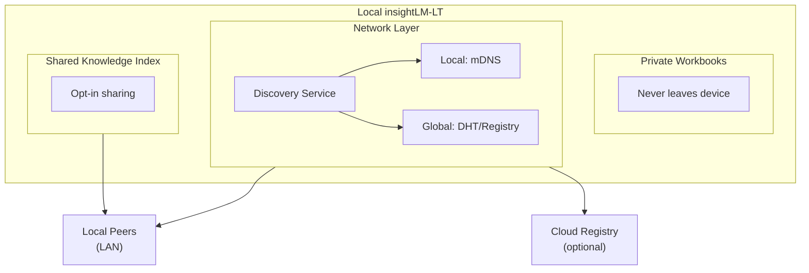
```mermaid
graph TB
    subgraph Local["Local insightLM-LT"]
        subgraph Private["Private Workbooks"]
            PW["Never leaves device"]
        end

        subgraph Shared["Shared Knowledge Index"]
            SK["Opt-in sharing"]
        end

        subgraph Network["Network Layer"]
            DS["Discovery Service"]
            MDNS["Local: mDNS"]
            DHT["Global: DHT/Registry"]
            DS --> MDNS
            DS --> DHT
        end
    end

    Shared --> LocalPeers["Local Peers<br/>(LAN)"]
    Network --> LocalPeers
    Network --> CloudRegistry["Cloud Registry<br/>(optional)"]
```

#### 5.4.3 Key Challenges

| Challenge         | Options                                               |
| ----------------- | ----------------------------------------------------- |
| **Discovery**     | mDNS (local), DHT (global), Central registry (hybrid) |
| **Trust**         | Reputation system, Verified publishers, Web of trust  |
| **Privacy**       | User-controlled sharing levels, Encryption            |
| **Sync/Conflict** | CRDTs, Last-write-wins, Manual resolution             |
| **Incentives**    | Access requires contribution, Reputation rewards      |

---

### 5.5 Formal Project Workflows & Publish/Subscribe (Stretch Goal)

**Status**: Future Vision - Advanced feature for cloud/multi-user scenarios

#### 5.5.1 Overview

Projects should support formal workflows with approval gates and publish/subscribe capabilities. When projects are approved and published, their results become available to other projects that can subscribe to them, creating a dependency lattice of interconnected projects.

**Use Case Example**: Aircraft Acquisition Program

- Multiple projects work in parallel (FEA analysis, materials testing, cost analysis)
- As projects complete and are approved, their results (e.g., "Margin of Safety = 4.0") become published artifacts
- Other projects subscribe to these published results
- Changes upstream automatically trigger impact analysis downstream

#### 5.5.2 Project Workflow States

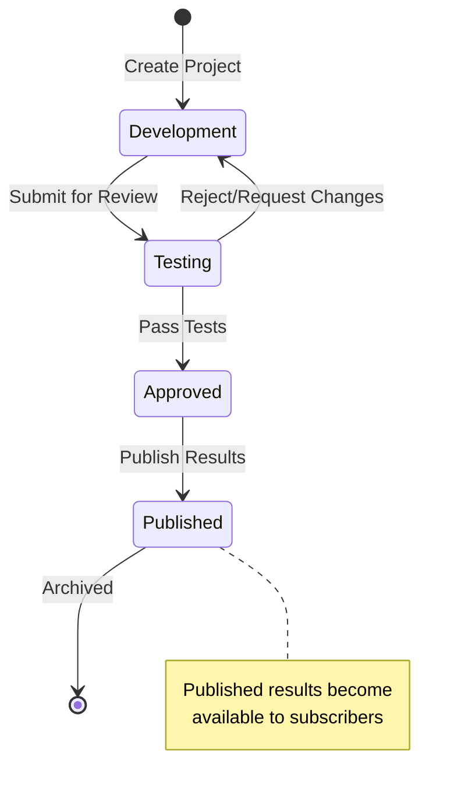
```mermaid
stateDiagram-v2
    [*] --> Development: Create Project
    Development --> Testing: Submit for Review
    Testing --> Development: Reject/Request Changes
    Testing --> Approved: Pass Tests
    Approved --> Published: Publish Results
    Published --> [*]: Archived

    note right of Published
        Published results become
        available to subscribers
    end note
```

**Workflow States:**

- **Development**: Active work, not yet ready
- **Testing**: Under review/validation
- **Approved**: Validated, ready to publish
- **Published**: Results available to subscribers
- **Archived**: Completed, no longer active

#### 5.5.3 Publish/Subscribe Model

When a project reaches "Published" state, it can publish specific artifacts/results:

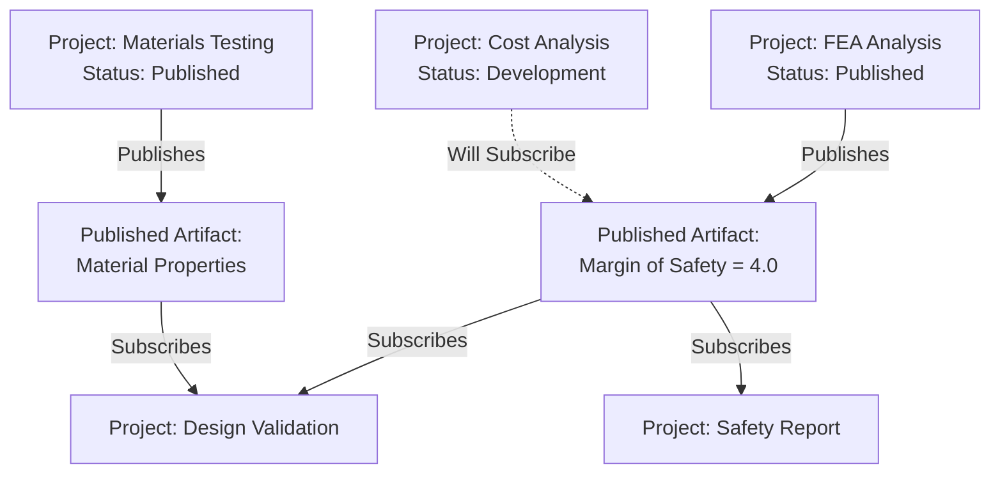
```mermaid
graph TB
    P1["Project: FEA Analysis<br/>Status: Published"]
    P2["Project: Materials Testing<br/>Status: Published"]
    P3["Project: Cost Analysis<br/>Status: Development"]

    P1 -->|Publishes| PA1["Published Artifact:<br/>Margin of Safety = 4.0"]
    P2 -->|Publishes| PA2["Published Artifact:<br/>Material Properties"]

    PA1 -->|Subscribes| P4["Project: Design Validation"]
    PA1 -->|Subscribes| P5["Project: Safety Report"]
    PA2 -->|Subscribes| P4

    P3 -.->|Will Subscribe| PA1
```

**Published Artifacts:**

- Can be any project output (calculations, data, documents, notebooks)
- Defined by project owner (what gets published)
- Versioned (changes create new versions)
- Subscribable by other projects

#### 5.5.4 Project Dependency Lattice

Projects form a directed graph where:

- **Upstream Projects**: Publish results that others depend on
- **Downstream Projects**: Subscribe to published results
- **Impact Analysis**: When upstream changes, downstream effects must be identified

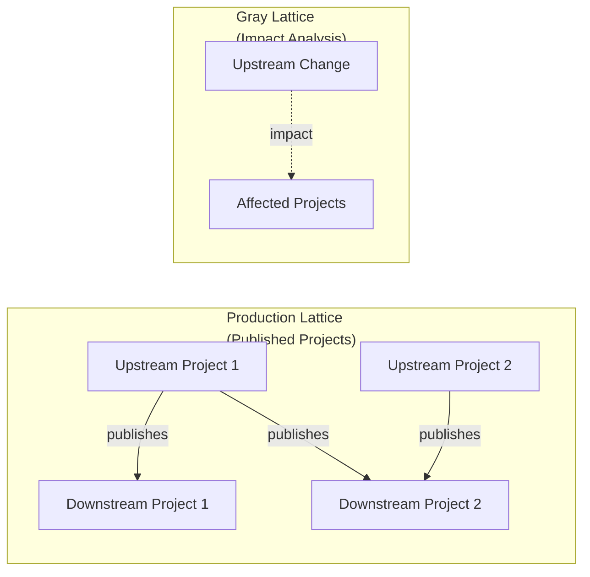
```mermaid
graph LR
    subgraph Production["Production Lattice<br/>(Published Projects)"]
        UP1[Upstream Project 1]
        UP2[Upstream Project 2]
        DP1[Downstream Project 1]
        DP2[Downstream Project 2]

        UP1 -->|publishes| DP1
        UP1 -->|publishes| DP2
        UP2 -->|publishes| DP2
    end

    subgraph Gray["Gray Lattice<br/>(Impact Analysis)"]
        GUP1[Upstream Change]
        GDP1[Affected Projects]

        GUP1 -.->|impact| GDP1
    end
```

**Two Lattices:**

1. **Production Lattice**: Published projects and their active subscriptions
2. **Gray Lattice**: Impact analysis - what would be affected by proposed changes

#### 5.5.5 Impact Analysis Workflow

Before making changes to a published project:

1. **Identify Dependencies**: Find all downstream subscribers
2. **Impact Assessment**: Determine what would break/change
3. **Gray Lattice**: Show impact graph before committing changes
4. **Downstream Feedback**: Notify subscribers of proposed changes
5. **Approval**: Get approval from affected parties (if required)
6. **Update**: Make change, republish, trigger downstream updates

#### 5.5.6 LLM-Generated Projects

Projects can be generated via LLM/MCP:

- **Project MCP Server**: Handles project generation and management
- **Natural Language**: "Generate projects for aircraft acquisition program"
- **Template-Based**: LLM creates project structure based on templates
- **Dependency Inference**: LLM suggests project dependencies and subscriptions

**Example**:

```
User: "I need to analyze a new aircraft design. Generate the necessary projects."

LLM generates:
- FEA Analysis Project (publishes: stress results, margin of safety)
- Materials Testing Project (publishes: material properties)
- Cost Analysis Project (subscribes: FEA results, materials)
- Safety Report Project (subscribes: FEA results, materials, cost)
```

#### 5.5.7 Implementation Considerations

**Desktop vs. Cloud:**

- **Desktop**: Can work standalone, but publish/subscribe requires network
- **Cloud**: Natural fit - teams, workspaces, formal workflows
- **Hybrid**: Desktop can publish to cloud, subscribe from cloud

**Technical Requirements:**

- **Project MCP Server**: Manages project lifecycle, workflows, publish/subscribe
- **Dependency Graph**: Track project dependencies and subscriptions
- **Event System**: Notify subscribers of upstream changes
- **Versioning**: Track published artifact versions
- **Approval Workflows**: Multi-user approval gates (cloud feature)

**Data Model Extensions:**

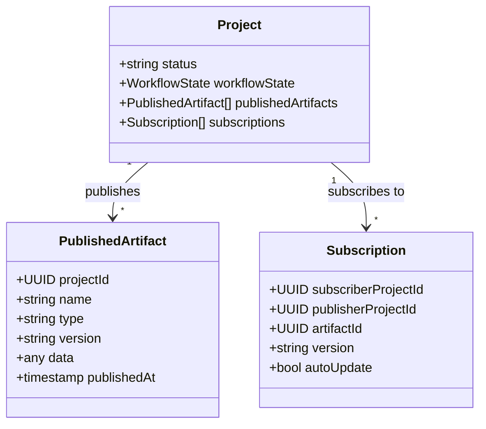
```mermaid
classDiagram
    class Project {
        +string status
        +WorkflowState workflowState
        +PublishedArtifact[] publishedArtifacts
        +Subscription[] subscriptions
    }

    class PublishedArtifact {
        +UUID projectId
        +string name
        +string type
        +string version
        +any data
        +timestamp publishedAt
    }

    class Subscription {
        +UUID subscriberProjectId
        +UUID publisherProjectId
        +UUID artifactId
        +string version
        +bool autoUpdate
    }

    Project "1" --> "*" PublishedArtifact : publishes
    Project "1" --> "*" Subscription : subscribes to
```

#### 5.5.8 Benefits

1. **Formal Process**: Structured workflow ensures quality and validation
2. **Dependency Management**: Clear understanding of project relationships
3. **Impact Analysis**: Know what breaks before making changes
4. **Collaboration**: Teams can work on interdependent projects
5. **Reusability**: Published results can be reused across projects
6. **Traceability**: Full audit trail of project dependencies and changes

#### 5.5.9 Questions & Discussion

> **Q5.6**: Should workflow states be **configurable** per workspace/project type, or **fixed** across all projects?
>
> **Context**:
>
> - **Fixed**: Simpler, consistent across all projects
> - **Configurable**: More flexible, can adapt to different organizational needs
>
> **Recommendation**: Start with fixed workflow, allow customization later.

**A5.6**: [Your answer here]

---

> **Q5.7**: How should **published artifacts** be defined?
>
> **Options**:
>
> - **Manual**: Project owner explicitly marks what to publish
> - **Automatic**: All project outputs become published artifacts
> - **Template-based**: Project templates define what gets published
>
> **Context**: Manual gives control, automatic is simpler, templates provide consistency.

**A5.7**: [Your answer here]

---

> **Q5.8**: Should **downstream projects** be automatically updated when upstream changes, or require manual approval?
>
> **Context**:
>
> - **Automatic**: Simpler, but risky if changes break things
> - **Manual**: Safer, but requires more coordination
> - **Hybrid**: Auto-update with notification, manual override available

**A5.8**: [Your answer here]

---

> **Q5.9**: How should the **Project MCP Server** work?
>
> **Context**: Should it:
>
> - Generate projects from natural language descriptions?
> - Manage project workflows and state transitions?
> - Handle publish/subscribe operations?
> - All of the above?

**A5.9**: [Your answer here]

---

### 5.6 Questions & Discussion

> **Q5.1**: Is cloud deployment a **near-term** goal (next 6-12 months) or **long-term** aspiration?
>
> **Context**: This affects how much we invest in abstraction now vs. later.

**A5.1**: [Your answer here]

---

> **Q5.2**: For the decentralized model, is this a **vision** to keep in mind or something to **actively architect** for now?

**A5.2**: [Your answer here]

---

> **Q5.3**: What **sharing granularity** makes sense?
>
> Options:
>
> - **Entire workspaces** (complete work environment)
> - **Individual projects** (goal-oriented work within a workspace)
> - Entire workbooks
> - Individual documents
> - Knowledge snippets/insights
> - RAG index chunks
>
> **Context**:
>
> - **Workspaces**: Share complete work environments (plugins, configs, multiple projects)
> - **Projects**: Share specific goal-oriented work (what you're building)
> - Both make sense depending on use case - workspace for collaboration setup, project for specific deliverables

**A5.3**: [Your answer here]

---

> **Q5.4**: Should there be a **central registry** for discovery, or purely peer-to-peer?
>
> **Context**: Central registry is simpler but creates dependency. Pure P2P is more resilient but harder to bootstrap.

**A5.4**: [Your answer here]

---

> **Q5.5**: What **privacy model** do you envision?
>
> Options:
>
> - Everything private by default, explicit opt-in to share
> - Public by default, explicit opt-out
> - Tiered: Private → Team → Organization → Public

**A5.5**: [Your answer here]

---

> **Q5.6**: For **multi-user/team** scenarios, how should permissions work?
>
> - Role-based (Admin, Editor, Viewer)
> - Capability-based (specific permissions per resource)
> - Simple owner/shared model

**A5.6**: [Your answer here]

---

## Appendix A: Q&A Archive

_This section will be populated as questions are answered and discussions conclude. Each entry will include:_

- Question ID
- Original Question
- Answer/Decision
- Date
- Rationale

---

## Appendix B: Use Cases

_Document key use cases that drive architectural decisions._

### UC-1: [Use Case Name]

**Actor**: [Who performs this]
**Preconditions**: [What must be true before]
**Flow**:

1. Step 1
2. Step 2
3. ...

**Postconditions**: [What is true after]

---

## Appendix C: Assumptions

_List assumptions made during specification development._

| ID  | Assumption   | Impact if Wrong |
| --- | ------------ | --------------- |
| A-1 | [Assumption] | [Impact]        |

---

## Appendix D: Architectural Decision Records

_Document significant architectural decisions._

### ADR-001: [Decision Title]

**Status**: [Proposed | Accepted | Deprecated | Superseded]
**Context**: [Why is this decision needed?]
**Decision**: [What was decided?]
**Consequences**: [What are the implications?]

---

## Document History

| Version | Date       | Author       | Changes                                                                                                                              |
| ------- | ---------- | ------------ | ------------------------------------------------------------------------------------------------------------------------------------ |
| 0.1.0   | 2024-12-02 | AI Assistant | Initial draft from discussion                                                                                                        |
| 0.1.1   | 2024-12-03 | AI Assistant | Converted ASCII diagrams to Mermaid format                                                                                           |
| 0.1.2   | 2024-12-03 | AI Assistant | Added JupyterLab integration specification                                                                                           |
| 0.1.3   | 2024-12-03 | AI Assistant | Updated architecture to reflect workbench system with separate Dashboard/Workbooks/Chat views                                        |
| 0.1.4   | 2024-12-03 | AI Assistant | Added Workspace & Project concept - Workspace as top-level container, Projects as goal-oriented work within workspaces               |
| 0.1.5   | 2024-12-03 | AI Assistant | Changed Project to Workspace terminology - Workspace is top-level, Projects are goal-oriented work within workspaces                 |
| 0.1.6   | 2024-12-03 | AI Assistant | Added stretch goal: Formal Project Workflows & Publish/Subscribe model with dependency lattices and impact analysis                  |
| 0.1.7   | 2024-12-03 | AI Assistant | Added IRI (Internationalized Resource Identifier) management specification for all resources (workspaces, projects, workbooks, etc.) |
